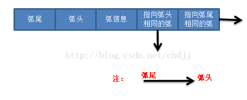
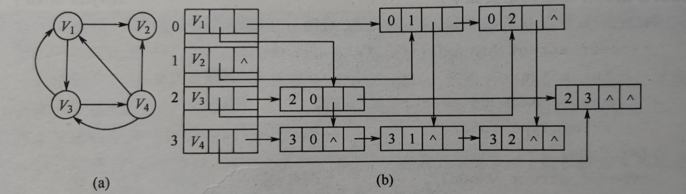
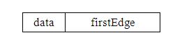
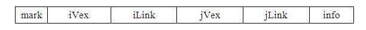
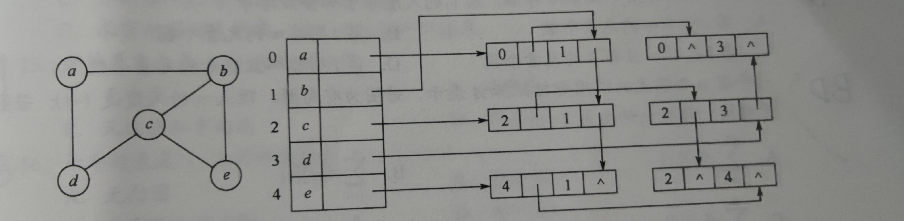
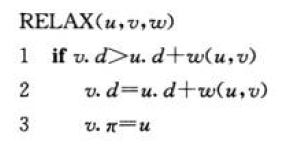
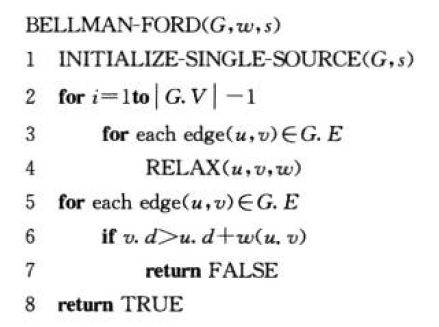
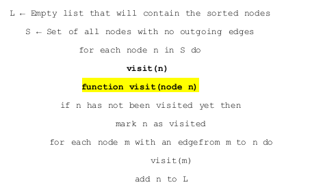

# Graph

[TOC]

$$
DR \ \ \ \ \ \ \ \ \ \ 2021/11/19 \ \ \ \ \ \ \ \ \ \ V1.0
\\
----------------------
$$


## Definition

1. $V(G) \&\& E(G)$、有向图&&无向图。

2. 基本概念：

   1. 有向图、无向图、子图（定义？）

   2. 连通与连通图与连通分量

      ​		——强连通图（指有向图）、强连通分量

   3. 度数、入度、出度、握手定理……

   4. 弧尾（起点）、弧头（终点）

   5. 稠密图 && 稀疏图（$|E| < |V|\log{|V|}$）

   6. 回路与环

3. $\color{red}\star$图的表示：$\begin{cases} 邻接矩阵 \\ 邻接表 \\ 邻接多重表 \end{cases}$（定义、使用场景、对比……）

   对于链表表示的图，我们需要注意：我们用两种不同的数据结构来表示**节点**（长度，`prev`和`next`的指针）和**边**（`data`、两端的节点、两端的边`next`与`prev`）。

   - 邻接链表的查找、删除结点、寻找出度入度……

   - 十字链表：有向图的链式存储（<font size = 2>$\Leftarrow $邻接表+逆邻接表</font>）（意味着我们很容易求出出度和入度！），使用两种不同的结点表示点和弧。

     怎样构建连接关系？

     

     

   

   - 邻接多重表：无向图的链式存储。用结点表示图中的边。
   
   ​	







## Operation

结合图的表示方式理解。（入度出度、删除点/边、增加……）

## DFS && BFS

<font color = darkgreen>DFS</font>：递归、回溯、栈结构、$preOrder$

<font color = darkgreen>BFS</font>：层次遍历、需要构造队列、针对无权图

**复杂度**

|         |        | 时间     | 空间   |
| ------- | ------ | -------- | ------ |
| **DFS** | 矩阵   | $O(V^2)$ | $O(V)$ |
|         | 邻接表 | $O(V+E)$ | $O(V)$ |
| **BFS** | 矩阵   | $O(V^2)$ | $O(V)$ |
|         | 邻接表 | $O(V+E)$ | $O(V)$ |

思考：

> 1. 非递归实现DFS？
> 2. 如何判断图是否是树？（以图判树）无环&&连通量为1 || n-1条边

**DFS（非递归）**——模拟栈

```c++
	while( !stack.empty() )
    {
        int val = stack.top();
        stack.pop();
        
        for( auto& edge:edges[val] )
            if( !visited[edge] ) 
            {
                stack.push(edge);
                visited[edge] = true;
            }
    }
```


**以图判树**

BFS。如果遍历的过程中出现已经访问的，直接退出。

```c++
    bool validTree(int n, vector<vector<int>>& edges) {
        vector<vector<int>> graph(n,vector<int>(n));
        for(int i=0;i<edges.size();i++){
            graph[edges[i][0]][edges[i][1]]=1;
            graph[edges[i][1]][edges[i][0]]=1;
        }
        queue<int>q;
        q.push(0);
        bool visited[n];
        memset(visited,false,sizeof(visited));
        
        while(!q.empty()){
            //	visit queue.top()
            int cur = q.front();
            q.pop();
            visited[cur]=true;
            // BFS
            for(int i=0;i<n;i++){
                if (graph[cur][i] == 1){
                    if(visited[i]) return false;
                    visited[i]=true;
                    graph[cur][i] = 0;
                    graph[i][cur] = 0;
                    q.push(i);
                }
            }
        }
        //	查看连通分量
        for(int i=0;i<n;i++)
            if(!visited[i]) return false;
        return true;
    }
```

用DFS也可以。（见王道）


### 最小生成树（MST）

定义：指总权值最小的生成树。不一定唯一。（$E' = V'-1$）（换言之，每条边权值不同，树是唯一的）。

关键词：**贪心**。

<font color = darkgreen>Kruskal</font>——边

1. 按权值选择。每次选择最小的边。加入边后判断是否成环。
2. 每次操作后，连通分量会减少（树$\to$森林？）
3. 适用稀疏图（Why？）


<font color = darkgreen>Prim</font>——点

1. 每次添加一个顶点，目标是距离集合最近。
2. 适用稠密图？（Why？）
3. 对比Dijkstra？

### [面试题 04.01. 节点间通路](https://leetcode-cn.com/problems/route-between-nodes-lcci/)

节点间通路。给定有向图，设计一个算法，找出两个节点之间是否存在一条路径。

---

注意这里是有向图。分别用DFS和BFS去做。

`BFS`

```c++
    bool findWhetherExistsPath(int n, vector<vector<int>>& graph, int start, int target) {
        edges.resize(n);
        visited.resize(n);
        for( auto& edge:graph ) 
            edges[edge[0]].push_back( edge[1] );
        queue<int> queue;
        queue.push( start );
        visited[start] = true;

        while( !queue.empty() )
        {
            int val = queue.front();
            if( val == target ) return true;
            queue.pop();
            for( auto& e:edges[val] )
            {
                if( visited[e] || e == val ) continue;
                visited[e] = true;
                queue.push(e);
            }
        }       
        return false;
    }
```

`DFS`

```c++
    bool valid = false;
	void DFS( int start,int target )
    {
        if( start == target )
        {
            valid = true;
            return;
        }
        visited[start] = true;
        for(auto& w:edges[start])
            if( !visited[w] ) DFS(w,target);
    }

    bool findWhetherExistsPath(int n, vector<vector<int>>& graph, int start, int target) {
		//	......
        //	init
        DFS(start,target);
        return valid;
    }
```


## 寻路算法

首先补充***松弛原则***：



这里的寻路算法我们都用松弛原则。细节上来看：$\mathbb{Dijkstra}$是对每条边操作一次，而$\mathbb{Bellman-Ford}$则是每轮都对所有边进行一次。

### **Dijkstra**

- 是***单源***最短路径算法($v_0$)。

- 关键词：贪心、BFS：
  $$
  dist[to] = min( dist[to],dist[from]+weight[from][to] )
  $$
  
- 细节问题：

  - 考虑循环，我们的策略是每次找一个新的点$x$，从点出发更新我们的`dist`。这个新的点$x$满足：$\mathit{\min{dist[x]}}$。因此时间复杂度是$O(n^2)$。对应的，需要维护两个数据结构：`dist[]`,`s[]`(check if visited)。
  - 需要指出的是：所有权值都必须为正！（为什么？）

  > <font size = 2>因为我们每次选取的点都是$min\{dist[x]\}$。换句话说，此时**我们可以确定点$x$的最短距离是确定了的。（反证）**</font>
  >
  > <font size = 2>则如果有负边，意味着可能之前的最短边就不成立了。</font>

  - 堆优化——在选取合适的点上优化。（`priority_queue`）


### Bellman-Ford

- 关键词：动态规划，无负权回路。
- 正确性？（思考：特别地，为什么检测边的顺序不会影响最终的结果？）



其中**第一部分**用来松弛以及更新`dist[]`，**第二部分**则是用来检测是否有负权环路。

显然，时间复杂度：$O(n^2)$（邻接矩阵）or $O(mn)$（邻接表）。


### Floyd-Warshall

- 关键词：动态规划、多源寻路算法，同样要求没有负权的环路。

- 关键代码：（复杂度$O(n^3)$）

  ```c++
  for(k=1;k<=n;k++)
      for(i=1;i<=n;i++)
          for(j=1;j<=n;j++)
              if(e[i][j]>e[i][k]+e[k][j])
                   e[i][j]=e[i][k]+e[k][j];
  ```

  逻辑：我们对于每一个点`k`都让其作为一次***必经过***的点。


---

### 例题

用一个例题来总结：

> 有 n 个网络节点，标记为 1 到 n。给你一个列表 times，表示信号经过 有向 边的传递时间。 `times[i] = (ui, vi, wi)`，其中 `ui` 是源节点，`vi` 是目标节点， `wi` 是一个信号从源节点传递到目标节点的时间。
>
> 现在，从某个节点 K 发出一个信号。需要多久才能使所有节点都收到信号？如果不能使所有节点收到信号，返回 -1 。

```
输入：times = [[2,1,1],[2,3,1],[3,4,1]], n = 4, k = 2
输出：2
```

---

简言之，就是求最短路径中的最长路径。

传统的$\mathbb{Dijkstra}$算法，简单的“三步走”：

```c++
    int networkDelayTime(vector<vector<int>>& times, int N, int K) {
        //  init
        vector<bool> visit(N+1,false);
        vector<int> dist( N+1,INT_MAX/2 );
        dist[K] = 0;
        vector<vector<int>> graph( N+1,vector<int>(N+1,INT_MAX/2) );
        for( auto& time:times ) graph[time[0]][time[1]] = time[2];

        for( int i = 0;i!=N;i++ )
        {
            //  choose point x
            int x = -1;
            for( int j = 1;j<=N;j++ )
            {
                if( !visit[j] &&( x == -1 || dist[j]<dist[x] ) ) x = j;
            }
            visit[x] = true;

            //  update dist[n+1]
            for( int j = 1;j <= N;j++ )
            {
                if( dist[j]>dist[x]+graph[x][j] ) dist[j] = dist[x]+graph[x][j];
            }
        }

        //  get the max val
        int res = dist[1];
        for( int i = 1;i <= N;i++ ) res = max( res,dist[i] );
        return res == INT_MAX/2 ? -1 : res;
    }
```

使用堆优化，就是在第二步进行了修改。

也可以使用$\mathbb{Bellman-Ford}$:

```c++
    int networkDelayTime(vector<vector<int>>& times, int N, int K) {
        //  init
        vector<int> dist( N+1,INT_MAX/2 );
        dist[K] = 0;

        //Bellman-Ford
        for( int i = 0;i != N;i++ )
        {
            for( int j = 0;j != times.size();j++ )
            {
                if( dist[times[j][1]] > dist[times[j][0]]+times[j][2] )
                {
                    dist[times[j][1]] = dist[times[j][0]]+times[j][2];
                }
            }
        }
        int res = dist[1];
        for( int i = 1;i <= N;i++ ) res = max( res,dist[i] );
        return res == INT_MAX/2 ? -1 : res;
    }
```


## DAG（有向无环图）

中序表达式与DAG。

### AOE && AOV

**定义：**

<font color = darkblue>AOV：</font>用点表示活动，**有向图**：$<V_i,V_j>$表示先后关系。

拓扑排序与逆拓扑排序：定义、实现（解是树的形式）

拓扑排序：从前到后、每次选取入度为0的点。（逆排序反之，每次删除出度为0的点）

> - 需要维护一个入度为0的点集。（`stack` ）$\leftarrow$（<font size = 2>`queue`也可以，但是栈表示用完这个结点就立刻丢弃，同时替换成和它有关的结点</font>）（其实是**BFS**）
>
> - DFS通过判断是否有环来检测排序。（算法导论中，DFS才是官方解法）

DFS伪码：



---

<font color = darkblue>AOE：</font>用边表示活动，**有向图**：$<V_i,V_j>$表示先后关系。

关键路径（参考项目管理案例）——理解各个名词的意义！

事件（点）：最早/最迟发生时间（$V_k$）：
$$
\begin{cases}
ve(i) = max\{ve(j)+w[j][i]\}
\\
vl(i) = min\{vl(j)-w[i][j]\}
\end{cases}
$$
活动（边）：最早/最迟开始时间（$a_i$）
$$
\ for \ <v_k,v_j>=a_i
 \\
\begin{cases}
ee(i) = ve(k)
\\
el(i) = vl(j)-w(k,j)
\end{cases}
$$
关键路径 $\Rightarrow$ `el(i)-ee(i) == 0`。


> 1. DAG拓扑序列唯一$\not\Rightarrow$ 唯一确定该图。（反例？环与直线）
> 2. AOV若邻接矩阵是三角矩阵，则存在拓扑序列。反之未必。

