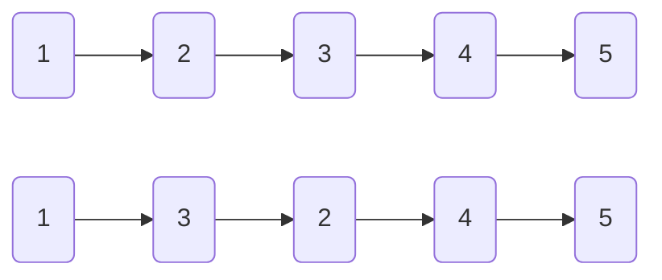
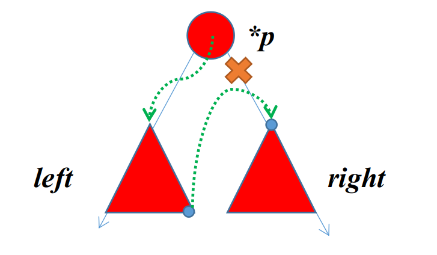

# Linked-list


[TOC]


## Definition


$$
线性表 \Rightarrow 
\begin{cases}
单链表
\\
双链表
\\
循环链表
\\静态链表 \Leftarrow (\textcolor{red}{ARRAY})
\end{cases}
$$


## Operation

### Search

By `index` or `value`.


### Insert

**头插法&&尾插法建立单链表**

头插就是将新元素插在链表头部，尾插就是将新元素插在链表尾部。

<font color = darkgreen><b>HEAD</b></font>

```c++
s->next = head->next;
head->next = s;
```

<font color = darkgreen><b>TAIL</b></font>

```c++
tail->next = s;
tail = s;
```

下面来讨论插入操作。以前2种插入操作为例。

<font color = darkgreen><b>Single</b></font>

```c++
s->next = p->next;
p->next = s;
```

<font color = darkgreen><b>Double</b></font>

```c++
s->next = p->next;
s->prior = p;
p->next->prior = s;
p->next = s;
```

总结一下，就是`*p->next`的操作要放到最后。


### Delete

没啥好说的，直接删除就可以。

## LeetCode

### [ 反转链表 II](https://leetcode-cn.com/problems/reverse-linked-list-ii/)

反转从位置 *m* 到 *n* 的链表。请使用一趟扫描完成反转。

**说明:**
1 ≤ *m* ≤ *n* ≤ 链表长度。

```
输入: 1->2->3->4->5->NULL, m = 2, n = 4
输出: 1->4->3->2->5->NULL
```

**思路分析：**

我们这里使用迭代的方法实现。先定位到指定的区间，再操作。



> $\begin{cases} 2 \to 4 \\ 3\to 2 \\ 1 \to 3 \end{cases}$


3 pointers: `pre,p,next`.

核心代码如下：

```c++
 			next = p->next;
            p->next = next->next;
            next->next = pre->next;
            pre->next = next;
```


### [删除排序链表中的重复元素 II](https://leetcode-cn.com/problems/remove-duplicates-from-sorted-list-ii/)

```
输入: 1->2->3->3->4->4->5
输出: 1->2->5
```

---

想法自然且直观：左右指针就可以。实现时注意细节。

3 *pointers* $\to$ $\begin{cases}dummy \\ left \\ right \end{cases}$

与其考虑左右指针的麻烦操作，不如用一个新的变量描述整个遍历的过程~

```c++
 	ListNode *p = new ListNode(0);
        p->next = head;
        head = p;
        ListNode *left = head,*right = head;
        while( p->next )
        {
            left = p->next;
            right=left;
            while( right->next && right->next->val == left->val )
            {
                right = right->next;
            }
            if( left == right ) 
            p = p->next;
            else
            p->next = right->next;
        }
```


### [复杂链表的复制](https://leetcode-cn.com/problems/fu-za-lian-biao-de-fu-zhi-lcof/)

请实现 `copyRandomList` 函数，复制一个复杂链表。在复杂链表中，每个节点除了有一个 next 指针指向下一个节点，还有一个 random 指针指向链表中的任意节点或者 null。

```
输入：head = [[7,null],[13,0],[11,4],[10,2],[1,0]]
输出：[[7,null],[13,0],[11,4],[10,2],[1,0]]
```

---

**分析：**

如果只是单纯地复制链表呢？easy！只需要一次遍历就可以完成了！

加入random后呢？$\to$ 第一次遍历是无法确定random的，因为还没有建好。

*2 times of traversals is enough. We can use hash map to save the random vale.*

具体来看：

（1）第一次遍历：我们只需要完成链表的复制和基本的链接操作即可。

（2）第二次遍历：我们需要按序填充对应的random即可。

<div align = 'center'><font color = red>TOO BAD!</font></div>

IMPROVEMENT:
==神来之笔==：省略了hash map， 构建了中间节点。最后实现链表的拆分。

```c++
        Node* phead = head;
        //  01: expand the list
        while( phead != nullptr )
        {
            Node *tmp = new Node( phead->val );
            tmp->next = phead->next;
            phead->next = tmp;
            phead = tmp->next;
        }
        //  02: build index 
        phead = head;
        while( phead != nullptr )
        {
            if( phead->random != nullptr )
            {
                phead->next->random = phead->random->next;
            }
            phead = phead->next->next;
        }
        //  03: split
        phead = head->next;
        Node* pre = head;
        Node* p = head->next;
        while( phead->next != nullptr )
        {
            pre->next = pre->next->next;
            phead->next = phead->next->next;

            pre = pre->next;
            phead = phead->next;
        }
        pre->next = nullptr;
        return p;        
```

### [扁平化多级双向链表](https://leetcode-cn.com/problems/flatten-a-multilevel-doubly-linked-list/)

多级双向链表中，除了指向下一个节点和前一个节点指针之外，它还有一个子链表指针，可能指向单独的双向链表。这些子列表也可能会有一个或多个自己的子项，依此类推，生成多级数据结构，如下面的示例所示。

给你位于列表第一级的头节点，请你扁平化列表，使所有结点出现在单级双链表中。

```
输入：head = [1,2,3,4,5,6,null,null,null,7,8,9,10,null,null,11,12]
输出：[1,2,3,7,8,11,12,9,10,4,5,6]
```

---


很朴素的想法：斜过来看，是二叉树的遍历。（参考森林的定义）又是先序遍历。DFS可解。

我们用一个序列存储指定顺序的有效元素的地址。`vector<Node*>`

*`preorder`*的核心代码：

```c++
 res.push_back( head );
 DFS( head->child );
 DFS( head->next );
```


### [合并K个升序链表](https://leetcode-cn.com/problems/merge-k-sorted-lists/)

给你一个链表数组，每个链表都已经按升序排列。

请你将所有链表合并到一个升序链表中，返回合并后的链表。

------

<u>***参考并推广两个数组合并的情景？***</u> ： 如果我们定义三个指针，那么我们每次返回的都是最小的那个，同时它向后加一。

我们的思路类似，问题在于我们不确定到底有多少个链表。因此我们可以考虑**优先队列**。以此近似地模拟多个指针的移动。

````c++
 		//  save the head of all the lists
        for( auto&l : lists ) if( l ) queue.push( l );
        //  move each head pointer
        auto p = &head;
        while( !queue.empty() )
        {
            p->next = queue.top();
            p = p->next;
            queue.pop();
            
            if( p->next ) queue.push( p->next );
        }
````


### [两两交换链表中的节点](https://leetcode-cn.com/problems/swap-nodes-in-pairs/)

给定一个链表，两两交换其中相邻的节点，并返回交换后的链表。

**你不能只是单纯的改变节点内部的值**，而是需要实际的进行节点交换。

```
输入：head = [1,2,3,4]
输出：[2,1,4,3]
```

------

<div align = 'center'><B><I><font color = red>Recursion or Iteration?</I></B></div>

***Recursion***

我们考虑对于一个节点`*p`，在调整的过程中会受到波及的节点，一个是`next`。我们如果用递归的话，每次返回的都是（当前节点开始，）到尾的排好序的链表的表头，我们简单梳理一下这三者的关系：


我们的代码也就呼之欲出了：

```c++
        ListNode *pNext = head->next;
        head->next = swapPairs( pNext->next );
        pNext->next = head;
```

***Iteration***

类似地，我们同样可以以此考虑迭代的整个过程。这里我们可以发现，涉及到的节点有三个，还包括之前的节点`prev`。或者说，就是当前节点之后的两个节点。


换句话说，我们**每次跳两格**，**每次只改变后面两个节点的位置。**

```c++
            temp->next = n2;
            n1->next = n2->next;
            n2->next = n1;
```


### [ K 个一组翻转链表](https://leetcode-cn.com/problems/reverse-nodes-in-k-group/)

给你一个链表，每 k 个节点一组进行翻转，请你返回翻转后的链表。

k 是一个正整数，它的值小于或等于链表的长度。

如果节点总数不是 k 的整数倍，那么请将最后剩余的节点保持原有顺序。

进阶：

你可以设计一个只使用常数额外空间的算法来解决此问题吗？
你不能只是单纯的改变节点内部的值，而是需要实际进行节点交换。

```
输入：head = [1,2,3,4,5], k = 2
输出：[2,1,4,3,5]
```

---

我们计数每一个小的循环，判断并将它们给循环。（k'）之后我们可以采用***<u>递归</u>***的方法，返回新的头节点然后拼接起来。

关键就是那个k个节点的颠倒。我们规定如果个数不满足，就不颠倒。


如图，我们先获得头节点和尾节点，然后两边移动：

```c++
    ListNode* reverseK( ListNode* head,ListNode* tail )
    {
        ListNode* p = tail;
        while( head != tail )
        {
            ListNode* nxt = head->next;
            head->next = p;
            p = head;
            head = nxt;
        }
        return p;
    }
```


### [环形链表 II](https://leetcode-cn.com/problems/linked-list-cycle-ii/)

给定一个链表，返回链表开始入环的第一个节点。 如果链表无环，则返回 null。

为了表示给定链表中的环，我们使用整数 pos 来表示链表尾连接到链表中的位置（索引从 0 开始）。 如果 pos 是 -1，则在该链表中没有环。注意，pos 仅仅是用于标识环的情况，并不会作为参数传递到函数中。

说明：不允许修改给定的链表。

进阶：

你是否可以使用 O(1) 空间解决此题？

-----

数据结构期末考试最后一题。

***<u>快慢指针</u>***  yyds！

step 1:

```c++
        do{
            if( fast == nullptr || fast->next == nullptr ) return nullptr;
            fast = fast->next->next;
            slow = slow->next;
        }
        while( fast != slow );
```

step 2:

```c++
        fast = head;
        while( fast != slow )
        {
            slow = slow->next;
            fast = fast->next;
        }
        return slow;
    }
```

证明有空就补。


### [有序链表转换二叉搜索树](https://leetcode-cn.com/problems/convert-sorted-list-to-binary-search-tree/)

给定一个单链表，其中的元素按升序排序，将其转换为高度平衡的二叉搜索树。

本题中，一个高度平衡二叉树是指一个二叉树每个节点 的左右两个子树的高度差的绝对值不超过 1。

```
给定的有序链表： [-10, -3, 0, 5, 9],

一个可能的答案是：[0, -3, 9, -10, null, 5], 它可以表示下面这个高度平衡二叉搜索树：

      0
     / \
   -3   9
   /   /
 -10  5
```

---

有序链表构造平衡二叉搜索树，显然根节点是在中间。自然而然地想到递归。而中间结点显然快慢指针可以实现。答案就呼之欲出了：

```c++
 		//  有序 -> middle
        if( !head ) return nullptr;
        else if( !head->next ) return new TreeNode( head->val );
     
        //  get middle node
        ListNode* slow = head;
        ListNode* p = head->next;
        ListNode* fast = p->next;
        while( fast && fast->next )
        {
            slow = slow->next;
            p = slow->next;
            fast = fast->next->next;
        } 

        //  split the tree
        TreeNode* root = new TreeNode(p->val);
        slow->next = nullptr;
        //  recursion
        root->left = sortedListToBST( head );
        root->right = sortedListToBST( p->next );
        return root; 
```

官方题解的另一种解法也是递归：链表就是中序遍历的结果。换句话说，我们已经知道了整个树的结构。我们还是只要确定根节点就🆗了。


### [两数相加 II](https://leetcode-cn.com/problems/add-two-numbers-ii/)

给你两个 非空 链表来代表两个非负整数。数字最高位位于链表开始位置。它们的每个节点只存储一位数字。将这两数相加会返回一个新的链表。

你可以假设除了数字 0 之外，这两个数字都不会以零开头。

```
输入：(7 -> 2 -> 4 -> 3) + (5 -> 6 -> 4)
输出：7 -> 8 -> 0 -> 7
```

---

换句话说，就是链表实现加法，但是按照从低位加的原则，我们需要**颠倒数组**。比较显然的是用`stack`实现。

```c++
 			while( !stack1.empty() || !stack2.empty() || carry!=0 )
        {
            int e1 = stack1.empty()? 0:stack1.top();
            int e2 = stack2.empty()? 0:stack2.top();
            int t = e1+e2+carry;
            carry = t/10;
            t=t%10;

            if( !stack1.empty() ) stack1.pop();
            if( !stack2.empty() ) stack2.pop();
            ListNode* pNode = new ListNode(t);
            pNode->next = p;
            p = pNode;
        }
        //	return p;
```


### [面试题 02.01. 移除重复节点](https://leetcode-cn.com/problems/remove-duplicate-node-lcci/)

编写代码，移除未排序链表中的重复节点。保留最开始出现的节点。

---

很简单的题目，逻辑也很清晰。我们用`set`存放所有已经出现了的值。每次都去查看是否已经有了。这里就需要一个前继节点`pre`。

```c++
        unordered_set<int> set;
        while( p )
        {
            if( set.count( p->val ) ) 
            {
                pre->next = p->next;
                p = p->next;
            }
            else
            {
                set.insert( p->val );
                pre = p;
                p = p->next;
            }
        }
```


### <font color = red size = 8>$\star$</font>[面试题 02.07. 链表相交](https://leetcode-cn.com/problems/intersection-of-two-linked-lists-lcci/)

给定两个（单向）链表，判定它们是否相交并返回交点。请注意相交的定义基于节点的引用，而不是基于节点的值。换句话说，如果一个链表的第k个节点与另一个链表的第j个节点是同一节点（引用完全相同），则这两个链表相交。

---

简单来说就是找出两个链表的交点节点。最暴力的办法就是两个集合存对应的地址。然后依次去比较。

- 考虑这样一种解法：我们首先需要明确这样一点：如果两个链表相交于节点`*p`，那么在`*P`之后的所有节点都应该完全相同，因为完全相同的两个节点，它们的指向也是一样的（==<font color = red>***链表的节点不是树的节点！***</font>==）。

  ```c++
          while( p1 && p2 )
          {
              if( p1 == p2 ) return p1;
              else{
                  p1 = p1->next;
                  p2 = p2->next;
              }
          }
  ```

  此时要注意，两个链表不一定相同，我们需要多走一步：消除两个链表之间的长度差距。	

  ```c++
          while(p1){
              p1 = p1->next;
              l1++;
          }
          while(p2){
              p2 = p2->next;
              l2++;
          }
          p1 = headA;
          p2 = headB;
  
          
          int delta = 0;
          if( l1>=l2 ){
              delta = l1-l2;
              while( delta-- ) p1 = p1->next;
          }
          else
          {
              delta = l2-l1;
              while( delta-- ) p2 = p2->next;
          }
  ```

- 事实上，我们还有这样一种写法，可能是从寻找环的入口得到的启发：

  ```c++
          ListNode* p1 = headA;
          ListNode* p2 = headB;
  
          while( p1 != p2 )
          {
              p1 = ( p1 == nullptr? headB:p1->next );
              p2 = ( p2 == nullptr? headA:p2->next );
          }
          return p1;
  
  ```

  其实本质上是一样的，我们可以证明最多两圈就可以相遇。

（Tip：本题是2012年考研原题。）


### [二叉树展开为链表](https://leetcode-cn.com/problems/flatten-binary-tree-to-linked-list/)


给你二叉树的根结点 `root` ，请你将它展开为一个单链表：

- 展开后的单链表应该同样使用 `TreeNode` ，其中 `right` 子指针指向链表中下一个结点，而左子指针始终为 `null` 。
- 展开后的单链表应该与二叉树 [**先序遍历**](https://baike.baidu.com/item/先序遍历/6442839?fr=aladdin) 顺序相同。


---

直观的想法还是两种：递归和迭代。

<center><b>递归</b></center>

很自然地就可以得出顺序：$*p \to p.left \to p.right$。

```c++
    if( root == nullptr ) return;
    flatten( root->left );
    flatten( root->right );

```

但是需要注意（这也是树和链表的重要区别）：我们转化为链表的时候，**只有一个指针域是有效的**。换句话说，我们需要将左（右）子树清空。




```c++
    TreeNode* pright = root->right;
    root->right = root->left;
    root->left = nullptr;
	//	get the rightest of the left-subTree
    TreeNode* t = root;
    while( t->right ) t = t->right;
    t->right = pright;    
```


<center><b>迭代</b></center>

本质上来看，迭代和递归两者并没有太大的区别。迭代就是递归栈的显式实现。先序的话，我们遵循“先左后右”的原则。最后注意把树改为链表即可。

```c++

        while( p!=nullptr || !stack.empty() )
        {
            //  push(p) and move forward
            while( p!=nullptr )
            {
                res.push_back( p );
                stack.push( p );
                p = p->left;
            }

            //  p => p.right
            p = stack.top();
            stack.pop();
            p = p->right;
        }
```


## 模拟题 && 真题

### 合并两个有序链表

将两个升序链表合并为一个新的 **升序** 链表并返回。新链表是通过拼接给定的两个链表的所有节点组成的。 

---

我们用递归和迭代两种方法来实现。直接上代码。

首先是**递归**。

```c++
        if( l1 == nullptr ) return l2;
        if( l2 == nullptr ) return l1;
        if( l1->val < l2->val )
        {
            l1->next = mergeTwoLists( l1->next,l2 );
            return l1;
        }
        else
        {
            l2->next = mergeTwoLists( l2->next,l1 );
            return l2;
        }
```

至于**迭代**，我们加入`dummyNode`来帮助实现。

```c++
        ListNode* dummyNode = new ListNode(-1);
        ListNode* pre = dummyNode;

        while( l1 != nullptr && l2 != nullptr )
        {
            if( l1->val < l2->val )
            {
                pre->next = l1;
                l1 = l1->next;
            }
            else
            {
                pre->next = l2;
                l2 = l2->next;
            }
            pre = pre->next;
        }
        pre->next = l1==nullptr?l2:l1;
        return dummyNode->next;
```

 

### [反转链表](https://leetcode-cn.com/problems/fan-zhuan-lian-biao-lcof/)

定义一个函数，输入一个链表的头节点，反转该链表并输出反转后链表的头节点。

```
输入: 1->2->3->4->5->NULL
输出: 5->4->3->2->1->NULL
```

---

很经典的题目。我们用迭代和递归两种方法去实现。

- **迭代**


我们分析`*p`时。完成$p \to pre$后进行两个指针的移动。但是此时我们已经改变了p的位置，因此我们需要提前对这个指针进行保存。简单来说，就是需要三个指针：

```c++
        ListNode* pre = nullptr;
        ListNode* p = head;
        ListNode* next = nullptr;
```

代码如下：

```c++
        while( p )
        {
            next = p->next;
            p->next = pre;
            pre = p;
            p = next;
        }
        return pre;
```

- **递归**

递归的思路大致上一致：

```c++
        ListNode *phead = reverseList( head->next );       				head->next->next = head;        
		head->next = nullptr;        
		return phead;
```


### [重排链表](https://leetcode-cn.com/problems/reorder-list/)

给定一个单链表 L 的头节点 head ，单链表 L 表示为：

 `L0 → L1 → … → Ln-1 → Ln` 
请将其重新排列后变为：

`L0 → Ln → L1 → Ln-1 → L2 → Ln-2 → …`

```
输入: head = [1,2,3,4]
输出: [1,4,2,3]
```

---

这是2019年考研真题。题目要求是O(1)的空间复杂度。

也就是说，我们只能在原链表上进行操作。大体上来看分为以下几步：

**1、快慢指针找到中间节点**

**2、反转后半段链表**

**3、合并前半段链表和后半段链表。**

画图的话是可以发现的。但我们需要进一步思考：***到底怎么想到的***？

我们想到首尾指针的配对，自然地想到**中点**。然后我们需要注意一下整体的顺序。这样来说答案就顺理成章了。

---

```c++
    void reorderList(ListNode* head) {
        //	step 1
        ListNode* mid = findMiddleNode(head);
        //	step 2
        ListNode* l1 = head;
        ListNode* l2 = mid->next;
        mid->next = nullptr;
        l2 = reverseList(l2);
		//	step 3
        mergeList(l1,l2);
    }
```

（思考：如何用`stack`实现？用`deque`属于是偷懒了）