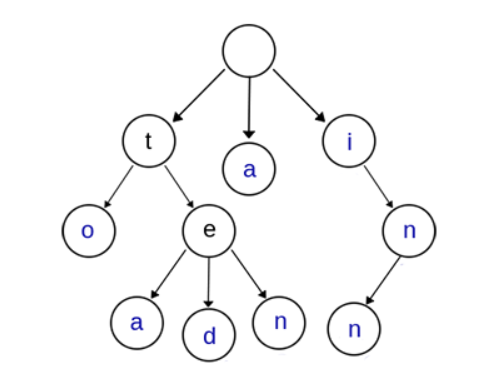

[TOC]

# :bat:刷题

$$
Dong\_Rui \  continue  \ \ refreshing
\\
---------------------------
$$


# 滑动窗口算法

## Sliding Window in Network

skip.

## Sliding Windows

滑动窗口的基本思想是将二维的嵌套循环转为一维。我们希望避免指针回头，即两个指针始终**朝着一个方向！**（否则复杂度会上升一个维度）

### ex1

给定一个整数数组，计算长度为 **'k'** 的连续子数组的最大总和。
$$
for \ i \ < \ n-k+1
\\
for \ j \ < \ k
\\
sum = sum+currentValue
$$
OK, but the cost is $O(k*n)$. What is the improvement?

------

Two points: $left \ \& \ right$
$$
maxSum = S[0:k-1]
\\
sum = maxSum
\\
for \ i \ in \ (k,n)
\\
sum += \Delta S
\\
maxSum = \max(maxSum,sum)
$$


### ex2

给定一个字符串S和一个字符串T，请在S中找出包含T所有字母的最小子串。(minimum-window substring)


**First step:**


$\begin{cases} left = 0 \\ right = k_0 \end{cases}$ How to move 2 pointers?

Notice that the result satisfies that 
$$
result \le l_0 = (k_0 - 0)
$$
We need to shrink the total size but not expand it.

- move left：希望破坏已有的解
- move right：希望找到新的解

**Second step:**

 $\Rightarrow$

$End \ when \ right \ reaches \ the \ end.$
$$
while \ right <S.length
\\
$$


### ex3

[1423. 可获得的最大点数](https://leetcode-cn.com/problems/maximum-points-you-can-obtain-from-cards/)

几张卡牌 排成一行，每张卡牌都有一个对应的点数。点数由整数数组 cardPoints 给出。

每次行动，你可以从行的开头或者末尾拿一张卡牌，最终你必须正好拿 k 张卡牌。

你的点数就是你拿到手中的所有卡牌的点数之和。

给你一个整数数组 cardPoints 和整数 k，请你返回可以获得的最大点数。

```
输入：cardPoints = [1,2,3,4,5,6,1], k = 3
输出：12
解释：第一次行动，不管拿哪张牌，你的点数总是 1 。但是，先拿最右边的卡牌将会最大化你的可获得点数。最优策略是拿右边的三张牌，最终点数为 1 + 6 + 5 = 12。
```

<font color = red>**等价于求中间连续数组的最小值**</font>

$sliding \ window:size=(length-k)$

### ex4

[992. K 个不同整数的子数组](https://leetcode-cn.com/problems/subarrays-with-k-different-integers/)

给定一个正整数数组 A，如果 A 的某个子数组中不同整数的个数恰好为 K，则称 A 的这个连续、不一定独立的子数组为好子数组。

（例如，[1,2,3,1,2] 中有 3 个不同的整数：1，2，以及 3。）

返回 A 中好子数组的数目。

```
输入：A = [1,2,1,2,3], K = 2
输出：7
解释：恰好由 2 个不同整数组成的子数组：[1,2], [2,1], [1,2], [2,3], [1,2,1], [2,1,2], [1,2,1,2].
```

------

常规做法：

- $Map<key,count>$
- $left \ \& \ right$

We move right first until  it <font color = red>**$cannot$**</font> move.($k_0>k$)

Then we move left until it <font color = red>$cannot$</font> move.($k_0 < k$)

**Notice:**

（1）对于$right$每到达一个新的位置，所有的新的情况均在此时的$left$和$right$之间产生，不需要考虑其他因素。

（2）移动$left$首先得到的是刚好符合条件，即最大的区间。

------

**$reference \ code$**
$$
ret = right - left
\\
res = getMostDistinct(A,k)-getMostDistinct(k-1)
$$
**Why?**

The results are in the form of $(l',right),l' \in [left,right)]$,which means <font color = red>$Backtracking$</font>!

### [220. 存在重复元素 III](https://leetcode-cn.com/problems/contains-duplicate-iii/)

给你一个整数数组 nums 和两个整数 k 和 t 。请你判断是否存在 两个不同下标 i 和 j，使得 abs(nums[i] - nums[j]) <= t ，同时又满足 abs(i - j) <= k 。如果存在则返回 true，不存在返回 false。

```
输入：nums = [1,2,3,1], k = 3, t = 0
输出：true
```

------

这是一个滑动窗口的变式。下标是为了限制窗口的大小，`nums[i]`中的值则是为了进行判断与筛选。

朴素的想法是我们每次维护一个固定的窗口，然后检查该固定窗口是否存在成立的解，存在则返回。这里我们只能在查找操作中优化。使用STL中的`set`以及对应的操作。

```c++
            auto it = res.lower_bound( max(nums[i],INT_MIN+t)-t );
            if( it != res.end() && *it <= min(nums[i],INT_MAX-t)+t ) return true;

            res.insert( nums[i] );
            if( i>=k ) res.erase( nums[i-k] );	// 保证窗口大小
```

> 执行用时：24 ms, 在所有 C++ 提交中击败了90.65%的用户
>
> 内存消耗：15.1 MB, 在所有 C++ 提交中击败了17.16%的用户

参考答案使用桶排序仍然是对查找的优化。（效果其实并不好。）

直接上滑动窗口呢？（双指针）老规矩，先动右（扩张），再动左（收缩）。（<font size = 2 color = gray>但是这样时间上很烂。因为不是二分，可以看成另一种形式的暴力。</font>）

### [剑指 Offer 48. 最长不含重复字符的子字符串](https://leetcode-cn.com/problems/zui-chang-bu-han-zhong-fu-zi-fu-de-zi-zi-fu-chuan-lcof/)

```
输入: "abcabcbb"
输出: 3 
解释: 因为无重复字符的最长子串是 "abc"，所以其长度为 3。
```

---

滑动窗口+左右指针：**先右指针**，如果发现当前元素已经访问过，那我们移动左指针（减小窗口的规模），注意保存结果。

```c++
        while( right<s.size() )
        {
            while( used[s[right]] == true ) 
                used[ s[left++] ] = false;
            // move left
            res = max( res,right-left+1 );
            used[ s[right++] ] = true;
        }
```

### [1498. 满足条件的子序列数目](https://leetcode-cn.com/problems/number-of-subsequences-that-satisfy-the-given-sum-condition/)

给你一个整数数组 nums 和一个整数 target 。

请你统计并返回 nums 中能满足其最小元素与最大元素的 和 小于或等于 target 的 非空 子序列的数目。

由于答案可能很大，请将结果对 10^9 + 7 取余后返回。

---

滑动窗口，其实有了这个提示就已经很明显了。我们这里设：
$$
\begin{cases}
left = 0
\\
right = nums.size()-1
\end{cases}
$$
这样，对于每个符合要求的left和right，总的情况就是：$2^{(right-left)}$。（**需要稍微的推导一下，为什么能不重复不遗漏**，其实很容易的啦，因为我们==只固定了一端==，就保证了不会有重复的，找到右边界就说明不会遗漏）

```c++
 		while( left<=right )
        {
            if( nums[left]+nums[right]<=target )
            {
                res = ( res+pow( right-left ) )%MOD;
                left++;
            }
            else right--;
        }
```

其实难点主要在二次幂的求法上，会溢出。

```c++
    int pow(int n){ 
        if(n<=0) return 1;
        long ans=pow(n/2)%MOD;
        if(n%2==0) return (ans*ans)%MOD; 
        return ((ans*ans)%MOD*2)%MOD;
    }
```

可以看出时间上很烂，显然可以优化。我们`dp`求过的幂次方就可以了。

```c++
		vector<int> dp(nums.size());
        dp[0] = 1;
        for( int i = 1;i != nums.size();i++ )
        {
            dp[i] = (dp[i-1]*2)%MOD;
        }
```


### [30. 串联所有单词的子串](https://leetcode-cn.com/problems/substring-with-concatenation-of-all-words/)

给定一个字符串 s 和一些 长度相同 的单词 words 。找出 s 中恰好可以由 words 中所有单词串联形成的子串的起始位置。

注意子串要与 words 中的单词完全匹配，中间不能有其他字符 ，但不需要考虑 words 中单词串联的顺序。

```
输入：s = "barfoothefoobarman", words = ["foo","bar"]
输出：[0,9]
解释：
从索引 0 和 9 开始的子串分别是 "barfoo" 和 "foobar" 。
输出的顺序不重要, [9,0] 也是有效答案。
```

---

注意这里所有的单词的长度都是一样的。并且单词不一定只出现一遍。

直觉上，对于字符串的匹配问题，比较爽的解法是`KMP`。`KMP`本质上还是字符串跳跃。这里我们首先分析一下，什么样的情况下我们是不需要匹配的。**显而易见的一点是说当我们字符串的长度就不匹配的时候，我们显然是不用看的。**这样来看，似乎我们要用滑动窗口来解决。

但是，对于单个的`word`来说，我们其实是无法直接以单词为划分跳跃的，即：$index = index + len(word)$。因为我们没法知道**单词之间的相似性**。

这样一看，似乎没有什么好方法。这里，先给出一个特别的`滑动窗口`解法。

---

我们定义左右指针$left,right$，还是**先移动右再移动左**。不同的是，我们这里对于右指针，每次移动单词长度（m）大小——换句话说，我们**由小变大**，**每次判断这个单词是否可以加进去**。这样超出窗口时，我们再移动左指针，就顺理成章了。

我们用`map`存单词和对应的次数比较合理。

```c++
    vector<int> findSubstring(string s, vector<string>& words) {
        vector<int> res;
        if( s.empty() || words.empty() ) return {};

        int length = s.size();
        int n = words.size();
        int m = words[0].size();    //  we assume each word has the same letters
        unordered_map< string,int > map;
        for( string& word:words ) map[word]++;

        for( int i = 0;i != m;i++ )
        {
            int left = i;
            int right = i;
            int totalCnt = 0;
            unordered_map<string,int> temp;

            //  move right to get the word
            while( right+m <= length )
            {
                string t = s.substr( right,m );
                right += m;
                if( map.find( t ) != map.end() )
                {
                    //  find the word
                    temp[t]++;
                    totalCnt++;
                    while( temp[t] > map[t] )
                    {
                        //  key: move left
                        //  notice that we do not minus the t string
                        string s1 = s.substr( left,m );
                        left += m;
                        temp[s1]--;
                        totalCnt--;
                    }
                    if( totalCnt == n ) res.push_back( left );
                }
                else
                {
                    //  reset
                    left = right;
                    totalCnt = 0;
                    temp.clear();
                }
            }
        }
        return res;
    }
```

（思考：我们其实可以看看能否用一般的滑动窗口去解决它。）

### [1838. 最高频元素的频数](https://leetcode-cn.com/problems/frequency-of-the-most-frequent-element/)

元素的 频数 是该元素在一个数组中出现的次数。

给你一个整数数组 nums 和一个整数 k 。在一步操作中，你可以选择 nums 的一个下标，并将该下标对应元素的值增加 1 。

执行最多 k 次操作后，返回数组中最高频元素的 最大可能频数 。

```
输入：nums = [1,2,4], k = 5
输出：3
解释：对第一个元素执行 3 次递增操作，对第二个元素执 2 次递增操作，此时 nums = [4,4,4] 。
4 是数组中最高频元素，频数是 3 。
```

---

如果我们给定了输入的`nums`和`k`，那么我们的数组和是可以确定的。我们首先需要理解这样一件事：最后出现次数最多的元素必定属于原先的元素集合：$x_i \in nums$。

结合这两点，我们从整体出发去考虑：对于一个给定的$x_i$，我们需要修改（增加）比它小的元素$x_j$（大的不需要考虑）使两者相等。此时滑动窗口的模型已经出来了。


```c++
        while( right<n )
        {
            sum += ( long long )( nums[right]-nums[right-1] )*( right-left );
            while( sum>k )
            {
                //  move left
                sum -= ( nums[right]-nums[left] );
                left++;
            }
            res = max( res,right-left+1 );
            right++;
        }
```


# 动态规划

## Basic knowledge

Skip.

## e.g.

### [面试题 17.21. 直方图的水量](https://leetcode-cn.com/problems/volume-of-histogram-lcci/)

给定一个直方图(也称柱状图)，假设有人从上面源源不断地倒水，最后直方图能存多少水量?直方图的宽度为 1。

```
输入: [0,1,0,2,1,0,1,3,2,1,2,1]
输出: 6
```

------

**思路分析：** 动态规划的思想。显然每一列的最高可达高度取决于它的左右最短。这意味着我们在每一次都需要向两边看。
$$
x[i] = min(left,right)-height[i]
$$
我们这里需要维护两个变量，left( max )和right( max )。

```c++
            left[i] = max( left[i-1],height[i] );
            right[i] = max( right[i+1],height[i] );
```


***TOO BAD!***

Improvement: We don't need `left[n],right[n]` which may waste too much space!
$$
leftMax \leftarrow leftMaxCurrent
\\
rightMax \leftarrow rightMaxCurrent
$$
我们每次只获取当前的值。动态更新left_max 和 right_max。

```c++
while( leftCurrent<rightCurrent )
        {
            if( height[leftCurrent]<height[rightCurrent] )
            {
                leftMaxCurrent = max( height[leftCurrent],leftMaxCurrent );
                res += leftMaxCurrent-height[leftCurrent];
                leftCurrent++;
            }
            else
            {
                rightMaxCurrent = max( height[rightCurrent],rightMaxCurrent );
                res += rightMaxCurrent-height[rightCurrent];
                rightCurrent--;
            }
        }
```

（思考这里if中的条件的理由。——<font size = 2>因为有可能左边后边就是右边，即遇到左右靠近的情形，否则就会出现水由高处向低处流的情形</font>）

------

当然，还有一种解法——单调栈。


### [639. 解码方法 II](https://leetcode-cn.com/problems/decode-ways-ii/)

一条包含字母 A-Z 的消息通过以下的方式进行了编码：

```
'A' -> 1
'B' -> 2
...
'Z' -> 26
除了上述的条件以外，现在加密字符串可以包含字符 '*'了，字符'*'可以被当做1到9当中的任意一个数字。
```

给定一条包含数字和字符'*'的加密信息，请确定解码方法的总数。

同时，由于结果值可能会相当的大，所以你应当对109 + 7取模。（翻译者标注：此处取模主要是为了防止溢出）

```
输入: "*"
输出: 9
解释: 加密的信息可以被解密为: "A", "B", "C", "D", "E", "F", "G", "H", "I".
```

------

经典的动态规划——备忘录思路。该题的备忘录思想比较简单，关键是对于递推关系的建立。

```c++
const int MOD = pow(10, 9) + 7;
class Solution {
public:
    int numDecodings(string s) {
        if( s.size() == 0 || s[0] =='0' ) return 0;
        int n = s.size();
        vector<int> dp(n+1);
        dp[0] = 1;

        if( s[0]=='*' ) dp[1] = 9;
        else dp[1] = 1;

        for( int i = 2;i <= n;i++ )
        {
            if( s[i-1]=='*' )
            {
                //  f(n)*9
                dp[i] = (dp[i]+dp[i-1]*9LL)%MOD;
                //  consider s[i-2]
                if( s[i-2] == '*' ) dp[i] = ( dp[i]+dp[i-2]*15LL )%MOD; // why 15?
                else if( s[i-2] == '1' ) dp[i] = ( dp[i]+dp[i-2]*9LL )%MOD;
                else if( s[i-2] == '2' ) dp[i] = ( dp[i]+dp[i-2]*6LL )%MOD;
            }
            else
            {
                if( s[i-1] != '0' ) dp[i] += dp[i-1]%MOD;
                //  consider s[i-2]
                if( s[i-2] == '1' || ( s[i-2] == '2' && s[i-1]-'0'<=6 ) ) dp[i] = (dp[i]+dp[i-2])%MOD;
                if( s[i-2] == '*' )
                {
                    //  1x
                    if( s[i-1]-'0' > 6 ) dp[i] = (dp[i]+dp[i-2])%MOD;
                    else dp[i] = ( dp[i]+dp[i-2]*2LL )%MOD;
                }
            }
        }
        return dp[n];
    }
};
```

我们不妨记$s[0:n] = s[0:(n-1)]+\delta$，分类：

$1^{o}$ $\delta = '*'$

显然有$dp[n-1]$的部分。那么$dp[n-2]$的部分该怎么考虑呢？

我们考虑$s[n-1]$，即我们考虑$\overline{s[n-1]\cdot\delta}$能否构成一个有意义的符号，即$s[n-1]$为1，为2，或者为`"*"`。

注意这里第三种情况我们视为前两种的***加和***。换言之，我们对于产生相同结果的不同表达式是**看成不同的解的。**

$2^{o}$ $\delta \not= '*'$

同理。稍有不同的是$s[n-1] ='*'$的情况。核心还是看$\overline{s[n-1]\cdot\delta}$能否构成有意义的符号，这个时候我们对于$\delta$是否超过6进行进一步的细分。


### [377. 组合总和 Ⅳ](https://leetcode-cn.com/problems/combination-sum-iv/)

给你一个由 不同 整数组成的数组 nums ，和一个目标整数 target 。请你从 nums 中找出并返回总和为 target 的元素组合的个数。

题目数据保证答案符合 32 位整数范围。

```
输入：nums = [1,2,3], target = 4
输出：7
解释：
所有可能的组合为：
(1, 1, 1, 1)
(1, 1, 2)
(1, 2, 1)
(1, 3)
(2, 1, 1)
(2, 2)
(3, 1)
```

---

一种显然的方法是DFS。注意这里的数字是可以无限重复的。换句话说，我们回溯的时候没必要记住开始的位置，直接从头再来就OK。我们又加了一个cache缓存。

```c++
       	int res = 0;
        if( dp[target] != -1 ) return dp[target];
        for( auto& n:nums )
        {
            if( n>target ) break;
            else if( n==target )
            {
                res++;
                break;
            }
            else
                res += DFS( nums,target-n );//  the number can repeat!
        }
        dp[target] = res;
        return res;
```

下面我们考虑动态规划。我们可以参考锯钢条的例子。使用数组存储：$dp[0:target]$。其中，我们有：
$$
dp[i] = dp[j]+nums[k],
i > j
$$


### [198. 打家劫舍](https://leetcode-cn.com/problems/house-robber/)

你是一个专业的小偷，计划偷窃沿街的房屋。每间房内都藏有一定的现金，影响你偷窃的唯一制约因素就是相邻的房屋装有相互连通的防盗系统，如果两间相邻的房屋在同一晚上被小偷闯入，系统会自动报警。

给定一个代表每个房屋存放金额的非负整数数组，计算你 不触动警报装置的情况下 ，一夜之内能够偷窃到的最高金额。

```
输入：[1,2,3,1]
输出：4
	解释：偷窃 1 号房屋 (金额 = 1) ，然后偷窃 3 号房屋 (金额 = 3)。
	偷窃到的最高金额 = 1 + 3 = 4 。
```

------

典型的dp问题，dp的思路：
$$
dp[i] = max( dp[i-2]+nums[i],dp[i-1] )
$$
处理好边界（开头两个）就OK了。
可以在空间上进一步优化：我们不难发现，我们需要的只是前两个的值，因此，我们只需要动态地保存这两个值就可以了。

```c++
        int n = nums.size();
        int first = nums[0];
        int second = max( nums[0],nums[1] );
        for( int i = 2;i != n;i++ )
        {
            int temp = second;
            second = max( second,first+nums[i] );
            first = temp;
        }
        return second;
```

### [740. 删除并获得点数](https://leetcode-cn.com/problems/delete-and-earn/)

给你一个整数数组 nums ，你可以对它进行一些操作。

每次操作中，选择任意一个 nums[i] ，删除它并获得 nums[i] 的点数。之后，你必须删除每个等于 nums[i] - 1 或 nums[i] + 1 的元素。

开始你拥有 0 个点数。返回你能通过这些操作获得的最大点数。

```
输入：nums = [3,4,2]
输出：6
解释：
删除 4 获得 4 个点数，因此 3 也被删除。
之后，删除 2 获得 2 个点数。总共获得 6 个点数。
```

------


### [停在原地的方案数](https://leetcode-cn.com/problems/number-of-ways-to-stay-in-the-same-place-after-some-steps/)

有一个长度为 arrLen 的数组，开始有一个指针在索引 0 处。

每一步操作中，你可以将指针向左或向右移动 1 步，或者停在原地（指针不能被移动到数组范围外）。

给你两个整数 steps 和 arrLen ，请你计算并返回：在恰好执行 steps 次操作以后，指针仍然指向索引 0 处的方案数。

由于答案可能会很大，请返回方案数 模 10^9 + 7 后的结果。

---

答案的思路很简单：

$dp[i][j]$表示i步，***<u>走到下标j</u>***的方案数。递推关系是显然的：
$$
dp[i][j] = dp[i-1][j-1]+dp[i-1][j]+dp[i-1][j+1]
$$
然而我当时在做的时候，思路却没转过来，当时想的是$dp[i][j]$就表示i步，***<u>j长度</u>***的方案数。我们分类是以第一步为准的。第一步不动或向右。
$$
dp[i][j] = dp[i-1][j]+dp[i-2][j-1]+dp[i-2][j]
$$
到这里和编程已经没关系了，下面就是看这两种是否是等价的。当然其实是等价的，但是两边的dp代表的含义是完全不同，在证明的时候是要做转化的。

------

当然我们是可以减少空间消耗的，因为每次只需要三个数据就可以了。

```c++
#define N 502
#define M 1000000007
class Solution {
public:
    int dp[N]={1};
    int numWays(int steps, int arrLen) {
        for(int i=1;i<=steps;++i)
        for(int j=0,now=0;j<=min(i,arrLen-1);++j)
        {
            swap(now,dp[j]);
            dp[j]=((now+dp[j])%M+dp[j+1])%M;
        }
        return dp[0];
    }
};
```


---

<center><font size = 5 color = red><B>背包问题</B></font></center>

### [474. 一和零](https://leetcode-cn.com/problems/ones-and-zeroes/)

给你一个二进制字符串数组 strs 和两个整数 m 和 n 。

请你找出并返回 strs 的最大子集的大小，该子集中 最多 有 m 个 0 和 n 个 1 。

如果 x 的所有元素也是 y 的元素，集合 x 是集合 y 的 子集 。

```
输入：strs = ["10", "0001", "111001", "1", "0"], m = 5, n = 3
输出：4
解释：最多有 5 个 0 和 3 个 1 的最大子集是 {"10","0001","1","0"} ，因此答案是 4 。
其他满足题意但较小的子集包括 {"0001","1"} 和 {"10","1","0"}。{"111001"} 不满足题意，因为它含 4 个 1 ，大于 n 的值 3。
```

---

**分析**

我们反过来看，即含有m个0和n个1，最多可以包含多少个子集元素。这样我们用`dp[i][j]`来表示。写出递推方程：
$$
dp[i][j] = max( dp[i][j],(dp[i-zero][j-one]+1) )
$$


### [494. 目标和](https://leetcode-cn.com/problems/target-sum/)

给你一个整数数组 nums 和一个整数 target 。

向数组中的每个整数前添加 '+' 或 '-' ，然后串联起所有整数，可以构造一个 表达式 ：

例如，nums = [2, 1] ，可以在 2 之前添加 '+' ，在 1 之前添加 '-' ，然后串联起来得到表达式 "+2-1" 。
返回可以通过上述方法构造的、运算结果等于 target 的不同 表达式 的数目。

---

```
输入：nums = [1,1,1,1,1], target = 3
输出：5
解释：一共有 5 种方法让最终目标和为 3 。
-1 + 1 + 1 + 1 + 1 = 3
+1 - 1 + 1 + 1 + 1 = 3
+1 + 1 - 1 + 1 + 1 = 3
+1 + 1 + 1 - 1 + 1 = 3
+1 + 1 + 1 + 1 - 1 = 3
```

---

回溯是比较好想的方法，考虑到解的结构（$<x_i>,i \in [1,n],s_i \in \{0,1\}$）。非常直接的思路：

```c++
    void dfs( vector<int>& nums,int target,int index,int sum )
    {
        //  边界条件    
        if( index == nums.size() )
        {
            if( target == sum ) count++;
        }
        else
        {
            //  backtracking
            dfs( nums,target,index+1,sum + nums[index] );
            dfs( nums,target,index+1,sum - nums[index] );
        }
    }
```

显然这么写是不够的，我们要考虑简化。我们使用动态规划解决这道题。我们构思一下怎么构造我们的备忘录。

这里的构造方法其实和

[一和零]: https://leetcode-cn.com/problems/ones-and-zeroes/

有异曲同工之处。和通常地记录每一个数字的情况不同，我们这里`dp[i]`的下标是和$sum$的值。如果考虑和的话，就很容易了，对于每一个数字，我们都有：
$$
dp[i] += dp[i-sum]
$$

```c++
        int sum = accumulate( nums.begin(),nums.end(),0 );
        int delta = sum - target;
        //  编号的话，一正一负相当于减去了两次
        if( delta<0 || delta%2 != 0 ) return 0;
        delta = delta/2;

        vector<int> dp( delta+1 );
        dp[0] = 1;
        for( auto& num:nums )
        {
            //  和0，1题相似，我们这里是对每一个num进行计算
            for( int i = delta;i >= num;i-- )
            {
                dp[i] += dp[i-num];
            }
        }
```

需要注意的是这里我们一开始求的是和，当我们把一个加号变成减号的时候，其实是相差了两个数值。


### [1449. 数位成本和为目标值的最大数字](https://leetcode-cn.com/problems/form-largest-integer-with-digits-that-add-up-to-target/)


给你一个整数数组 `cost` 和一个整数 `target` 。请你返回满足如下规则可以得到的 **最大** 整数：

- 给当前结果添加一个数位（`i + 1`）的成本为 `cost[i]` （`cost` 数组下标从 0 开始）。
- 总成本必须恰好等于 `target` 。
- 添加的数位中没有数字 0 。

由于答案可能会很大，请你以字符串形式返回。

如果按照上述要求无法得到任何整数，请你返回 "0" 。

 ```
输入：cost = [4,3,2,5,6,7,2,5,5], target = 9
输出："7772"
解释：添加数位 '7' 的成本为 2 ，添加数位 '2' 的成本为 3 。所以 "7772" 的代价为 2*3+ 3*1 = 9 。 "977" 也是满足要求的数字，但 "7772" 是较大的数字。
 数字     成本
  1  ->   4
  2  ->   3
  3  ->   2
  4  ->   5
  5  ->   6
  6  ->   7
  7  ->   2
  8  ->   5
  9  ->   5
 ```

---

还是经典的背包问题。（○|￣|_）这里多了一个对于原先的个数，实现了一个到`string`的转变。

事实上，对于背包类问题，难点在于一个遍历以及更新备忘录的顺序。

```c++
 for( int i = 0;i != n;i++ ) // for each c in cost
        {
            for( int j =1;j <=target;j++ )
            {
             if( j>=cost[i] && dp[j-cost[i]]!="#" )
                dp[j] = getMaxString( dp[j],to_string(i+1)+dp[j-cost[i]] );
            }
        }
        if( dp[target] == "#" ) return "0";
        else return dp[target];
```

### [560. 和为K的子数组](https://leetcode-cn.com/problems/subarray-sum-equals-k/)

给定一个整数数组和一个整数 **k，**你需要找到该数组中和为 **k** 的连续的子数组的个数。

---

暴力显然可以解决，但是很烂。我们这里首先考虑前缀和：
$$
sum(i,j) = presum(j)-presum(i-1)
$$
这样子，我们就可以将暴力的结果降低一维。我们继续优化。

我们想：如果我能知道每个前缀和对应的次数，是不是就可以简化了？答案是可以的。如果我们知道$presum(i),presum(i+k)$存在，我们就可以放心的加上$presum(i)$了。（**理解！**）

```c++
        for( auto&n:nums )
        {
            preSum += n;
            if( map.find( preSum-k ) != map.end() ) cnt += map[preSum-k];

            map[preSum]++;
        }
```

这个逻辑是完美的。关键是开头的值怎么设置？我们这里只需要设置`map[0] = 1`即可。


# 单调栈

单调栈定义类比单调队列，此处略。


### [739. 每日温度](https://leetcode-cn.com/problems/daily-temperatures/)

请根据每日 气温 列表，重新生成一个列表。对应位置的输出为：要想观测到更高的气温，至少需要等待的天数。如果气温在这之后都不会升高，请在该位置用 0 来代替。

例如，给定一个列表 temperatures = [73, 74, 75, 71, 69, 72, 76, 73]，你的输出应该是 [1, 1, 4, 2, 1, 1, 0, 0]。

------

比较直观的想法是可以用单调队列去解，从后往前。但是这个不完全准确。注意到一个明显的区别：单调队列中处理的滑动窗口是有定长的，这里长度是不固定的。

我们用单调栈来实现。先上代码：

```c++
        for( int i = 0;i != n;i++ )
        {
            while( !stack.empty() && T[i]>T[stack.top()] )
            {
                int prev = stack.top();
                res[ prev ] = i-prev;
                stack.pop();
            }
            stack.push( i );
        }
        return res;
```


这里的思维其实是有一点相反的：我们用当前的$index$去更新栈中所有符合要求的$index$。具体来看：

（1）显然栈中所有的元素对应的下标此时都没有更新（其实还没赋值）。

（2）栈顶元素前面的元素还需要看嘛？答案是不需要，因为可以证明，如果一个元素在栈顶前就被弹出去了，说明最优解一定在栈顶以前。


### [84. 柱状图中最大的矩形](https://leetcode-cn.com/problems/largest-rectangle-in-histogram/) 

给定 *n* 个非负整数，用来表示柱状图中各个柱子的高度。每个柱子彼此相邻，且宽度为 1 。求在该柱状图中，能够勾勒出来的矩形的最大面积。


以上是柱状图的示例，其中每个柱子的宽度为 1，给定的高度为 `[2,1,5,6,2,3]`。

------

有一种显然的想法：双指针：每个位置都向右找到合适的右下标。

关于单调栈的用法和解释，官方给出的像奥里给一样。这里做一点自己的说明：

我们对于当前下标，同时向左右延伸，那么我们什么时候停止呢：$\star height[i] > right[i] \&\& height[i]<left[i]$。

那我们就可以顺理成章的引入单调栈了。我们这里维护的是一个单调递增的栈，即栈顶向栈底依次递减。（***注意栈本身的性质~***）

我们先给出最后期望，求出结果的方式。

```c++
            res = max( res,(right[i]-left[i]-1)*heights[i] );
```

向上逆推，推出整个过程：

```c++
            while( !stack.empty() && heights[ stack.top() ]>=heights[i] )
            {
                right[ stack.top() ] = i;
                stack.pop();
            }
            if( stack.empty() ) left[i] = -1;
           		 else left[i] = stack.top();
            stack.push(i);
```

（当然，如果是自己想的话，还是把他们左右分开来计算更好些~~）


# Union Set

### [面试题 17.07. 婴儿名字](https://leetcode-cn.com/problems/baby-names-lcci/)

每年，政府都会公布一万个最常见的婴儿名字和它们出现的频率，也就是同名婴儿的数量。有些名字有多种拼法，例如，John 和 Jon 本质上是相同的名字，但被当成了两个名字公布出来。给定两个列表，一个是名字及对应的频率，另一个是本质相同的名字对。设计一个算法打印出每个真实名字的实际频率。注意，如果 John 和 Jon 是相同的，并且 Jon 和 Johnny 相同，则 John 与 Johnny 也相同，即它们有传递和对称性。

在结果列表中，选择 字典序最小 的名字作为真实名字。

```
输入：names = ["John(15)","Jon(12)","Chris(13)","Kris(4)","Christopher(19)"], synonyms = ["(Jon,John)","(John,Johnny)","(Chris,Kris)","(Chris,Christopher)"]
输出：["John(27)","Chris(36)"]
```

**Analysis**

27 = 15+12 while 36 = 13+4+19

Union Set contains names that have the same meaning: $<name1,name2,...,namek>$. 

The root of the name contains the total value.

```java
class Solution {
    public String[] trulyMostPopular(String[] names, String[] synonyms) {
        UnionFind uf = new UnionFind();
        for(String str : names) {
            int index1 = str.indexOf('('), index2 = str.indexOf(')');
            String name = str.substring(0, index1);
            int count = Integer.valueOf(str.substring(index1 + 1, index2));
            //并查集初始化
            uf.parent.put(name, name);
            uf.size.put(name, count);

        }
        for(String synonym : synonyms) {
            int index = synonym.indexOf(',');
            String name1 = synonym.substring(1, index);
            String name2 = synonym.substring(index + 1, synonym.length() - 1);
            //避免漏网之鱼
            if(!uf.parent.containsKey(name1)) {
                uf.parent.put(name1, name1);
                //注意人数为0
                uf.size.put(name1, 0);
            }
            if(!uf.parent.containsKey(name2)) {
                uf.parent.put(name2, name2);
                uf.size.put(name2, 0);
            }
            uf.union(name1, name2);
        } 
        List<String> res = new ArrayList<>();
        for(String str : names) {
            int index1 = str.indexOf('('), index2 = str.indexOf(')');
            String name = str.substring(0, index1);
            //根节点
            if(name.equals(uf.find(name))) 
                res.add(name + "(" + uf.size.get(name) + ")");    
        }
         return res.toArray(new String[res.size()]);
    }
}

//并查集
//路径压缩
public class UnionFind{
    //当前节点的父亲节点
    Map<String, String> parent;
    //当前节点人数
    Map<String, Integer> size;

    public UnionFind() {
        this.parent = new HashMap<>();
        this.size = new HashMap<>();
    }

    //找到x的根节点
    public String find(String x) {
        if(parent.get(x).equals(x))
            return x;
        //路径压缩
        parent.put(x, find(parent.get(x)));
        return parent.get(x);
    }

    public void union(String x, String y) {
        String str1 = find(x), str2 = find(y);
        if(str1.equals(str2))
            return;
        //字典序小的作为根
        if(str1.compareTo(str2) > 0) {
            parent.put(str1, str2);
            //人数累加到根节点
            size.put(str2, size.get(str1) + size.get(str2));
        }else {
            parent.put(str2, str1);
            size.put(str1, size.get(str2) + size.get(str1));
        }
    }
    //以x为根结点的子树包含的人数
    public int getSize(String x) {
        String str = find(x);
        return size.get(str);
    }
}
```


# string_ex

## Trie $\to$ AC

### Introduction && Application

**Trie树**，又叫**字典树**、**前缀树（Prefix Tree）**、**单词查找树** 或 **键树**，是一种多叉树结构。



归纳总结：两个有公共前缀的关键字，在Trie树中前缀部分的路径相同。**核心思想就是以空间换时间。**


可以看出一个基本的实现：

```c++
class Trie {
public:
    Trie* children[26];
    bool isWord;    //?
    /** Initialize your data structure here. */
    Trie() {
        isWord = false;
        for( auto&child:children ) child = nullptr;
    }
    
    /** Inserts a word into the trie. */
    void insert(string word) {
        Trie* p = this;
        for( auto&ch:word )
        {
            if( !p->children[ch-'a'] ) p->children[ch-'a'] = new Trie();
            p = p->children[ch-'a'];
        }
        p->isWord = true;
    }
    
    /** Returns if the word is in the trie. */
    bool search(string word) {
        //  must go till the end
        Trie* p = this;
        for( auto&ch:word )
        {
            //  是否会越界？
            if( !p->children[ch-'a'] ) return false;
            p = p->children[ch-'a'];
        }
        return p->isWord;
    }
    
    /** Returns if there is any word in the trie that starts with the given prefix. */
    bool startsWith(string prefix) {
        Trie* p = this;
        for( auto&ch:prefix )
        {
            if( !p->children[ch-'a'] ) return false;
            p = p->children[ch-'a'];
        }
        return true;
    }
};
```

可以看出，我们如果简化了字符的种类（26），那我们只需要一个简单的判断就可以了：
$$
compare \& \& ( p = p \to children[c] )
$$


## ==FSM== in string matching

Components of FSM:$(Q,q_0,A,\Sigma,\delta)$
$$
\begin{cases}
Q:all \ states
\\
q_0:initial \ state
\\
A:state \ that \ means \ accept
\\
\Sigma:input \ alphabet
\\
\delta: transfer \ function
\end{cases}
$$

**辅助函数**：$\sigma(x) = max\{k:P_k\sqsupset x\}$.
$$
\Rightarrow
\begin{cases}
suffix \ of \ x
\\
prefix \ of \ P_k
\end{cases}
$$
$\sqsupset$ means $P_k$ is the suffix of $x$.

Transition function:
$$
\delta(q,a) = \sigma(P_qa)
$$

$q$ is the number state. Different string may have the same $q$ value! 

Notice that the **string in the bracket is $P$!**

As to $\sigma(x)$,obviously we have:

- $\forall x,a,\sigma(xa) \le \sigma(x)+1$
- $\forall x,a,if \ q = \sigma(x),then\ \sigma(xa) = \sigma(P_q,a)$


### Process

We define the text **T**, and the pattern string **P**. Then $||Q|| = P.length()$

- Process of FSM:


- The calculation of $\delta(x)$:


​		$Analysis:$

1. The purpose is to find the max **k** such that $P_k \sqsupset P_qa$, the initial **k** is the rightmost place, we scan it from right to left.

2. Why do we set $k = \min(m+1,q+2)?$

   $m+1$ means we may accept it while $q+2$ actually means $q+1$ as we will do operation`k--`.

​		

```c++
//  judging if Pk is suffix of Pq-a
bool suffixMatchingPrefix( char*p,int k,int q,char a )
{
    if( k == 0 )
    return true;
    if( k == 1 )
    return p[0] == a;
    if( !strncmp( p,p+q-k+1,k-1 ) && p[k-1] == a )
    return true;
    else
    return false;

}

vector< map<char,int> > transitionFunction( char*pattern,const char* alphabet )
{
    int m = strlen( pattern );
    int k = 0;
    int j = 0;
    vector< map<char,int> > map( m+1 );
    for( int i = 0;i != m;i ++ )
    {
        // all the alphabet
        j = 0;
        while( alphabet[j] != '\0' )
        {   
            k = min( m+1,i+2 );
            //  repeat k--
            do
            {
                k--;
            }
            while( !suffixMatchingPrefix( pattern,k,i,alphabet[j] ) );// Pk is suffix of S
            map[ i ][alphabet[j]] = k;
            j++;
        }

    }
    return map;
}

void FSMMatching( char*text,char*pattern,vector<map<char,int>> map )
{
    int n = strlen( text );
    int m = strlen( pattern );
    int q = 0;
    for( int i = 0;i != n;i++ )
    {
        q = map[ q ][ text[i] ];
        if( q == m )
        cout<<"Pattern occurs with shift "<<i+1-m<<endl;
    }
}
```


## 最长公共子序列

### [得到子序列的最少操作次数](https://leetcode-cn.com/problems/minimum-operations-to-make-a-subsequence/)


给你一个数组 `target` ，包含若干 **互不相同** 的整数，以及另一个整数数组 `arr` ，`arr` **可能** 包含重复元素。

每一次操作中，你可以在 `arr` 的任意位置插入任一整数。比方说，如果 `arr = [1,4,1,2]` ，那么你可以在中间添加 `3` 得到 `[1,4,**3**,1,2]` 。你可以在数组最开始或最后面添加整数。

请你返回 **最少** 操作次数，使得 `target` 成为 `arr` 的一个子序列。

一个数组的 **子序列** 指的是删除原数组的某些元素（可能一个元素都不删除），同时不改变其余元素的相对顺序得到的数组。比方说，`[2,7,4]` 是 `[4,**2**,3,**7**,2,1,**4**]` 的子序列（加粗元素），但 `[2,4,2]` 不是子序列。

```
输入：target = [5,1,3], arr = [9,4,2,3,4]
输出：2
解释：你可以添加 5 和 1 ，使得 arr 变为 [5,9,4,1,2,3,4] ，target 为 arr 的子序列。
```

---

简单来说，就是扩充`arr`使其可以包含整个`target`。显然的事实是，我们最终的结果在$[0,target.size()]$。

这里复述一下题解的思想：我们将`arr`中的所有元素映射成**其在`target`中的下标index**，由于`target`元素的唯一性，实际上我们实现的是一对一的映射。


<center><b>则求原数组的最长公共子序列等价于求上述转换后的两数组的最长公共子序列。</b></center>

> 我们可以特殊化一下，如果是最好的情况，即恰好存在这样的`target`在`arr`中，那么就存在这样一个子序列：*0123……m*在`arr`中。进一步地，一般情况下，那必然也包含子序列：$\overline{i(i+1)(i+2)...j}$。

我们只关心那些target中存在的元素`val`和对应的下标`idx`。其实到这里并没有实质性的解决问题，因为只是做了映射而已。

对于`val`，我们要查看之前的元素（0～`val-1`）是否已经存在了。如果存在了，就说明需要重新计数。这里我们用了二分，这才是映射的最终目的。

```c++
                int index = map[num];
                //  二分，是关键部分
                auto it = lower_bound( a1.begin(),a1.end(),index );

                if( it != a1.end() ) *it = index;
                else a1.push_back( index );
```

## ==FSM== in string matching

Components of FSM:$(Q,q_0,A,\Sigma,\delta)$
$$
\begin{cases}
Q:all \ states
\\
q_0:initial \ state
\\
A:state \ that \ means \ accept
\\
\Sigma:input \ alphabet
\\
\delta: transfer \ function
\end{cases}
$$

**辅助函数**：$\sigma(x) = max\{k:P_k\sqsupset x\}$.
$$
\Rightarrow
\begin{cases}
suffix \ of \ x
\\
prefix \ of \ P_k
\end{cases}
$$
$\sqsupset$ means $P_k$ is the suffix of $x$.

Transition function:
$$
\delta(q,a) = \sigma(P_qa)
$$

$q$ is the number state. Different string may have the same $q$ value! 

Notice that the **string in the bracket is $P$!**

As to $\sigma(x)$,obviously we have:

- $\forall x,a,\sigma(xa) \le \sigma(x)+1$
- $\forall x,a,if \ q = \sigma(x),then\ \sigma(xa) = \sigma(P_q,a)$

### Process

We define the text **T**, and the pattern string **P**. Then $||Q|| = P.length()$

- Process of FSM:


- The calculation of $\delta(x)$:


​		$Analysis:$

1. The purpose is to find the max **k** such that $P_k \sqsupset P_qa$, the initial **k** is the rightmost place, we scan it from right to left.

2. Why do we set $k = \min(m+1,q+2)?$

   $m+1$ means we may accept it while $q+2$ actually means $q+1$ as we will do operation`k--`.		

```c++
//  judging if Pk is suffix of Pq-a
bool suffixMatchingPrefix( char*p,int k,int q,char a )
{
    if( k == 0 )
    return true;
    if( k == 1 )
    return p[0] == a;
    if( !strncmp( p,p+q-k+1,k-1 ) && p[k-1] == a )
    return true;
    else
    return false;

}

vector< map<char,int> > transitionFunction( char*pattern,const char* alphabet )
{
    int m = strlen( pattern );
    int k = 0;
    int j = 0;
    vector< map<char,int> > map( m+1 );
    for( int i = 0;i != m;i ++ )
    {
        // all the alphabet
        j = 0;
        while( alphabet[j] != '\0' )
        {   
            k = min( m+1,i+2 );
            //  repeat k--
            do
            {
                k--;
            }
            while( !suffixMatchingPrefix( pattern,k,i,alphabet[j] ) );// Pk is suffix of S
            map[ i ][alphabet[j]] = k;
            j++;
        }

    }
    return map;
}

void FSMMatching( char*text,char*pattern,vector<map<char,int>> map )
{
    int n = strlen( text );
    int m = strlen( pattern );
    int q = 0;
    for( int i = 0;i != n;i++ )
    {
        q = map[ q ][ text[i] ];
        if( q == m )
        cout<<"Pattern occurs with shift "<<i+1-m<<endl;
    }
}
```

## 字符串——回文

### Definition

**回文串** 是正着读和反着读都一样的字符串。（对称性）

基本方法：动态规划。

## More methods

### Manacher(马拉车)

### 例题

#### [131. 分割回文串](https://leetcode-cn.com/problems/palindrome-partitioning/)

给你一个字符串 `s`，请你将 `s` 分割成一些子串，使每个子串都是 **回文串** 。返回 `s` 所有可能的分割方案。

---

***dp+dfs?***

- DP: $dp[i][j] = dp[i+1][j-1] \&\& (s[i]==s[j])$

- DFS:

  ```c++
  ans.push_back( s.substr( i,j-i+1 ) );
  DFS( s,j+1 );
  ans.pop_back();
  ```


#### [132. 分割回文串 II](https://leetcode-cn.com/problems/palindrome-partitioning-ii/)

给你一个字符串 `s`，请你将 `s` 分割成一些子串，使每个子串都是回文。

返回符合要求的 **最少分割次数** 。

---

一致的思路。必然要判定是否为回文串：$\to dp$

除此之外，我们需要考虑最小的数量。一个显然的结论：如果$s[i:j]$是回文串，那么这部分的值就为1.否则，我们可以用$dp$将其子问题的值组合起来。

`nums[j] = min(nums[j],nums[i-1]+1)` (If `s[i:j]` is a palindrome)


# Graph

## DFS

### [面试题 04.06. 后继者](https://leetcode-cn.com/problems/successor-lcci/)


设计一个算法，找出二叉搜索树中指定节点的“下一个”节点（也即中序后继）。

如果指定节点没有对应的“下一个”节点，则返回`null`。

------

**简单来说，就是需要返回BST的下一个节点。**

我们需要注意到这样一件事：对于BST，本身的顺序性说明了节点就是比它大的节点中，最小的那一个。

***迭代***相对直观，首先找到该节点，然后再查看其是否具有右子树，如果没有就进行相关操作。

```c++
 TreeNode* inorderSuccessor(TreeNode* root, TreeNode* p) {
        TreeNode* pre = nullptr;
        while( root->val != p->val )
        {
            if( p->val > root->val ) root = root->right;
            else{
                pre = root;
                root = root->left;
            }
        }
        if( root->right == nullptr ) return pre;
        else{
            root = root->right;
            while( root->left != nullptr )
            root = root->left;
        }
        return root;
    }
```

这里需要注意和思考的点是`pre`的更新的时机以及相应的原因。

答：我们这样考虑：***==我们只有当右子树不存在的时候才存在回看的问题。==***

当p节点向右方向移动时，不移动`pre`。因为对于任意一棵子树而言，右子树永远是最后才遍历到的。

------

***递归***要抽象很多，这里先贴出代码：

```c++
class Solution {
public:
    TreeNode* pre = nullptr;	TreeNode* res = nullptr;
    TreeNode* inorderSuccessor(TreeNode* root, TreeNode* p) {
        if( root == nullptr || p == nullptr ) return res;
        inorder( root,p );
        return res;
    }
    void inorder( TreeNode*root,TreeNode*p )
    {
        if( root == nullptr ) return;
        inorder( root->left,p );
        if( pre == p ) res = root;
        pre = root;
        inorder( root->right,p );
    }
};
```

### [106. 从中序与后序遍历序列构造二叉树](https://leetcode-cn.com/problems/construct-binary-tree-from-inorder-and-postorder-traversal/)

```
中序遍历 inorder = [9,3,15,20,7]
后序遍历 postorder = [9,15,7,20,3]

返回如下的二叉树：
	3
   / \
  9  20
    /  \
   15   7
```

------

显然可以递归或迭代。

分析一下$inorder$与$postorder$。
$$
\begin{cases}
inorder:[[left],root,[right]]
\\
postorder:[[left],[right],root]
\end{cases}
$$
换句话说，后序我们获得根，中序我们通过根的index获得左右子树，然后递归。

```c++
    TreeNode* build( int inLeft,int inRight,vector<int>& inorder,vector<int>& postorder )
    {
        if( inLeft>inRight ) return nullptr;
        int rootVal = postorder[ postIndex ];
        
        TreeNode* rootTemp = new TreeNode( rootVal );
        int rootIndex = map[ rootVal ];
        postIndex--;

        //  left,right order is wrong!
        rootTemp->right = build( rootIndex+1,inRight,inorder,postorder );
        rootTemp->left = build( inLeft,rootIndex-1,inorder,postorder );
        return rootTemp;
    }
```

其中map实现了中序的值和位置的映射。注意先左后右会报错。可以这么考虑：由于递归，这里的`postIndex`是全局变量，每次都要减小1（作为寻根），因此必须先右后左边。


下面考虑迭代。

### [124. 二叉树中的最大路径和](https://leetcode-cn.com/problems/binary-tree-maximum-path-sum/)

路径 被定义为一条从树中任意节点出发，沿父节点-子节点连接，达到任意节点的序列。同一个节点在一条路径序列中 至多出现一次 。该路径 至少包含一个 节点，且不一定经过根节点。

路径和 是路径中各节点值的总和。

给你一个二叉树的根节点 root ，返回其 最大路径和 。

```
输入：root = [-10,9,20,null,null,15,7]
输出：42
解释：最优路径是 15 -> 20 -> 7 ，路径和为 15 + 20 + 7 = 42
```

------

首先分析题目，换句话说，我们要找一条没有分岔的路径，最后的和最大。那么必定有一个最高的节点（ 我们记为 root ）。我们可以看成：
$$
root.val + sum(leftTree)+sum(rightTree)
$$
如此一来，递归（DFS）便有了。


注意对于这里的`*p`，可能是一个中间节点，这意味着我们要将其作为结果返回。即：

（1）对上返回其中一条路径的结果（左or右）

（2）对下本身的完整的一条路也可能是结果，先记录下来。

```c++
        int leftMax = max( DFS( root->left ),0 );
        int rightMax = max( DFS( root->right ),0 );
        maxVal = max( maxVal,root->val+leftMax+rightMax );
        return ( root->val+max( leftMax,rightMax ) );
```

### [面试题34. 二叉树中和为某一值的路径](https://leetcode-cn.com/problems/er-cha-shu-zhong-he-wei-mou-yi-zhi-de-lu-jing-lcof/)

输入一棵二叉树和一个整数，打印出二叉树中节点值的和为输入整数的所有路径。从树的根节点开始往下一直到叶节点所经过的节点形成一条路径。

 ```
			  5
             / \
            4   8
           /   / \
          11  13  4
         /  \    / \
        7    2  5   1

[
   [5,4,11,2],
   [5,8,4,5]
]
 ```

------

注意是从根节点到叶节点。标准的DFS套路( 3*steps )：

```c++
t.push(val) 
DFS()
t.pop()
```

这里只要保存当前的解，以及一个标记是否到头的情况就好了。（如果都是正的，可以剪枝）

```c++
 		//	step 1
		path.push_back( root->val );
        currentSum -= root->val;
		//	step 2
        if( currentSum != 0 || root->left || root->right )
        {
            DFS( root->left,currentSum );
            DFS( root->right,currentSum );
        }
        else res.push_back( path );
		//	step 3
        path.pop_back();
```

### [面试题 17.22. 单词转换](https://leetcode-cn.com/problems/word-transformer-lcci/)

给定字典中的两个词，长度相等。写一个方法，把一个词转换成另一个词， 但是一次只能改变一个字符。每一步得到的新词都必须能在字典中找到。

编写一个程序，返回一个可能的转换序列。如有多个可能的转换序列，你可以返回任何一个。

```
输入:
beginWord = "hit",
endWord = "cog",
wordList = ["hot","dot","dog","lot","log","cog"]

输出:
["hit","hot","dot","lot","log","cog"]
```

------

这里是一个图。对于每一个可能的单词，我们需要遍历整个字典，显然，那些已经出现的词就不考虑了。

老规矩，三步走。注意最后一步。

```c++
 			if( isVisited[i] || !change( currentWord,wordList[i] ) ) continue;
            isVisited[i] = true;
            res.push_back( wordList[i] );
            if( DFS( wordList[i],endWord,wordList ) ) return true;
            res.pop_back();
            //isVisited[i] = false;
```

如果reset，会报超时的错误~


### [1028. 从先序遍历还原二叉树](https://leetcode-cn.com/problems/recover-a-tree-from-preorder-traversal/)

我们从二叉树的根节点 root 开始进行深度优先搜索。

在遍历中的每个节点处，我们输出 D 条短划线（其中 D 是该节点的深度），然后输出该节点的值。（如果节点的深度为 D，则其直接子节点的深度为 D + 1。根节点的深度为 0）。

如果节点只有一个子节点，那么保证该子节点为左子节点。

给出遍历输出 S，还原树并返回其根节点 root。

```
输入："1-2--3--4-5--6--7"
输出：[1,2,5,3,4,6,7]
```

------

我们考虑如何确定每一个节点？显然需要知道值和深度。深度用来插值，值用来构造节点。如下，我们需要双指针定位度数和值。


```c++
        queue<int> d,v;
```

```c++
for(int i=0;i<S.size();i++){
            if(S[i]!='-'){
                d.push(i-left);
                left = i;
                while(i<S.size() && S[i]!='-') i++;
                v.push(stoi(S.substr(left,i-left)));
                left = i;
            }
        }
```

我们可以采用递归来做。

```c++
 TreeNode* build(queue<int>& d,queue<int>& v,int depth){
        if(d.front()!=depth) return NULL;
        TreeNode* root = new TreeNode(v.front());
        d.pop();v.pop();
        root->left = build(d,v,depth+1);
        root->right = build(d,v,depth+1);
        return root;
 }
```

***Notice:***

（1）为什么左右操作是紧挨着的？不要自底向上考虑，要自顶向下考虑，交给子节点去做就好！

---

<div align = 'center'><font color = red><B>TOO BAD!


How to improve? **迭代**

栈模拟！

```c++
TreeNode* recoverFromPreorder(string S) {
        int position = 0;
        stack< TreeNode* > path;
        while( position != S.size() )
        {
            //  get current value
            int depth = 0;
            while( S[position] == '-' )
            {
                depth++;
                position++;
            }
            //  get new value
            int value = 0;
            while( position != S.size() && isdigit( S[position] ) )
            {
                value = value*10 + (S[position]-'0');
                position++;
            }

            TreeNode* root = new TreeNode( value );
            //  get root->left and root->right
            if( depth == path.size() )
            {
                if( !path.empty() ) path.top()->left = root;
            }
            else
            {
                while( path.size() != depth ) path.pop();
                path.top()->right = root;
            }
            path.push( root );
        }

        while( path.size() > 1 ) path.pop();
        return path.top();
    }
```


### [99. 恢复二叉搜索树](https://leetcode-cn.com/problems/recover-binary-search-tree/)

给你二叉搜索树的根节点 root ，该树中的两个节点被错误地交换。请在不改变其结构的情况下，恢复这棵树。

进阶：使用 O(n) 空间复杂度的解法很容易实现。你能想出一个只使用常数空间的解决方案吗？

------


题目指明了是有两个节点交换。首先必然考虑如果只是两个节点被交换产生的影响。我们任意地调换一棵BST中两个节点的位置。比较直接的想法是中序遍历，这样就会发现两个大小关系颠倒的节点，然后交换就好。


显然性能糟糕。考虑进一步优化。我们每次比较都是比较的相邻的节点的大小关系，因此我们将问题简化为模拟中序遍历，每次仅考虑当前节点与后面的一个节点。

```c++
 while( root || !stack.empty() )
        {
            while( root )
            {
                stack.push( root );
                root = root->left;
            }
     		//	core code
            root = stack.top();
            stack.pop();
            if( pred && pred->val>root->val )
            {
                y = root;
                if( !x ) x = pred;
                else break;
            }
     	    //	end core code
     
            pred = root;
            root = root->right;
        }
```

官方给出的两种解法都是对于求先序中的所谓“反常点”。当然还有另一种算法，不过大体上来说是对内存的优化，核心思想并无差别。


### [面试题 04.12. 求和路径](https://leetcode-cn.com/problems/paths-with-sum-lcci/)

给定一棵二叉树，其中每个节点都含有一个整数数值(该值或正或负)。设计一个算法，打印节点数值总和等于某个给定值的所有路径的数量。注意，路径不一定非得从二叉树的根节点或叶节点开始或结束，但是其方向必须向下(只能从父节点指向子节点方向)。

```
 			  5
             / \
            4   8
           /   / \
          11  13  4
         /  \    / \
        7    2  5   1
-------------------------------------------------------
3
解释：和为 22 的路径有：[5,4,11,2], [5,8,4,5], [4,11,7]

```


## BFS

### [909. 蛇梯棋](https://leetcode-cn.com/problems/snakes-and-ladders/)

r 行 c 列的棋盘，按前述方法编号，棋盘格中可能存在 “蛇” 或 “梯子”；如果 board[r][c] != -1，那个蛇或梯子的目的地将会是 `board[r][c]`。

玩家从棋盘上的方格 1 （总是在最后一行、第一列）开始出发。

每一回合，玩家需要从当前方格 x 开始出发，按下述要求前进：

选定目标方格：选择从编号 x+1，x+2，x+3，x+4，x+5，或者 x+6 的方格中选出一个目标方格 s ，目标方格的编号 <= N*N。
该选择模拟了掷骰子的情景，无论棋盘大小如何，你的目的地范围也只能处于区间 [x+1, x+6] 之间。
传送玩家：如果目标方格 S 处存在蛇或梯子，那么玩家会传送到蛇或梯子的目的地。否则，玩家传送到目标方格 S。 
注意，玩家在每回合的前进过程中最多只能爬过蛇或梯子一次：就算目的地是另一条蛇或梯子的起点，你也不会继续移动。

返回达到方格 N*N 所需的最少移动次数，如果不可能，则返回 -1。


---

```
输入：[
[-1,-1,-1,-1,-1,-1],
[-1,-1,-1,-1,-1,-1],
[-1,-1,-1,-1,-1,-1],
[-1,35,-1,-1,13,-1],
[-1,-1,-1,-1,-1,-1],
[-1,15,-1,-1,-1,-1]]
输出：4
解释：
首先，从方格 1 [第 5 行，第 0 列] 开始。
你决定移动到方格 2，并必须爬过梯子移动到到方格 15。
然后你决定移动到方格 17 [第 3 行，第 5 列]，必须爬过蛇到方格 13。
然后你决定移动到方格 14，且必须通过梯子移动到方格 35。
然后你决定移动到方格 36, 游戏结束。
可以证明你需要至少 4 次移动才能到达第 N*N 个方格，所以答案是 4。
```

---

分析一下寻路的过程，可以迅速发现这是一个BFS问题。我们对于当前的结点$p$，需要判断向后六个点。从这可以看出，这跟整个二维数组是没有什么关系的。事实上，**我们完全可以用一维数组搞定**。进一步地，这就是一个图的连接，结点总共有<font color = red>$ n^2$</font>。

当然，我们必须注意二维和一维位置之间的转化。

```c++
public:
    //  id => ( row,col )
    pair<int,int> id2rc( int id,int n )
    {
        int row = ( id-1 )/n;
        int col = ( id-1 )%n;
        //  考虑迂回
        if( row%2 == 1 ) col = n-1-col;

        return { n-1-row,col };
    }
```

具体的细节在代码后讨论。

```c++
   int snakesAndLadders(vector<vector<int>>& board) {
        int  n = board.size();
        queue< pair<int,int> > queue;   //  queue( id,times )
        queue.emplace( 1,0 );
        vector< bool > isVisited( n*n+1 );

        while( !queue.empty() )
        {
            auto p = queue.front();
            queue.pop();

            //  forwarding *p
            for( int i = 1;i <= 6;i++ )
            {
                //  get next location
                int pnext = p.first + i;
                if( pnext>n*n ) break;

                auto location = id2rc( pnext,n );
                int rowLoc = location.first;
                int colLoc = location.second;
                if( board[rowLoc][colLoc] > 0 )
                {
                    //  has a ladder => jump!
                    pnext = board[rowLoc][colLoc];
                }
                if( pnext == n*n ) return p.second+1;

                //  else we continue
                if( !isVisited[pnext] )
                {
                    isVisited[pnext] = true;
                    queue.emplace( pnext,p.second+1 );
                }
            }
        }
        return -1;
    }
```

有两个细节需要注意。

1. **判断条件的顺序**：先判断这个点合不合适再插入。
2. **为啥直接返回就一定是最小（不需要比较的🏇？）**因为我们是广度优先遍历。换句话说，在同一次`for`循环中，大家的地位是相同的。因此我如果此时返回，必然是最小的。

### [815. 公交路线](https://leetcode-cn.com/problems/bus-routes/)

给你一个数组 routes ，表示一系列公交线路，其中每个 routes[i] 表示一条公交线路，第 i 辆公交车将会在上面循环行驶。

例如，路线 routes[0] = [1, 5, 7] 表示第 0 辆公交车会一直按序列 1 -> 5 -> 7 -> 1 -> 5 -> 7 -> 1 -> ... 这样的车站路线行驶。
现在从 source 车站出发（初始时不在公交车上），要前往 target 车站。 期间仅可乘坐公交车。

求出 最少乘坐的公交车数量 。如果不可能到达终点车站，返回 -1 。

---

```
输入：routes = [[1,2,7],[3,6,7]], source = 1, target = 6
输出：2
解释：最优策略是先乘坐第一辆公交车到达车站 7 , 然后换乘第二辆公交车到车站 6 。 
```

---

注意我们不一定非要走到头，可能就已经知道两个**公交车**之间是可达的了。

- 我们可以从输入数据入手，构造出一个***图***。

```c++
        vector< vector<int> > graph( n,vector<int>(n) );    //  graph( station,station )
        unordered_map< int,vector<int> > map;   //  map( index,bus-routes )
        for( int i = 0 ;i != n;i++ )
        {
            for( auto& site:routes[i] )
            {
                //  site <=> i
                for( auto& j:map[site] )
                {
                    graph[i][j] = true;
                    graph[j][i] = true;
                }

                map[site].push_back( i );
            }
        }
```

注意这里构造图的过程。事实上，我们对整个`routers`进行遍历，也可以得到这样的结果。这里的map`push`的方式是不能调换的，因为这是一个<font color = red>有向图</font>。

- 然后就是标准的BFS问题了。

```c++
     //  BFS
        queue< int > queue;
        vector< int > distance( n,-1 );
        for( auto& bus:map[source] )
        {
            distance[bus] = 1;
            queue.push( bus );
        }

        while( !queue.empty() )
        {
            int i = queue.front();
            queue.pop();
            for( int j = 0;j != n;j++ )
            {
                if( graph[i][j] == true && distance[j] == -1 )
                {
                    distance[j] = distance[i] + 1;
                    queue.push( j );
                }
            }
        }

        int res = INT_MAX;
        for( auto& bus:map[target] )
        {
            if( distance[bus] != -1 ) res = min( res,distance[bus] );
        }
        return res == INT_MAX ? -1 : res;
```

这里依然有一个小细节：`distance[j] == -1`这句话的用处。其实和之前一样，当你使用BFS的时候，你本身就已经<font color = red>**隐含了层次的信息**</font>。换言之，当我们更新`distance[j]`的时候，如果其值不为-1，则这个解必定比之后更新的值要优。

### [剑指 Offer 37. 序列化二叉树](https://leetcode-cn.com/problems/xu-lie-hua-er-cha-shu-lcof/)

请实现两个函数，分别用来序列化和反序列化二叉树。

你需要设计一个算法来实现二叉树的序列化与反序列化。这里不限定你的序列 / 反序列化算法执行逻辑，你只需要保证一个二叉树可以被序列化为一个字符串并且将这个字符串反序列化为原始的树结构。

提示：输入输出格式与 LeetCode 目前使用的方式一致，详情请参阅 LeetCode 序列化二叉树的格式。你并非必须采取这种方式，你也可以采用其他的方法解决这个问题。

---

所谓序列化，就是指树的层次遍历。反序列化，相对应地就是指由先序遍历恢复树的结构。

可以采用类似BFS的思路，我们使用`queue`。这样，每当在同一层遍历的时候，我们都可以按顺序添加进去。

**代码略。**

### [LCP 07. 传递信息](https://leetcode-cn.com/problems/chuan-di-xin-xi/)

小朋友 A 在和 ta 的小伙伴们玩传信息游戏，游戏规则如下：

有 n 名玩家，所有玩家编号分别为 0 ～ n-1，其中小朋友 A 的编号为 0
每个玩家都有固定的若干个可传信息的其他玩家（也可能没有）。传信息的关系是单向的（比如 A 可以向 B 传信息，但 B 不能向 A 传信息）。
每轮信息必须需要传递给另一个人，且信息可重复经过同一个人
给定总玩家数 n，以及按 [玩家编号,对应可传递玩家编号] 关系组成的二维数组 relation。返回信息从小 A (编号 0 ) 经过 k 轮传递到编号为 n-1 的小伙伴处的方案数；若不能到达，返回 0。

---

```
输入：n = 5, relation = [[0,2],[2,1],[3,4],[2,3],[1,4],[2,0],[0,4]], k = 3**

**输出：3**

**解释：信息从小 A 编号 0 处开始，经 3 轮传递，到达编号 4。共有 3 种方案，分别是 0->2->0->4， 0->2->1->4， 0->2->3->4。
```

---

图相关的遍历问题。采用BFS去做。大致分为三步：

- 构造图，由输入构造点到点之间的有向边。
- BFS。基本思想一致，稍微有些不同的地方就是我们需要每次把同一层的所有元素都给`push`出去，因为我们最后是希望拿到同一层的所有结果的。代码如下：

```c++
        int step = 0;
        queue< int > queue;
        queue.push(0);
        while( !queue.empty() && step<k )
        {
            //  BFS
            int n = queue.size();
            for( int i = 0;i !=n;i++ )
            {
                int t = queue.front();
                queue.pop();
                for( auto& nxt:edges[t] ) queue.push( nxt );
            }
            step++;
        }
```

- 结果的展示。	

由于这是计数问题，因此我们也可以使用动态规划解决这道题。我们记录每一次到达相关节点的路径的路径总数：$dp[i+1][j] = \sum_k dp[i][k](edge[k][j] \not = 0)$

```c++
        vector<vector<int>> dp( k+1,vector<int>(n) );
        dp[0][0] = 1;
        for( int i = 0;i != k;i++ )
        {
            for( auto& edge:relation )
            {
                dp[ i+1 ][edge[1]] += dp[i][edge[0]];
            }
        }
        return dp[k][n-1];
```

## Topological Sort

### [207. 课程表](https://leetcode-cn.com/problems/course-schedule/) 

你这个学期必须选修 numCourses 门课程，记为 0 到 numCourses - 1 。

在选修某些课程之前需要一些先修课程。 先修课程按数组 prerequisites 给出，其中 prerequisites[i] = [ai, bi] ，表示如果要学习课程 ai 则 必须 先学习课程  bi 。

例如，先修课程对 [0, 1] 表示：想要学习课程 0 ，你需要先完成课程 1 。
请你判断是否可能完成所有课程的学习？如果可以，返回 true ；否则，返回 false 。

```
输入：numCourses = 2, prerequisites = [[1,0]]
输出：true
解释：总共有 2 门课程。学习课程 1 之前，你需要完成课程 0 。这是可能的。
```

---

经典的拓扑排序，我们用两种方法都来做一下（DFS && BFS）。注意这里原图的边的顺序是反的，也就是我们需要重新构造新的图。

`BFS` 也就是所谓的官方拓扑排序，我们用栈来实现（`queue`同样OK）

```c++
class Solution {
    vector<int> vertexIn;   //  入度
    vector< vector<int> > edges;	// reconstruct the graph
public:
    bool canFinish(int numCourses, vector<vector<int>>& prerequisites) {
        //  init
        edges.resize( numCourses );
        vertexIn.resize( numCourses );
        for( auto& ele:prerequisites )
        {
            edges[ ele[1] ].push_back( ele[0] );
            vertexIn[ele[0]]++;
        }
        // topological sort
        stack<int> stack;
        for( int i = 0;i != vertexIn.size();i++ )
            if( vertexIn[i] == 0 ) stack.push( i );
        int count = 0;
        while( !stack.empty() )
        {
            count++;
            int val = stack.top();
            stack.pop();
            for( auto& v:edges[val] )
            {
                vertexIn[v]--;
                if( vertexIn[v] == 0 ) stack.push(v);
            }
        }
		//	end
        return count == numCourses;
    }
};
```

`DFS`：首先要明确，递归隐式地维护了一个栈。而在BFS中，弹出元素后压入其后继顶点替代。

但是，这里并不需要打印最终的结果，因此，只需要作出判断即可。

```c++
    void DFS( int v )
    {
        visited[v] = 1;
        for( auto& e:edges[v] )
        {
            //  not visited
            if( visited[e] == 0 )
            {
                DFS(e);
                if( !valid ) return;
            }
            //  remain unchanged
            else if( visited[e] == 1 )
            {
                valid = false;
                return;
            }
            //  else, already in the stack
        }
        visited[v] = -1;
    }
```

主函数中，对每个顶点调用一次：

```c++
				for(auto& edge:edges)	DFS(edge);
```

总共是三种情况：其中第二种是有环的情况。**换个角度**，从解集的角度考虑：解集是树的形式，也就是说，我们的这个值始终是没有变化的，意味着出现环了。

### [210. 课程表 II](https://leetcode-cn.com/problems/course-schedule-ii/)

题干和207一样。

```
输入: 2, [[1,0]] 
输出: [0,1]
解释: 总共有 2 门课程。要学习课程 1，你需要先完成课程 0。因此，正确的课程顺序为 [0,1] 。
```

---

这里我们需要输出结果，因此需要考虑整个输出的顺序。我们依然考虑两种解法。

`BFS`：代码逻辑不变，只不过需要中途打印结果最后判断的标准是：$res.size() == numCourse.size()$。

`DFS`：其实也很类似，我们只需要在每次`DFS`的时候保存该节点就好。

我们因为使用了stl就不需要像书上一样构造逆邻接表。
