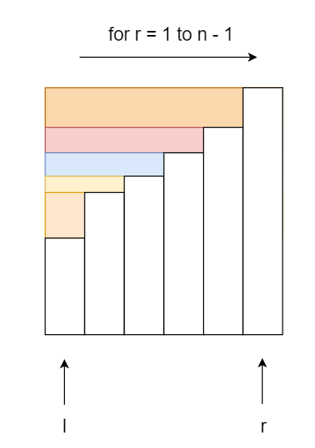

[TOC]

# 滑动窗口算法

## Sliding Window in Network


## Sliding Windows

滑动窗口的基本思想是将二维的嵌套循环转为一维。我们希望避免指针回头，即两个指针始终**朝着一个方向！**（否则复杂度会上升一个维度）

### ex1

给定一个整数数组，计算长度为 **'k'** 的连续子数组的最大总和。
$$
for \ i \ < \ n-k+1
\\
for \ j \ < \ k
\\
sum = sum+currentValue
$$
OK, but the cost is $O(k*n)$. What is the improvement?

------

Two points: $left \ \& \ right$
$$
maxSum = S[0:k-1]
\\
sum = maxSum
\\
for \ i \ in \ (k,n)
\\
sum += \Delta S
\\
maxSum = \max(maxSum,sum)
$$


### ex2

给定一个字符串S和一个字符串T，请在S中找出包含T所有字母的最小子串。(minimum-window substring)


**First step:**


$\begin{cases} left = 0 \\ right = k_0 \end{cases}$ How to move 2 pointers?

Notice that the result satisfies that 
$$
result \le l_0 = (k_0 - 0)
$$
We need to shrink the total size but not expand it.

- move left：希望破坏已有的解
- move right：希望找到新的解

**Second step:**

 $\Rightarrow$

$End \ when \ right \ reaches \ the \ end.$
$$
while \ right <S.length
\\
$$


### ex3

[1423. 可获得的最大点数](https://leetcode-cn.com/problems/maximum-points-you-can-obtain-from-cards/)

几张卡牌 排成一行，每张卡牌都有一个对应的点数。点数由整数数组 cardPoints 给出。

每次行动，你可以从行的开头或者末尾拿一张卡牌，最终你必须正好拿 k 张卡牌。

你的点数就是你拿到手中的所有卡牌的点数之和。

给你一个整数数组 cardPoints 和整数 k，请你返回可以获得的最大点数。

```
输入：cardPoints = [1,2,3,4,5,6,1], k = 3
输出：12
解释：第一次行动，不管拿哪张牌，你的点数总是 1 。但是，先拿最右边的卡牌将会最大化你的可获得点数。最优策略是拿右边的三张牌，最终点数为 1 + 6 + 5 = 12。
```

<font color = red>**等价于求中间连续数组的最小值**</font>

$sliding \ window:size=(length-k)$

### ex4

[992. K 个不同整数的子数组](https://leetcode-cn.com/problems/subarrays-with-k-different-integers/)

给定一个正整数数组 A，如果 A 的某个子数组中不同整数的个数恰好为 K，则称 A 的这个连续、不一定独立的子数组为好子数组。

（例如，[1,2,3,1,2] 中有 3 个不同的整数：1，2，以及 3。）

返回 A 中好子数组的数目。

```
输入：A = [1,2,1,2,3], K = 2
输出：7
解释：恰好由 2 个不同整数组成的子数组：[1,2], [2,1], [1,2], [2,3], [1,2,1], [2,1,2], [1,2,1,2].
```

------

常规做法：

- $Map<key,count>$
- $left \ \& \ right$

We move right first until  it <font color = red>**$cannot$**</font> move.($k_0>k$)

Then we move left until it <font color = red>$cannot$</font> move.($k_0 < k$)

**Notice:**

（1）对于$right$每到达一个新的位置，所有的新的情况均在此时的$left$和$right$之间产生，不需要考虑其他因素。

（2）移动$left$首先得到的是刚好符合条件，即最大的区间。

------

**$reference \ code$**
$$
ret = right - left
\\
res = getMostDistinct(A,k)-getMostDistinct(k-1)
$$
**Why?**

The results are in the form of $(l',right),l' \in [left,right)]$,which means <font color = red>$Backtracking$</font>!

### [220. 存在重复元素 III](https://leetcode-cn.com/problems/contains-duplicate-iii/)

给你一个整数数组 nums 和两个整数 k 和 t 。请你判断是否存在 两个不同下标 i 和 j，使得 abs(nums[i] - nums[j]) <= t ，同时又满足 abs(i - j) <= k 。如果存在则返回 true，不存在返回 false。

```
输入：nums = [1,2,3,1], k = 3, t = 0
输出：true
```

------

这是一个滑动窗口的变式。下标是为了限制窗口的大小，`nums[i]`中的值则是为了进行判断与筛选。

朴素的想法是我们每次维护一个固定的窗口，然后检查该固定窗口是否存在成立的解，存在则返回。这里我们只能在查找操作中优化。使用STL中的`set`以及对应的操作。

```c++
            auto it = res.lower_bound( max(nums[i],INT_MIN+t)-t );
            if( it != res.end() && *it <= min(nums[i],INT_MAX-t)+t ) return true;

            res.insert( nums[i] );
            if( i>=k ) res.erase( nums[i-k] );	// 保证窗口大小
```

> 执行用时：24 ms, 在所有 C++ 提交中击败了90.65%的用户
>
> 内存消耗：15.1 MB, 在所有 C++ 提交中击败了17.16%的用户

参考答案使用桶排序仍然是对查找的优化。（效果其实并不好。）

直接上滑动窗口呢？（双指针）老规矩，先动右（扩张），再动左（收缩）。（<font size = 2 color = gray>但是这样时间上很烂。因为不是二分，可以看成另一种形式的暴力。</font>）

### [剑指 Offer 48. 最长不含重复字符的子字符串](https://leetcode-cn.com/problems/zui-chang-bu-han-zhong-fu-zi-fu-de-zi-zi-fu-chuan-lcof/)

```
输入: "abcabcbb"
输出: 3 
解释: 因为无重复字符的最长子串是 "abc"，所以其长度为 3。
```

---

滑动窗口+左右指针：**先右指针**，如果发现当前元素已经访问过，那我们移动左指针（减小窗口的规模），注意保存结果。

```c++
        while( right<s.size() )
        {
            while( used[s[right]] == true ) 
                used[ s[left++] ] = false;
            // move left
            res = max( res,right-left+1 );
            used[ s[right++] ] = true;
        }
```

### [1498. 满足条件的子序列数目](https://leetcode-cn.com/problems/number-of-subsequences-that-satisfy-the-given-sum-condition/)

给你一个整数数组 nums 和一个整数 target 。

请你统计并返回 nums 中能满足其最小元素与最大元素的 和 小于或等于 target 的 非空 子序列的数目。

由于答案可能很大，请将结果对 10^9 + 7 取余后返回。

---

滑动窗口，其实有了这个提示就已经很明显了。我们这里设：
$$
\begin{cases}
left = 0
\\
right = nums.size()-1
\end{cases}
$$
这样，对于每个符合要求的left和right，总的情况就是：$2^{(right-left)}$。（**需要稍微的推导一下，为什么能不重复不遗漏**，其实很容易的啦，因为我们==只固定了一端==，就保证了不会有重复的，找到右边界就说明不会遗漏）

```c++
 		while( left<=right )
        {
            if( nums[left]+nums[right]<=target )
            {
                res = ( res+pow( right-left ) )%MOD;
                left++;
            }
            else right--;
        }
```

其实难点主要在二次幂的求法上，会溢出。

```c++
    int pow(int n){ 
        if(n<=0) return 1;
        long ans=pow(n/2)%MOD;
        if(n%2==0) return (ans*ans)%MOD; 
        return ((ans*ans)%MOD*2)%MOD;
    }
```

可以看出时间上很烂，显然可以优化。我们`dp`求过的幂次方就可以了。

```c++
		vector<int> dp(nums.size());
        dp[0] = 1;
        for( int i = 1;i != nums.size();i++ )
        {
            dp[i] = (dp[i-1]*2)%MOD;
        }
```


### [30. 串联所有单词的子串](https://leetcode-cn.com/problems/substring-with-concatenation-of-all-words/)

给定一个字符串 s 和一些 长度相同 的单词 words 。找出 s 中恰好可以由 words 中所有单词串联形成的子串的起始位置。

注意子串要与 words 中的单词完全匹配，中间不能有其他字符 ，但不需要考虑 words 中单词串联的顺序。

```
输入：s = "barfoothefoobarman", words = ["foo","bar"]
输出：[0,9]
解释：
从索引 0 和 9 开始的子串分别是 "barfoo" 和 "foobar" 。
输出的顺序不重要, [9,0] 也是有效答案。
```

---

注意这里所有的单词的长度都是一样的。并且单词不一定只出现一遍。

直觉上，对于字符串的匹配问题，比较爽的解法是`KMP`。`KMP`本质上还是字符串跳跃。这里我们首先分析一下，什么样的情况下我们是不需要匹配的。**显而易见的一点是说当我们字符串的长度就不匹配的时候，我们显然是不用看的。**这样来看，似乎我们要用滑动窗口来解决。

但是，对于单个的`word`来说，我们其实是无法直接以单词为划分跳跃的，即：$index = index + len(word)$。因为我们没法知道**单词之间的相似性**。

这样一看，似乎没有什么好方法。这里，先给出一个特别的`滑动窗口`解法。

---

我们定义左右指针$left,right$，还是**先移动右再移动左**。不同的是，我们这里对于右指针，每次移动单词长度（m）大小——换句话说，我们**由小变大**，**每次判断这个单词是否可以加进去**。这样超出窗口时，我们再移动左指针，就顺理成章了。

我们用`map`存单词和对应的次数比较合理。

```c++
    vector<int> findSubstring(string s, vector<string>& words) {
        vector<int> res;
        if( s.empty() || words.empty() ) return {};

        int length = s.size();
        int n = words.size();
        int m = words[0].size();    //  we assume each word has the same letters
        unordered_map< string,int > map;
        for( string& word:words ) map[word]++;

        for( int i = 0;i != m;i++ )
        {
            int left = i;
            int right = i;
            int totalCnt = 0;
            unordered_map<string,int> temp;

            //  move right to get the word
            while( right+m <= length )
            {
                string t = s.substr( right,m );
                right += m;
                if( map.find( t ) != map.end() )
                {
                    //  find the word
                    temp[t]++;
                    totalCnt++;
                    while( temp[t] > map[t] )
                    {
                        //  key: move left
                        //  notice that we do not minus the t string
                        string s1 = s.substr( left,m );
                        left += m;
                        temp[s1]--;
                        totalCnt--;
                    }
                    if( totalCnt == n ) res.push_back( left );
                }
                else
                {
                    //  reset
                    left = right;
                    totalCnt = 0;
                    temp.clear();
                }
            }
        }
        return res;
    }
```

（思考：我们其实可以看看能否用一般的滑动窗口去解决它。）

### [1838. 最高频元素的频数](https://leetcode-cn.com/problems/frequency-of-the-most-frequent-element/)

元素的 频数 是该元素在一个数组中出现的次数。

给你一个整数数组 nums 和一个整数 k 。在一步操作中，你可以选择 nums 的一个下标，并将该下标对应元素的值增加 1 。

执行最多 k 次操作后，返回数组中最高频元素的 最大可能频数 。

```
输入：nums = [1,2,4], k = 5
输出：3
解释：对第一个元素执行 3 次递增操作，对第二个元素执 2 次递增操作，此时 nums = [4,4,4] 。
4 是数组中最高频元素，频数是 3 。
```

---

如果我们给定了输入的`nums`和`k`，那么我们的数组和是可以确定的。我们首先需要理解这样一件事：最后出现次数最多的元素必定属于原先的元素集合：$x_i \in nums$。

结合这两点，我们从整体出发去考虑：对于一个给定的$x_i$，我们需要修改（增加）比它小的元素$x_j$（大的不需要考虑）使两者相等。此时滑动窗口的模型已经出来了。



```c++
        while( right<n )
        {
            sum += ( long long )( nums[right]-nums[right-1] )*( right-left );
            while( sum>k )
            {
                //  move left
                sum -= ( nums[right]-nums[left] );
                left++;
            }
            res = max( res,right-left+1 );
            right++;
        }
```

