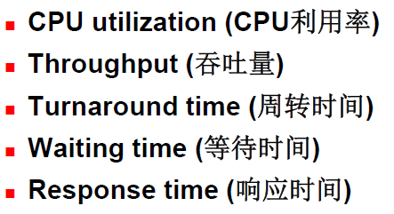
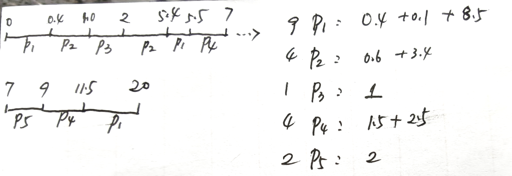

# 💎进程（CPU）调度

[TOC]

$$
DR \ \ \ \ \ \ \ \ \ \ \ 2021/10/22 \ \ \ \ \ \ \ \ \ \ \ V \ 1.0
\\
---------------------------
$$

> $\mathbb{CPU \ scheduling \ is  \ the \ basis \ of \ multiprogrammed \ operating \  systems.}$

## CPU调度

短期调度程序（from ready queue）。

调度发生的时机：考虑以下状态的转换

- $\mathbb{running \to terminated}$
- $\mathbb{running \to wait}$
- $\mathbb{running \to ready}$（interrupt…）
- $\mathbb{wait \to ready}$（I/O completion…）
- $\mathbb{new \to ready}$（higher priority…）

【**③④⑤**】抢占调度；【**①②**】非抢占调度。

**分派程序（dispatcher）**：是用来将CPU控制交给短期调度程序的进程（模块）。【分派延迟：diapatcher latency】

## 🚌调度准则

**CPU利用率**：低（40%）~高（60%）

**周转时间：**$\sum waiting_i + T_{CPU}$，等待的时间包括进入系统前，就绪队列中以及等待其他事件。OR 任务提交到任务完成：$T_{finished} - T_{arrival}$

**等待时间：**only **ready queue**！（CPU只会影响就绪队列中的时间）

**响应时间：**事务提交到第一次响应的时间。

## 🏔调度算法

### FCFS

队列实现，非抢占式。

车队效应（convoy effect）：等待大进程放弃CPU使用权

### SJF

最短最先。可以抢占与非抢占。会产生**饥饿**。

> **平均等待和平均周转时间最少。**（可以**反证**）

我们需要**预测**下一个CPU区间（Burst）的长度：**指数平均法**（$\tau_{n+1} =  \alpha\tau_n + (1-\alpha)\tau_n$）。

### 优先级调度

可以是抢占式/非抢占式调度，同样会产生**饥饿**OR**无穷阻塞**。（事实上，可以把SJF看成优先级的特例。）

Aging（老化）：逐步增加未选中的进程的优先级。

### Round Robin 轮转法调度（时间片轮转）

为分时系统设计。**定义了时间片**。

（`王道P60`）（**时间片轮转法**），使得多个交互的用户可以得到及时响应。

首先进程按照FCFS排序，但每个进程只有一个时间片的时间，如此轮回。通常来说，平均周转时间会更长，但响应时间更好。

<B>Question：WHY 需要设置合适大小的时间片！</B>

时间片太长：FCFS；时间片太短：变成处理器共享（频繁切换，处理机的开销增大）。

上下文切换可能影响RR的性能，更短的时间片意味着更多的上下文切换。In general，**80%** CPU bursts应当小于时间片长度。**增加时间片的长度，平均周转时间不一定减少**

### 多级队列调度

就绪队列被分割为不同的队列，根据进程的性质将其**永久**分配到一个队列中。

<B>多级队列+固定优先级</B>

如**前台**（交互，高优先级，**RR**），**后台**（批处理，低优先级，**FCFS**）。

### 多级反馈队列调度

这里进程可以在不同的队列中间移动（**Aging**）。如果进程使用时间过长，就进入低级别队列中。

优先级越高的队列中，每个进程的时间片越（**小**）。

（`王道P59`）算法思想：进程首先进入第一级，FCFS执行。如果时间片内未完成，进入二级队列，以此类推。到第n级队列，开始用时间片。调度程序按照队列的优先级别一次调度。（1级空才搞2级）

> 几个参数：num(queues)、每个队列的算法、提升和降低级别各自的算法。

### 💖计算（例题）

**e.g.**	

（`王道P62`）已知p，arrival time，burst time，则：（1）非抢占式，SJF；（2）抢占式，SJF。分别求平均周转时间。

| $process_i$  | p1   | p2   | p3   | p4   | p5   |
| ------------ | ---- | ---- | ---- | ---- | ---- |
| arrival time | 0    | 0.4  | 1    | 5.5  | 7    |
| burst time   | 9    | 4    | 1    | 4    | 2    |

**解：**

（1）$T = \frac{9+9+5+15.6+14.5}{5} = 10.62s$

（2）如图：$T = \frac{(20-0)+(5.4-0.4)+(2-1)+(11.5-5.5)+(9-7)}{5} = 6.8s$

---

（`2016`）CPU\*1，input\*1，output\*1，三个并发执行的作业，每个作业$p_i(input,burst,output) = (2ms,3ms,4ms)$，则执行完需要最小的时间是？（**17ms**）

分析：对于每一项任务（`in`，`cal`，`out`），我们都是三个进程无缝衔接进行的。（**流水线？**）

---

（`2018`）基于优先级，非抢占式调度。完成一次进程调度和进程切换的系统时间开销1μs。p1 p2 p3，优先级大的先获得CPU，则平均周转时间？（**75μs**）

| process | waiting | burst | priority |
| ------- | ------- | ----- | -------- |
| p1      | 30      | 12    | 10       |
| p2      | 15      | 24    | 30       |
| p3      | 18      | 36    | 20       |

顺序显然是$p_2 \to p_3 \to p_1$。则
$$
\begin{cases}
p_2:15+(1+24) = 40
\\
p_3:18+(24+1)+(36+1) = 80
\\
p_1:30+(1+24)+(1+36)+(1+12)
\end{cases}
$$
题目中的等待时间应该是指：当开始调度的时候，该进程已经在就绪队列中的等待时间。

## 🛹调度の例子

### Windows

抢占式+优先级

### Linux

核心是选取`vruntime`最小的进程运行。（DS：$RBTree$），计算时间`vruntime`只用了所有进程数以及nice值的加权。

### Solaris

抢占式+优先级