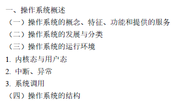

# :beginner:OS概述

[TOC]

$$
\textbf{DR          2021/11/07          V1.0}
\\
-------------------
$$

---

>- **操作系统是政府**。（==**迎刃而解**==）或者说，一切都是对现实生活的资源的一种（简单）抽象？
>
>- 换句话说，与其称为操作系统原理，倒不如成为**操作系统概念模型**更为贴切。
>- **5W**思考问题：**WHY**（为什么提出，为什么如此定义）、**WHAT**（定义是什么）、**HOW**（怎么解决）、**WHETHER**（是否解决了问题，是否带来了新的问题）、**WHAT ELSE**（对比、改进等）

## :milk_glass:Basic concepts

计算机基本的计算资源：CPU, memory, I/O.

以下很多语句都可以：

- 控制协调application对hardware的使用

- interface program that helps maximize the system resource utilization.

- compromise: $user \ usability \Leftrightarrow resource \ utilization$

  

计算机来看，与硬件接触最为密切。

==操作系统概念：==本质是**程序集**

······是一种**接口程序、分配程序、控制程序、内核程序**

> program：本质是程序集（操作系统是一种软件）
>
> interface：对用户而言的，用户可以通过操作系统使用硬件资源
>
> allocation（分配**资源**）：做分配，哪部分资源给用户使用
>
> control（控制**程序**执行）：多个程序都想使用同一个资源
>
> kernel：伴随计算机运行而运行，**唯一不可或缺**

==操作系统基本目标：==**方便性**（对用户）、**高效性**（对资源）

## 存储结构

内存（**小，易失**）、二级存储（**大，非易失**）、分层结构

CPU直接访问主存·······Only large storage media that the CPU can access directly

> Cache Coherency：缓存一致性问题
>
> 是指在采用**层次**结构存储系统的计算机系统中，保证高速缓冲存储器中数据与主存储器中数据相同机制

**引导程序（Bootstrap）：** **stored in ROM or ERPOM**

$\Rightarrow$开机启动，加载OS内核进入内存，然后OS `init()`等待事件的发生。换言之，最终OS kernel在（**RAM**）中。（`2013`）

## :full_moon_with_face:中断

中断是能够引起操作系统注意的一种事件，该事件能够驱动操作系统进行工作。

- 软中断是由**程序执行中断指令**产生的，软中断的发生是有序的、可控的。
- 硬中断是由**外设**引发的，硬中断的发生是随机的、突发的。

**中断机制如何工作**

> 操作系统是由**中断驱动**工作的，当产生一个中断时，当前正在执行的程序被挂起，同时保留当前状态，系统控制权交给操作系统，操作系统通过查找**中断向量**调用相应的**中断处理程序**。中断处理结束后返回被挂起的程序继续执行。

**中断向量 interrupt vector**

包含中断处理程序的入口**地址**

**中断处理程序 interrupt service routine**

处理中断的，预先编写好的程序

### 异常

异常又叫内中断（陷入，trap）。CPU执行指令出错引起，不能屏蔽，处理一般依赖于当前程序的现场。

（`2012`）关于子程序调用与中断处理，中断处理一定会保存而子程序不需要保存的是（**程序状态字寄存器**）。

中断或异常是用户态转化为内核态的**唯一途径**。

## :moon:I/O结构

I/O设备和CPU可以同时工作

**设备控制器**

- Each **device controller** is in charge of a particular device type and has a **local buffer**. I/O is from the device to **local buffer** of the device controller. CPU moves data from/to main memory to/from local buffers.

- 这种中断驱动的I/O适合移动**少量数据**

**DMA**

- Device controller directly transfers blocks of data between buffer storage and main memory **without CPU intervention**. Only **one** interrupt is generated per block.
- CPU给予控制器三条消息【**disk address, memory address for storing the block, byte count**】后就可以不再干预

双模式保护、CPU保护、内存保护、I/O保护

- CPU保护机制的目的是防止操作系统因**用户程序长期占用**而**得不到CPU资源**，可通过==定时器==来实现。(分时系统)
- 内存保护机制的目的是确保**每一进程的内存地址空间不被其他进程访问**，可通过==基址寄存器和界限寄存器==来实现。
- I/O保护机制的目的是**防止I/O设备被用户程序破坏**，可通过将**所有**I/O操作指令==设置为特权指令==来实现。

### **双模式保护**

**user mode、kernel mode**

模式位规定·······kernel(0), user(1)

一旦中断产生，硬件就从用户态切换到内核态

**特权指令**

一些机器指令可能会破坏系统，为了避免破坏，必须在内核模式下执行

常见特权指令：load-timer, load base registers, load limit registers, all I/O instructions

## Development

### 批处理

内存中只有一个作业，整体上成批处理作业。

**多道批处理系统**——允许多个程序同时进入内存并且允许交替进行。（宏观上并行，微观上串行）

### 分时

所谓分时，就是CPU时间分成很短的时间片，按时间片轮流分给各时间片使用。

（`王道P12`）分时系统追求快速地响应用户。

### :bookmark_tabs:**多道程序设计**

> 一些任务被同时放置在内存中，CPU选一个执行，若当前的任务需要等待，CPU切换到下一个任务

It’s the **first instance** where the operating system must make decisions for the users

多道程序设计的**好坏**：

- 调高CPU利用率，充分发挥并发性（包括程序间、设备间、设备和CPU间均并发工作）
- 用户独占资源，无交互性，延迟大

---

:star2::star2::star2:**现代操作系统具备的四大特征**

- **并发性**（Concurrence）：程序与程序之间、设备与设备之间、设备与CPU之间均可以并发工作。
- **共享性**（Sharing）：系统中的资源可以供多个程序共同使用。
- **虚拟性**（Virtual）：内存中的程序都认为自己“独享”硬件资源，把一台物理设备变成逻辑上的多台设备。
- **异步性**（Asynchronism）：程序的执行是无序的、随机的。

（`王道P5`）**并发性**指的是若干事件在同一时间间隔内发生，**并行性**指的是若干事件在同一时刻发生。

# :tipping_hand_man:OS structures

*操作系统的功能：*进程（CPU）管理、内存管理、文件管理、磁盘管理、I/O管理、**用户接口**

**操作系统的服务：**🐷

- 程序执行：系统可以将程序加载进内存并执行
- I/O操作：用户程序不能直接执行I/O操作，所以OS要提供一些支持I/O的方法
- 文件系统操作：程序可以读、写、创建、删除文件
- 通信：**进程间**交换信息（共享内存、消息传递）
- 错误检测与处理：检测硬件、用户程序的错误
- *资源分配*
- *统计（审计accounting）*：产生日志
- *保护*：保证访问系统资源的操作是受控制的，检测break-ins....

**功能和服务的关系**⭐

功能是**对内**而言，指**自身具备**的一种**能力**。服务是**对外**而言，指**满足外部需求**的一种能力，这种能力**并非完全自身具备**，可以通过**调用其他服务**来实现。

## 🍟系统调用——特殊的公共子程序

> 系统调用是**操作系统对程序所提供的服务的实现形式**。系统调用是一些可以向外提供操作系统服务和资源的函数。是用户态的程序访问内核态程序的接口
>

> **功能：**设备管理、文件管理、进程控制与通信、内存管理

**$\color{red}\textbf{user} \to  \textbf{kernel}$**

（1）系统调用	（2）发生中断

（3）程序error	（4）特权指令……

---

- （`2011`）用户态**执行**的是（**A**）。

A.	命令解释		B.	缺页处理

C.	进程调度		D.	时钟中断处理

（**中断相关一定是在内核态**！）

- （`2012`）一定不会在user mode**发生**的是（**C**）。

A.	系统调用		B.	外部中断

C.	进程切换		D.	缺页

（B——用户态发生后切换到内核态，在内核态处理；D同理）

- （`2013`）调用`sin()`（**不需要**）内核态。（用户态就可以完成，没必要）

- （`王道P21`）置时钟指令只能在（**内核态**）运行。（:star:**反向思考**：如果在用户态，用户可以自定义时间片，即可以无休止地进行。这样来看，OS就有点政府的宏观调控的意思了…）【*读时钟*指令*可以*在**用户态**执行！】

---

**参数传递**（传递参数到操作系统的通用方法）

1. 通过**寄存器**（最简单）
2. 通过**内存中的块和表**(**address** of block passed as a parameter in a register)
3. 通过**堆栈**

> 指出：此时CPU的状态会转到（**kernel**）mode，处理完成再返回user mode。

**为什么更喜欢用API编程？**

> **API**是应用程序开发人员**编写程序所使用的应用编程接口**。
>
> 使用API编程有如下优势：
>
> - 可移植：API对于某些系统调用实现了很好的封装，提高编程效率。
> - 可维护性：当对操作系统功能进行维护和修改时，主要API不变，无需修改用户程序。
> - 实用性：一个简单的程序需要大量的系统调用，实现对多个系统调用的封装，隐藏系统调用过程中的复杂细节，方便用户的使用。
> - 提高性能：可以减少从用户空间到内核空间切换的次数和开销。

**访管指令与访管中断**：访管指令可以在用户态下执行。但是其结果是产生一个中断事件（**自愿中断**），然后转为核心态。

## :keyboard:微内核

提供少量的**【进程管理、内存管理、通信功能】**⭐（也是冯诺依曼规定，不可或缺的……）

它的任一模块都能调用任何其他模块，提高了系统效率。

优缺点：

- 容易扩展（动态加载内核，提高效率），部署，更可靠安全
- 用户空间与内核空间的交流性能差

