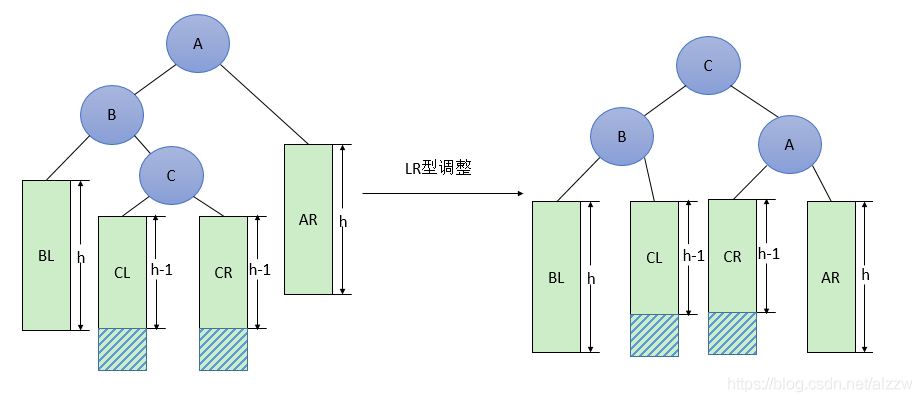
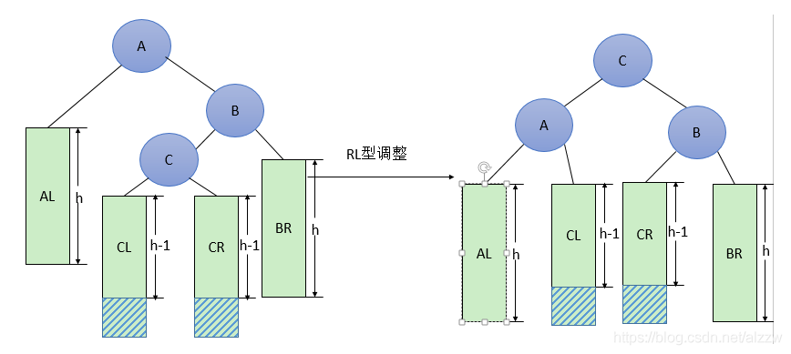
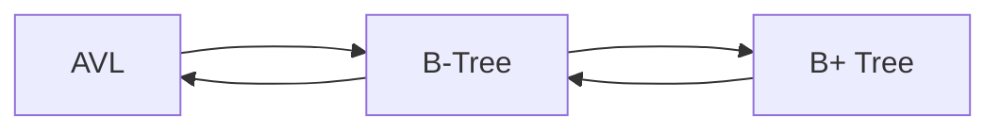

[TOC]

# Searching

## Definition

- 静态查找 v.s. 动态查找（二叉树、散列……）

- $\begin{cases}顺序查找 \\ 折半查找 \\ 块内查找 \end{cases} \Leftarrow \color{red}{\underline{ASL}}$

- 两个参数：平均查找时间、ASL。

- 二分查找的模板（以严版为准）：（递归如何实现？）

  ```c++
      int search(vector<int>& a, int target) {
          int left = 0;
          int right = a.size()-1;
          while(left <= right)
          {
              int mid = left + (right - left)/2;
              if( a[mid] == target)
                  return mid;
              else if(a[mid] < target)
                  left = mid + 1;
              else
                  right = mid - 1;
          }
          return -1;
      }
  ```

  - 二叉树的判定树：AVL（WHY？）$\to$ ASL = $\mathbf{\log_2(n+1)-1 \le h=\lceil \log_2(n+1)\rceil}$（不会超过树的高度）
  - 


## Data Structures

### **AVL Tree**

#### Definition && Operation

- 平衡因子$\mathbf{k}$

- $\star$：$\pmb{four \ rotations} <XY>$( X: X-Child，Y:Y-subTree )

  - RR && LL：一次旋转

  - RL && LR：两次旋转（HOW && WHY？）

    

  


- 如何判断是否平衡？（递归计算高度，见刷题）


### **B-Tree**

$$
\begin{cases}
search
\\
insert
\\
delete
\end{cases}
$$

B-Tree is one kind of **Multiple search tree**.


#### **Definition**

(1) Each node has at most ***m*** subtrees( children ) while the **minimum value**:
$$
n_{sub} = 
\begin{cases}
root \to 2
\\
not \ leaf \to \lceil \frac{m}{2} \rceil
\end{cases}
$$
<div align = "center"><font color = red size = 2><li>WHY we set minimum value?</li></font></div>

(2) ***Leaf*** nodes are on the same layer!

(3) All of the elements in one node are in order.

It is just like narrowing the range to an **interval**.

#### **Structure**

```java
	int m;
	BTreeNode parent;
	LinkedList<Integer> keyValues;
	LinkedList<BTreeNode> children;
```

Usually, m > 2.

It is obvious that $children.size() \le m$ and $keyVal.size() \le(m-1)$


#### Insertion

We need to find the correct position before we insert. Notice that  we will end at the bottom of the tree and the operation is **from bottom to top**.

The insert operation can be divided into 4 parts:
$$
\begin{aligned}
& step \ 1: find \ the \ position
\\
& step \ 2: insert \ the \ key \ into \ the \ leaf \ node
\\
& step \ 3: split \ if \ overflow
\\
& step \ 4: reconnect \ and \ recurse
\end{aligned}
$$

<div align = "center"><table><tr><td bgcolor = lightgreen>We split and move upward as we hope to maintain the definition of the structure.</td></tr></table></div>


#### Deletion

When we delete, we must consider the children nodes of $*p$.

删除叶子节点可能会破坏结构，删除非叶节点必定破坏结构！

- Leaf Node?(考虑***==兄弟节点==***)

  - For the two children nodes of $*p$ $\to x,z$, ==we select one which has at least t key values where t is the minimum value.== ——向兄弟节点借值。

  - If $||x||,||z|| \le t-1$: $merge(p,p_{brother})$.

    我们将其与兄弟节点**合并**后，是否维持了B-树的性质？ ( $|x|+|z| \le 2t=m$  )
    
    这样，当我们执行***merge***操作的时候，我们可以保证不需要进行多余的操作。($\frac{m}{2}\cdot2=m$)

- Non-leaf Node? $\to$ Leaf Node

  选择最接近删除关键值的元素进行填充: $max(left-tree) \ or \ min(right-tree)$，然后调整。


### **B+ Tree**

Two structures. Both are OK.


#### New rules

- Non-leaf nodes only serve as indexes. Leaf nodes contain data.
- Each search has the **same** I/O times!
- Structures：
  - 

### Conclusion



如何提升查找的速度？（**平衡，二分**）

#### B-Tree v.s. B+ Tree

1、B+**树的层级更少**：相较于B树B+每个**非叶子**节点存储的关键字数更多，树的层级更少所以查询数据更快；

2、B+**树查询速度更稳定**：B+所有关键字数据地址都存在**叶子**节点上，所以每次查找的次数都相同所以查询速度要比B树更稳定;

3、B+**树天然具备排序功能：**B+树所有的**叶子**节点数据构成了一个有序链表，在查询大小区间的数据时候更方便，数据紧密性很高，缓存的命中率也会比B树高。

4、B+**树全节点遍历更快：**B+树遍历整棵树只需要遍历所有的**叶子**节点即可，而不需要像B树一样需要对每一层进行遍历，这有利于数据库做全表扫描。

5、**B树**相对于**B+树**的优点是，如果经常访问的数据离根节点很近，而**B树**的**非叶子**节点本身存有关键字其数据的地址，所以这种数据检索的时候会要比**B+树**快。


### 散列

