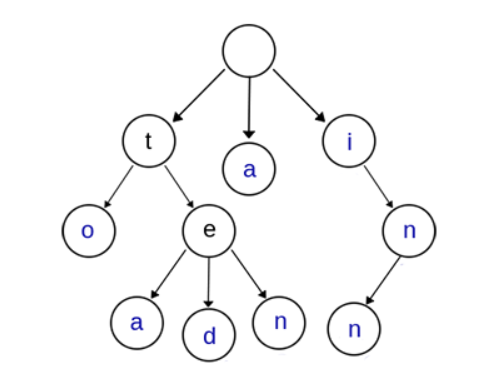

[TOC]

# string_ex

## Trie $\to$ AC

### Introduction && Application

**Trie树**，又叫**字典树**、**前缀树（Prefix Tree）**、**单词查找树** 或 **键树**，是一种多叉树结构。



归纳总结：两个有公共前缀的关键字，在Trie树中前缀部分的路径相同。**核心思想就是以空间换时间。**


可以看出一个基本的实现：

```c++
class Trie {
public:
    Trie* children[26];
    bool isWord;    //?
    /** Initialize your data structure here. */
    Trie() {
        isWord = false;
        for( auto&child:children ) child = nullptr;
    }
    
    /** Inserts a word into the trie. */
    void insert(string word) {
        Trie* p = this;
        for( auto&ch:word )
        {
            if( !p->children[ch-'a'] ) p->children[ch-'a'] = new Trie();
            p = p->children[ch-'a'];
        }
        p->isWord = true;
    }
    
    /** Returns if the word is in the trie. */
    bool search(string word) {
        //  must go till the end
        Trie* p = this;
        for( auto&ch:word )
        {
            //  是否会越界？
            if( !p->children[ch-'a'] ) return false;
            p = p->children[ch-'a'];
        }
        return p->isWord;
    }
    
    /** Returns if there is any word in the trie that starts with the given prefix. */
    bool startsWith(string prefix) {
        Trie* p = this;
        for( auto&ch:prefix )
        {
            if( !p->children[ch-'a'] ) return false;
            p = p->children[ch-'a'];
        }
        return true;
    }
};
```

可以看出，我们如果简化了字符的种类（26），那我们只需要一个简单的判断就可以了：
$$
compare \& \& ( p = p \to children[c] )
$$

---


## ==FSM== in string matching

Components of FSM:$(Q,q_0,A,\Sigma,\delta)$
$$
\begin{cases}
Q:all \ states
\\
q_0:initial \ state
\\
A:state \ that \ means \ accept
\\
\Sigma:input \ alphabet
\\
\delta: transfer \ function
\end{cases}
$$

**辅助函数**：$\sigma(x) = max\{k:P_k\sqsupset x\}$.
$$
\Rightarrow
\begin{cases}
suffix \ of \ x
\\
prefix \ of \ P_k
\end{cases}
$$
$\sqsupset$ means $P_k$ is the suffix of $x$.

Transition function:
$$
\delta(q,a) = \sigma(P_qa)
$$

$q$ is the number state. Different string may have the same $q$ value! 

Notice that the **string in the bracket is $P$!**

As to $\sigma(x)$,obviously we have:

- $\forall x,a,\sigma(xa) \le \sigma(x)+1$
- $\forall x,a,if \ q = \sigma(x),then\ \sigma(xa) = \sigma(P_q,a)$


### Process

We define the text **T**, and the pattern string **P**. Then $||Q|| = P.length()$

- Process of FSM:


- The calculation of $\delta(x)$:


​		$Analysis:$

1. The purpose is to find the max **k** such that $P_k \sqsupset P_qa$, the initial **k** is the rightmost place, we scan it from right to left.

2. Why do we set $k = \min(m+1,q+2)?$

   $m+1$ means we may accept it while $q+2$ actually means $q+1$ as we will do operation`k--`.

​		

```c++
//  judging if Pk is suffix of Pq-a
bool suffixMatchingPrefix( char*p,int k,int q,char a )
{
    if( k == 0 )
    return true;
    if( k == 1 )
    return p[0] == a;
    if( !strncmp( p,p+q-k+1,k-1 ) && p[k-1] == a )
    return true;
    else
    return false;

}

vector< map<char,int> > transitionFunction( char*pattern,const char* alphabet )
{
    int m = strlen( pattern );
    int k = 0;
    int j = 0;
    vector< map<char,int> > map( m+1 );
    for( int i = 0;i != m;i ++ )
    {
        // all the alphabet
        j = 0;
        while( alphabet[j] != '\0' )
        {   
            k = min( m+1,i+2 );
            //  repeat k--
            do
            {
                k--;
            }
            while( !suffixMatchingPrefix( pattern,k,i,alphabet[j] ) );// Pk is suffix of S
            map[ i ][alphabet[j]] = k;
            j++;
        }

    }
    return map;
}

void FSMMatching( char*text,char*pattern,vector<map<char,int>> map )
{
    int n = strlen( text );
    int m = strlen( pattern );
    int q = 0;
    for( int i = 0;i != n;i++ )
    {
        q = map[ q ][ text[i] ];
        if( q == m )
        cout<<"Pattern occurs with shift "<<i+1-m<<endl;
    }
}
```


## 最长公共子序列


### [得到子序列的最少操作次数](https://leetcode-cn.com/problems/minimum-operations-to-make-a-subsequence/)


给你一个数组 `target` ，包含若干 **互不相同** 的整数，以及另一个整数数组 `arr` ，`arr` **可能** 包含重复元素。

每一次操作中，你可以在 `arr` 的任意位置插入任一整数。比方说，如果 `arr = [1,4,1,2]` ，那么你可以在中间添加 `3` 得到 `[1,4,**3**,1,2]` 。你可以在数组最开始或最后面添加整数。

请你返回 **最少** 操作次数，使得 `target` 成为 `arr` 的一个子序列。

一个数组的 **子序列** 指的是删除原数组的某些元素（可能一个元素都不删除），同时不改变其余元素的相对顺序得到的数组。比方说，`[2,7,4]` 是 `[4,**2**,3,**7**,2,1,**4**]` 的子序列（加粗元素），但 `[2,4,2]` 不是子序列。

```
输入：target = [5,1,3], arr = [9,4,2,3,4]
输出：2
解释：你可以添加 5 和 1 ，使得 arr 变为 [5,9,4,1,2,3,4] ，target 为 arr 的子序列。
```

---

简单来说，就是扩充`arr`使其可以包含整个`target`。显然的事实是，我们最终的结果在$[0,target.size()]$。

这里复述一下题解的思想：我们将`arr`中的所有元素映射成**其在`target`中的下标index**，由于`target`元素的唯一性，实际上我们实现的是一对一的映射。


<center><b>则求原数组的最长公共子序列等价于求上述转换后的两数组的最长公共子序列。</b></center>

> 我们可以特殊化一下，如果是最好的情况，即恰好存在这样的`target`在`arr`中，那么就存在这样一个子序列：*0123……m*在`arr`中。进一步地，一般情况下，那必然也包含子序列：$\overline{i(i+1)(i+2)...j}$。

我们只关心那些target中存在的元素`val`和对应的下标`idx`。其实到这里并没有实质性的解决问题，因为只是做了映射而已。

对于`val`，我们要查看之前的元素（0～`val-1`）是否已经存在了。如果存在了，就说明需要重新计数。这里我们用了二分，这才是映射的最终目的。

```c++
                int index = map[num];
                //  二分，是关键部分
                auto it = lower_bound( a1.begin(),a1.end(),index );

                if( it != a1.end() ) *it = index;
                else a1.push_back( index );
```

## ==FSM== in string matching

Components of FSM:$(Q,q_0,A,\Sigma,\delta)$
$$
\begin{cases}
Q:all \ states
\\
q_0:initial \ state
\\
A:state \ that \ means \ accept
\\
\Sigma:input \ alphabet
\\
\delta: transfer \ function
\end{cases}
$$

**辅助函数**：$\sigma(x) = max\{k:P_k\sqsupset x\}$.
$$
\Rightarrow
\begin{cases}
suffix \ of \ x
\\
prefix \ of \ P_k
\end{cases}
$$
$\sqsupset$ means $P_k$ is the suffix of $x$.

Transition function:
$$
\delta(q,a) = \sigma(P_qa)
$$

$q$ is the number state. Different string may have the same $q$ value! 

Notice that the **string in the bracket is $P$!**

As to $\sigma(x)$,obviously we have:

- $\forall x,a,\sigma(xa) \le \sigma(x)+1$
- $\forall x,a,if \ q = \sigma(x),then\ \sigma(xa) = \sigma(P_q,a)$

### Process

We define the text **T**, and the pattern string **P**. Then $||Q|| = P.length()$

- Process of FSM:


- The calculation of $\delta(x)$:


​		$Analysis:$

1. The purpose is to find the max **k** such that $P_k \sqsupset P_qa$, the initial **k** is the rightmost place, we scan it from right to left.

2. Why do we set $k = \min(m+1,q+2)?$

   $m+1$ means we may accept it while $q+2$ actually means $q+1$ as we will do operation`k--`.		

```c++
//  judging if Pk is suffix of Pq-a
bool suffixMatchingPrefix( char*p,int k,int q,char a )
{
    if( k == 0 )
    return true;
    if( k == 1 )
    return p[0] == a;
    if( !strncmp( p,p+q-k+1,k-1 ) && p[k-1] == a )
    return true;
    else
    return false;

}

vector< map<char,int> > transitionFunction( char*pattern,const char* alphabet )
{
    int m = strlen( pattern );
    int k = 0;
    int j = 0;
    vector< map<char,int> > map( m+1 );
    for( int i = 0;i != m;i ++ )
    {
        // all the alphabet
        j = 0;
        while( alphabet[j] != '\0' )
        {   
            k = min( m+1,i+2 );
            //  repeat k--
            do
            {
                k--;
            }
            while( !suffixMatchingPrefix( pattern,k,i,alphabet[j] ) );// Pk is suffix of S
            map[ i ][alphabet[j]] = k;
            j++;
        }

    }
    return map;
}

void FSMMatching( char*text,char*pattern,vector<map<char,int>> map )
{
    int n = strlen( text );
    int m = strlen( pattern );
    int q = 0;
    for( int i = 0;i != n;i++ )
    {
        q = map[ q ][ text[i] ];
        if( q == m )
        cout<<"Pattern occurs with shift "<<i+1-m<<endl;
    }
}
```

## 字符串——回文

### Definition

**回文串** 是正着读和反着读都一样的字符串。（对称性）

基本方法：动态规划。

## More methods

### Manacher(马拉车)

### 例题

#### [131. 分割回文串](https://leetcode-cn.com/problems/palindrome-partitioning/)

给你一个字符串 `s`，请你将 `s` 分割成一些子串，使每个子串都是 **回文串** 。返回 `s` 所有可能的分割方案。

---

***dp+dfs?***

- DP: $dp[i][j] = dp[i+1][j-1] \&\& (s[i]==s[j])$

- DFS:

  ```c++
  ans.push_back( s.substr( i,j-i+1 ) );
  DFS( s,j+1 );
  ans.pop_back();
  ```


#### [132. 分割回文串 II](https://leetcode-cn.com/problems/palindrome-partitioning-ii/)

给你一个字符串 `s`，请你将 `s` 分割成一些子串，使每个子串都是回文。

返回符合要求的 **最少分割次数** 。

---

一致的思路。必然要判定是否为回文串：$\to dp$

除此之外，我们需要考虑最小的数量。一个显然的结论：如果$s[i:j]$是回文串，那么这部分的值就为1.否则，我们可以用$dp$将其子问题的值组合起来。

`nums[j] = min(nums[j],nums[i-1]+1)` (If `s[i:j]` is a palindrome)

