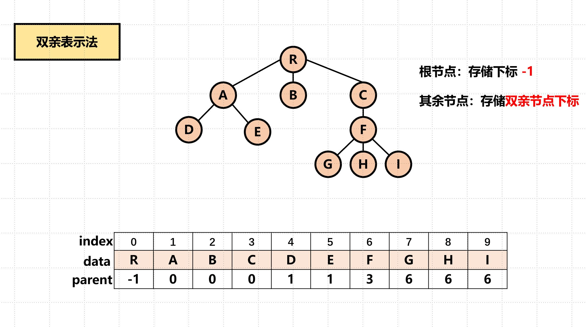
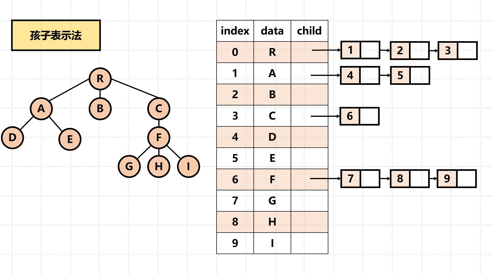
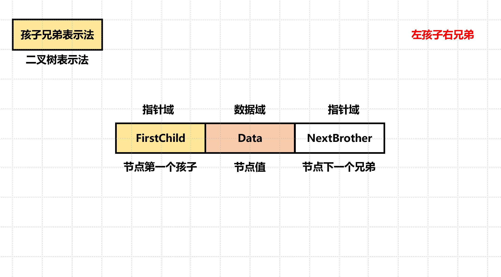

[TOC]

# Tree

## Definition

表示层次结构的数据，定义是递归的。

1. 度、高度、叶子结点的个数：$\sum degree = n-1 = \sum_0^kn_i$。

2. 满二叉树：超级对称的完美二叉树；

   完全二叉树：按照层次从左向右排列的二叉树。

3. 非空二叉树的叶子结点数：$n_0 = n_2 + 1$。（定义证明）——度为1的点是分支结点

4. 顺序存储 && 链式存储：

   - 顺序：数组，完全二叉树，缺填0——天然的父子关系。
   - 链式：$<data,*leftChild,*rightChild>$。

5. 对于链式：n个结点的二叉树，有(n+1)个空结点。

## Operation

1. 二叉树的三种遍历——递归：顺序的名称表示`root`的访问顺序。（复杂度：都是$O(n)$）

2. 迭代实现遍历。（How？）栈模拟

   `PreOrder` && `InOrder`

   ```c++
       vector<int> res;
       if (!root) return res;
       stack<TreeNode *> s;
       while (root || !s.empty()) {
           if (root) {
               s.push(root);
               // res.push_back(root->val);  // PreOrder
               root = root->left;
           } else {
               root = s.top();
               s.pop();
               // res.push_back(root->val);  // InOrder
               root = root->right;
           }
       }
       return res;
   ```

   `PostOrder`

   ```c++
   
   ```

   

   

3. 复制二叉树

4. 四

5. 五


## 线索二叉树

- （不要栈或别的辅助空间，完成`InOrder`）

- 每个节点都有直接前驱和后继：$<data,ltag,rtag,lchild,rchild>$。tag是标记量，主要是运用没有孩子的空结点。

- 左前驱，右后继。好比建立了一个双向链表。

- 构造：

  ```c++
  //	对*p的左右结点同时完成线索化的过程
  void InThread(TBNode *p,TBNode *&pre)
  {
  	if (p!=NULL)
  	{
  		InThread(p->lchild,pre); //递归，左子树线索化
  	}
  	if (p->lchild==NULL)
  	{
  		p->lchild=pre;
  		p->ltag=1;
  	}
  	if (pre!=NULL&&pre->rchild==NULL)
  	{
  		//建立前驱节点的后继线索
  		pre->rchild=p;
  		pre->rtag=1;
  	}
  	pre=p; //pre指向当前的p，作为p将要指向的下一个节点的前驱节点提示指针
  	InThread(p->rchild,pre);	
  }
  ```

  


## BST

- 定义：略。

- 操作：查找、插入、删除、构造。

  删除时应保证**性质不变**。

- 效率分析：平均查找长度***ASL***。

## Winner/Loser Tree


## 树与森林

- 树的存储——顺序&&链式。（不知道此时有多少个孩子）

  **双亲**（顺序？）：有一个域存储父亲。（迅速查找双亲，但是找孩子不方便）

  **孩子**：单链表存储。/**孩子兄弟**：二叉链表存储。







- 树与二叉树：左孩子右兄弟。（转换后二叉树无右子树）
- 二叉树与森林：左子树是孩子，右子树是兄弟。
- 树的2种遍历（为什么没有`inorder`？） && 森林的3种遍历。

> 森林的中序和先序遍历和二叉树对应的遍历结果相同！


## Union-Find Set

<font size = 4>$\forall S_i,S_j,S_i \bigcap S_j = \varnothing$</font>

**Operations:**

- $S_i \cup S_j \to union$
- `Find(i)`: find the root of each node $i$

Notice that here children point to parents node!

<div align = "center">UNION(i,j)</div>

$$
parent[j] = i
$$

(j and i are both roots.)

<div align = "center">FIND(i)</div>

$$
while(parent[i] >= 0)
\\
i = parent[i]
\\
return \ i
$$


We can use array or linked list to realize it!

**ARRAY**

We set $parent[i] = i$ in the beginning.


## 霍夫曼树

- 带权路径长度：$WPL = \sum_i w_il_i$。（$l_i$，路径长度，就是经过的结点个数）


## 习题

这里的习题以书面为主，不包括LeetCode。

