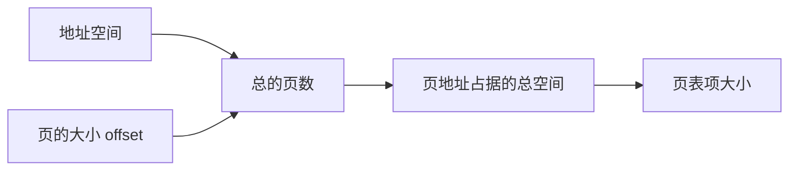

# 内存管理

[TOC]

$$
DR \ \ \ \ \ \ \ \ \ \ 2021/11/03 \ \ \ \ \ \ \ \ \ \ V 1.0
\\
---------------------
$$

内存管理主要分为两章内容：内存管理与虚拟内存。

## 🥓**内存管理**

### 内存管理基础 

#### 装入/链接

**3种链接方式：**静态链接、装入时动态链接、运行时动态链接

**内存装入的3种方式：**绝对装入、可重定位装入、动态运行时装入

（更多细节查询链接装载和库的笔记！）

#### 地址映射

MMU: $map<logical \ addr, physical \ addr>$

#### 内存保护

基址 + 界限

### **连续分配**

这里不考虑CPU的运算，那么我们需要考虑==内存空间==的使用，毕竟CPU空间是极其珍贵的资源。

内存一般分为两个区域：

​		==低地址==：驻留OS。

​		==高地址==：用户进程。

------

此时，每个进程处于连续的区域。

#### 固定分区 V.S. 动态分配

固定分区——每个进程固定大小（产生==内部碎片==）

可变分区：维护表——标记可用内存（hole）与已占用内存。

**方法：**

​	
$$
\begin{cases}
首次适应 \to 第一个足够大
\\
最佳适应 \to 最小的足够大
\\
最差适应 \to 最大的孔
\end{cases}
$$
首次和最佳会产生外部碎片。（最差为什么不会？TOO BIG?）

内部外部碎片可能共存！如何解决？$\to$ 紧缩（compaction）&& 非连续分配

#### 🍟碎片

==内部碎片==：页面内部（已经分配好了），进程和系统都无法使用（直到进程释放页之前）

==外部碎片==：处于任何已分配页面外部的空闲存储块，即使这些存储块的总和可以满足当前申请的长度要求，但由于这些存储块地址**不连续**，使得系统也**无法满足**当前申请。

> 简言之，碎片的概念是对于获得空间的进程而言的。

**Solution：**

1. Compaction（压缩）——把所有空闲的内存集中起来变成一个大的块，方法可行当且仅当分配是动态的，而且在执行时间就已经完成，压缩是高耗的。（不是永远可行）
2. 允许一个进程的物理地址空间是不连续的——采用分页和分割（paging & segmentation）段页式？

### **非连续分配**

分散存储$\to$ 增加索引$\to$ 存储密度降低。

#### 🧀分页

<table><tr><td bgcolor = 'pink'><B>我们希望尽量避免碎片的产生，才引入分页的思想。</B></td></tr></table>

（分页是清除外部碎片的方法，仍然会有内部碎片）

把内存空间分为大小相等（较小）的块。这样一来，最后剩余的空间是小于块的大小的。

> 注意，在参考资料上说的是：“尽管会产生内部碎片，但是相对进程很小。不等于没有。”

------

（物理）内存：帧/页框（frame）。
    
（逻辑内存）进程中：页（page）。
        
外存：块。

------

由于此时只是一维的地址转换，因此只需要两个变量即可：$p = <logical,physical>(frame \rightarrow page)$

##### 地址结构 && **页表**

**逻辑地址结构 = 页号p + 页内偏移量w**

**实际地址 = 物理块（页）号p + 页内偏移量w**

==***页表***==：每个进程建立一张页表，存放内存中，由**页表项**构成。（***页号+(memory)块号***）<u>**:star:页表实现了逻辑地址和物理地址的转换。**</u>

---

**思考：**总是强调这里的地址映射是一维的，但逻辑地址是p和w，如何理解?

个人解答：重点在映射两个字，内存中的映射无非就是逻辑地址到物理地址的转换，既然这样，只需要知道一个页号就可以了。

------

如何确定顺序？

*首先我们对于一个进程建立一张页表。我们知道了页表的逻辑块号与页内偏移，想知道物理块号。现在有一个实现映射的表（页表），也就说一次查询就可以定位到指定的物理块。问题解决。*

假设我们有了每一页的大小（4KB），那么剩余的是否都可以确定？

（1）偏移量有了，连带着逻辑地址的页号也就有了（总页数）。

（2）总页数有了，即页表中的所有项数也就有了。这里的页表项指的是页地址所占据的存储空间。

------

**存放的位置？**

- page table $\to$ main memory
- PTBR $\to$ register （基址寄存器）

##### 页表的实现

- 可以用硬件实现（寄存器）。（“页表比较**小**的情况”）

- **大**？ $\to$ PTBR访问 + 页表放入内存中 $\Rightarrow$ 2 times for searching. Bad.（书上用的是难以忍受，不如交换）

- ==标准解决方案== $\to$ 小且快速的***硬件缓冲***：TLB

计算其命中率：
$$
EAT = (1+\epsilon)\alpha+(2+\epsilon)(1-\alpha)
$$
( $\alpha \ for \ hit \ ratio \ and \ \epsilon \ for \ TLB \ lookup$ )

##### 页表结构

**页表的分级**

当页表过大时，很容易想到页表的分级。注意，我们此时考虑的还是页表的划分，即把一块连续的大页表拆成分散的小页表。（还都在内存里）

此外还有hash页表和反向页表。

---

**e.g.**	（`2010`）二级页表存储管理，字节编址，$page\to 2^{10}B$，页表项2B。逻辑地址结构：【`页目录号`+`页号`+`页内偏移量`】。逻辑地址空间$2^{16}pages$，则页目录表中包含表项的个数至少是（**128**）。（即第一项的大小）

**解：**

每一页容纳的表项个数：$\frac{2^10}{2} = 2^9$

则共需要$2^{(16-9)} = 128$个页面装这些页表项。

#### 分段

分页的问题：用户视角和物理内存的分离。分段是一种==支持用户视角==的管理方案。同样，每个进程建立一张段表。

此时的逻辑地址：$<segment-number,offset>$

段表：二维的用户定义地址 $\to$ 一维的物理地址 $<limit,base>$（需要两个变量，界限用来判断是否越界）。

段表项的内容：<B><段号，段长，在主存的始址></B>

> 段内连续，段与段之间不要求连续，因此整个作业的地址空间是二维的。（强调的是地址**映射**）（分页是一维的）

（`王道P165`）段式存储中，程序如何分段是在（`用户编程`）阶段决定的。（编译程序完成）

#### 段页

结合段页的优点：

1）**页**：有效提高内存利用率。

2）**段**：反应程序的逻辑结构且有利于段的共享。

段页：程序分段+每段分页。此时的逻辑地址：$<segement,page,offset(in \ page)>$

> **:star:地址映射是（每个进程一张段表，每个段一张页表）。**
>
> （段表只有一个，页表则不一定）

此时，需要访问主存（**3**）次。

> 指出：段页式管理中，地址空间是**2**维的。（如何理解？）

## 🥩**虚拟内存**

虚拟内存技术允许进程不必完全在内存中。一个直观的想法就是：内存中永远只存放正在执行的进程或进程片段。

> 局部性原理：时间局部性+空间局部性。

### 虚拟内存相关概念

**Q：**虚拟内存空间的大小由什么决定？

**A：**同时满足以下条件：==1）==**虚存大小≤内外存容量之和。** ==2）==**虚存大小≤计算机地址空间**。（ 存 疑 ）

### 按需调页 

对于调入的内存，如何知道该页面有还是没有？在页表中增加==**有效-无效**位==可以解决。

### 页面置换 && 帧分配

页面置换是由于内存的过度分配产生的——没有空闲帧使用。

对于某一个进程来说，基本页置换包括以下的流程：

1）查找位置。

2）查找空闲帧。没有就选择一个**牺牲**，将其写回磁盘，并更新表条目。（**缺页中断**）								

3）读入新的帧+**改变相关表条目**。

4）==重启用户进程。==

可以看出，这里产生了一个缺页中断，因此需要结合进程相关加以理解。

可以通过使用修改位（脏位）降低额外开销。

<B>因此，实际上需要考虑两种算法：帧分配算法+页面置换算法。</B>

#### 🥞页置换

$$
\begin{cases}
FIFO
\\
OPT(optimal)
\\
LRU
\\
second-chance
\\
counting \to 
\begin{cases}
LFU
\\
MFU
\end{cases}
\end{cases}
$$

OPT：未来使用时，出现最晚。

LRU：选择最长时间没使用的页。

##### LRU

关于LRU算法，是对OPT的近似。现在考虑如何实现它。显然只需要知道每个页面的时间就可以。

- **计时器——** 每个页表项关联一个计时器。

  

- **栈——** 页码栈的实现，栈顶永远是最近使用的页（使用便取出放在栈顶），栈底是LRU页。、

  > 头指针+尾指针的双向链表可以实现。

注：以上两种需要其他硬件支持。

------

由上，我们需要对LRU做进一步地近似。对于每一个页 （帧），添加一个附加位。

**CLOCK(NRU)** 页首次装入内存，设为0（也有的设为1），随后再次被访问，也设为1。因此，我们替换那些为0的页面。可能会遇到全是1的情况。

因此我们这样处理：**循环队列**。指针向前移动知道找到引用为0。过程中，遇到1，就置0。也被称为（二次机会算法（FIFO置换算法）事实上，二次机会更符合算法的思想。

换句话说，这里我们不考虑具体的顺序，我们只关心**是否被使用过**。

**增强型二次机会（改进型CLOCK）** $<reference-bit> \to <reference-bit,modification-bit>$
$$
\begin{cases}
0 \to unused
\\
1 \to used
\end{cases}
\times
\begin{cases}
0 \to not-modified
\\
1 \to modified
\end{cases}
$$
简单来说，我们对于是否使用过这个问题进行了进一步地细分，目的是进一步降低I/O次数。（换页次数）

##### 基于计数( COUNTING )

设置计数器，记录每一个页面的引用次数。

LFU && MFU：置换最不经常（最经常）使用的页面。

##### ***Belady异常***

**定义：** 出现**分配的页面数增多但缺页率反而提高**的异常现象。

#### 帧分配

**目的**：在各个进程之间分配一定的空闲内存。

每个进程帧的最少数量是由体系结构决定的，而最大数量是由物理内存决定的。

##### Global v.s. Local

**全局置换**从所有帧集合中选一个，**局部置换**仅从自己（进程）的分配帧中进行选择。

**比较？**

### 颠簸

频繁的调页行为，一个进程在换页上的时间超过了执行时间。

#### 原因

随着多道程序程度增加，CPU利用率先增加再减少。

降低多道程序的程度。

通过局部算法（优先置换算法）可以限制系统颠簸。（没有破坏整体程序并发的结构）

#### 工作模型集合与局部近似

**工作集**：指某段时间间隔内进程访问的页面集合。（决定：时间$t$、窗口大小$\Delta$）

工作集与窗口大小：整个进程构成时间序列，工作集是在窗口中涉及到的所有的进程，如果分配的物理块比工作集小，就会出现颠簸。

我们为进程分配大于工作集的物理块。

