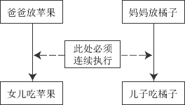
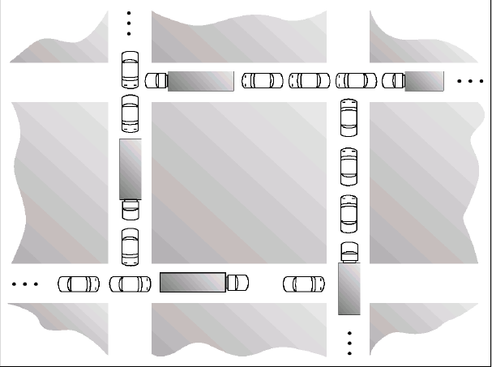
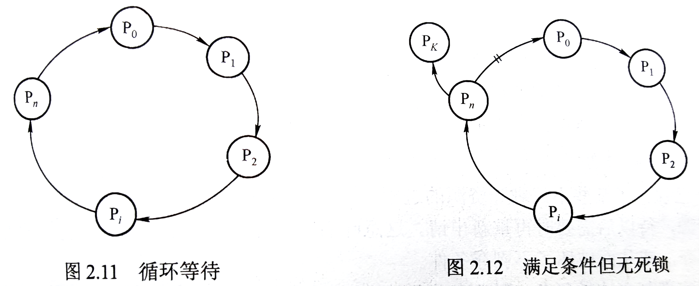

# ✍进程（Ⅲ）

$$
DR \ \ \ \ \ \ \ \ \ \ \ 2021/10/25 \ \ \ \ \ \ \ \ \ V \ 1.0
\\
--------------------------
$$


[TOC]


## 👑👼进程同步与互斥

同步与互斥描述的是两件不同的事情。同步指的是一个承接的关系（生产-消费），互斥指的是并列的竞争的关系。

### 临界区问题

这是使用软件来解决临界区问题。

**临界区：** **进程**中**包含修改共享数据**的**代码段**。

**临界区问题：**设计一个**协议**，确保一进程在临界区执行时**不允许其他进程同时也在临界区执行**。


临界区问题需要满足的**三个条件**：互斥、进展、有限等待⭐

- ==互斥性==：如果一个进程在临界区内执行，那么其他进程都不能在其临界区内执行。
- ==进展性==：如果没有进程在临界区内执行，而且有进程需要进入临界区，那么一定会有一个进程能够进入临界区执行。（避免死锁）
- ==有限等待==：从一个进程**做出进入临界区的请求**直**到这个请求允许为止**，**其他**进程允许进入其临界区的次数是**有限**的。（避免饥饿）


### Peterson算法

两个进程的互斥问题。用了两个数据结构：`flag[2]`表示进程是否想要进入临界区；`int turn`表示最终进入临界区的进程。

```c++
// process i
do{
    flag[i]=true;
    turn=j;
    while(flag[j] && turn==j);
    // critical section
    flag[i]=false;
    // remainder section
}while(1);
```

揣摩一下基本思想：对于进程$p_i$，想确保不被（$p_j$）打乱，那么做两件事：（1）提出申请；（2）保证$p_j$不再申请。做法就是礼让$p_j$先完成。

> 想证明的话，定义出发，证明可以满足三个条件。

该算法（**不会**）导致饥饿。（`2010`）

### Bakery算法

是关于多个进程的同步问题。对应的数据结构变成了`choosing[n]`表示是否取号；`number[n]`表示取到的号码。

```c++
do
{ 　　　　　　　　　
　 choosing[i] = true;
　 number[i] = max{number[0],number[1],…,number[n-1]}+1;//选号码
　 choosing[i] = false;
　 for(j = 0; j<n; j++)
    {
　　　　while (choosing[j]);
　　　　while ((number[j] != 0) && (number[j],j)<(number[i],i));
　　};
　　//临界区
　　number[i] = 0;
　　//其余部分
}while(1);
```

仍然是一样的想法，$p_i$自动排到队尾，等他前面的人都搞完了，现在轮到他。也就是第二个while的判断条件：取到号码并且在前面。

- 为什么对于`choosing[i]`这一变量，要先设true再设false？（`choosing`变量的含义）
- for循环中第一个while循环的意义？如果`choosing[i] = true`，意味着在取号，这样`number[i]`就有可能为0。（要考虑进程执行的速度是有差异的）


### 硬件同步机制

提供了特殊的**硬件指令**以允许能`原子`地（不可中断地）检查、修改或交换相关内容。

这里是使用硬件解决临界区问题。引入工具：**锁🔒**。

两种硬件同步机制：**Disabling/Enabling interrupts、特殊指令**。

#### 中断屏蔽法

CPU只在中断进行进程的切换，因此关中断（屏蔽中断）可以让临界区代码顺利地执行。顺序是**关中断——临界区——开中断**。

#### TestAndSet()

共享数据结构 `lock = false`。

```c++
bool lock = false;
// process Pi
do{
    while(TestAndSet(lock)); // 第一次返回是false，后面都是true
    // Critical
    lock = false;
    // remainder
}
```

可以看出，这里不满足**让权等待**的原则，即等待进入临界区的进程**不会主动放弃CPU**。（`2016`）

`TAS()`指令可以原子地执行。因此，TAS的过程如下：

```c
void TAS(bool* target)
{
	bool ret = *target;
	*target = true;
	return ret;
}
```

同理，swap操作：

```c++
do {
    key = true;
	while (key == true)
	Swap(lock,key);
		//	critical section
	lock = false;
		//	remainder section
}
```

```c
void Swap(bool &a, bool &b)
{
	bool temp = &a;
	&a = &b;
	&b = temp;
}
```

<font color = red><B>WHAT PROBLEM?</B></font> $\Rightarrow$ 未解决有限等待问题！（有多个进程waiting，其中一个进程可能一直没有被选中）


### 🎨信号量（Semaphore）

`wait(S):P(S)`：while S <= 0;	S— —;

`signal(S):V(S)`:	S++;

（`王道P93`）PV操作实质上是两个（**不可中断**）的过程。

> 🍊信号量也可以分为**互斥**信号量和**同步**信号量。

二进制信号量$mutex$（0、1变化），初始化为1。显然信号量为0表示所有的资源都已经使用。之后申请就会**阻塞该进程**。（计数大于0时退出）

基本逻辑如下：（*WHAT PROBLEM？*）会导致忙等待（busy waiting）。

这种信号量叫**自旋锁**（$spinlock$），此时其他进程会进行持续的循环判断（自旋），无上下文但也浪费CPU周期。

```c
do {
    wait(mutex); 
    //	critical section
	signal(mutex); 
    //	remainder section 
	} while (1);
```

（我们不妨可以把这个看成对信号量上锁和解锁的过程）

> Solution：`wait()`发现信号量为0时，阻塞自己，被放入相关的阻塞队列中。
>
> 其他进程的`signal()`操作完成以后就唤醒（`wakeup()`）放入就绪队列中。（由于调度算法，有可能不会立即唤醒该进程）

（`2010`）信号量K的初值是3，当前值为1。M表示可用的资源个数，B表示等待的资源个数，则M、N的值为（**1**，**0**）。


### 🎃经典案例（深刻理解）

#### 🧨有限缓冲问题（生产者消费者问题）

**问题描述：**n*buffer，mutex=1，empty && full分别表示空和满的缓冲项的个数。显然empty=n，full=0。

---

**生产者进程：**

```c
do { …
	produce an item in nextp
	…
	wait(empty);
	wait(mutex);
	…
	add nextp to buffer
	…
	signal(mutex);
	signal(full);
} while (1);
```

**消费者进程：**

```c
do {
	wait(full)
	wait(mutex);
	…
	remove an item from buffer to nextc
	…
	signal(mutex);
	signal(empty);
	…
	consume the item in nextc
	…
} while (1);
```

- 生产或消费哪个，就只改变哪个。结束了修改另一个。

- **❤Q：** *生产者（消费者）能否颠倒两个`wait()`操作的顺序？*$\Rightarrow$ **不可以**！如果两个进程都是先进入的话，empty为0，两个进程都在等待对方完成`signal()`操作才能进行下面的操作！

  > （直观理解，停车时先等有空位才去地下车库，不能先进车库再等位置 ）

- **Q：**释放信号量时顺序能否颠倒？$\Rightarrow$ 可以！释放是增加的操作，并不会导致冲突。换言之，**只有`wait()`操作有可能导致冲突（其实就是资源不够分了）**。

---

（`王道P97`）9\*producer，6\*consumer，cache*8，则互斥使用缓冲器的信号量的初始值是（**1**）。


#### 🐱‍🚀读者-写者问题

**问题描述：**reader && writer进程，共享一个文件。读可以并发，写不可以并发。

- 1st rw problem——readers first

- 2nd rw problem——writers first

---

以第一种为例，写进程需要等待读进程全部退出才可以进入。相关数据结构:

```c
int readCount = 0;
semaphore mutex,rw = 1;
```

**Writer:**

```c
do {
	wait(rw);
	//	writing is performed
    signal(rw);
} while (1)
```

**Reader:**

```c
do {
	wait(mutex);
	readcount++;
	if (readcount == 1)
		wait(rw);
	signal(mutex);
	
	//	reading is performed
	
	wait(mutex);
	readcount--;
	if (readcount == 0)
		signal(rw);
	signal(mutex):
}
```

- **Think：**两个信号量分别表示什么意义？$\Rightarrow$ （`mutex`是`readCount`的锁；`rw`用于互斥访问，也就是资源锁）
- **Q：** reader进程是否有误？（**correct**）
- **Q：**对比王道的代码。

```c
while(1)
{
	wait(mutex);
	if( readCount == 0 ) wait(rw);
	readCount++;
	signal(mutex);
	//	reading process
    //	......(same code)	
}
```

**分析：**整体来看可以分成三步。**访问前**需要保证与写进程不互斥，也就是只有一个读者的情况。然后是**访问过程**。**访问后**需要释放资给writer。（两者其实是一样的，但是不能先加再锁）

**WHAT PROBLEM？**$\Rightarrow$ 写者饥饿。（IMPROVE？）


#### 👩🏾‍🦳哲学家进餐问题

**问题描述：**五个哲学家分别坐在一张圆桌的五张椅子上，有五个碗和五只筷子，交替的进行思考和进餐。平时，一个哲学家进行思考，饥饿时便试图取用其左右最靠近他的筷子，只有在他拿到两只筷子时才能进餐。进餐完毕，放下筷子继续思考。

---

我们定义`signal()`为放下筷子的操作，`wait()`为取筷子。基本想法还是：等别人不用两个筷子，哲学家就把他拿起来。

定义相关的数据结构`semaphore chopstick[5]={1}`。一种代码如下（`王道P89`）

```c
do {
    wait(mutex);
	wait(chopstick[i]);
	wait(chopstick[(i+1) % 5]);
    signal(mutex);
	//	eat
	signal(chopstick[i]);
	signal(chopstick[(i+1) % 5]);
	//	think
} while (1);
```

- **Q：** Why we use mutex? $\Rightarrow$ 这里的想法是奇数和偶数分开取。

---

如果不加mutex会造成死锁，因为资源本身就不够。还有一种解法是设置计数器。（如何实现）

老规矩，我们只要对计数器加锁就行了。

```c
semaphore count = 4;
while(1)
{
    wait(count);
    //	wait
    //	eat
    //	signal
    signal(count);
}
```

> 总之一句话，只要是会产生矛盾的资源，我们就加一把锁就好了，等我们不用该变量，再把它释放掉。


#### 吸烟者问题（`王道P90`）

**问题描述：**3\*smoker && 1\*producer。三种材料：烟草、纸和胶水。`p1`有烟草，`p2`纸，`p3`胶水。

```c
semaphore offer1 = 0;
semaphore offer2 = 0;
semaphore offer3 = 0;
semaphore finish = 0;
int i = 0;
provider(){
    while(1){
        if(i == 0){
           //	将组合一放桌上
           V(offer1);
        }else if(i == 1)
        {
            //	将组合二放桌上
            V(offer2);
        }else id(i == 2)
        {
            //	将组合三放桌上
            V(offer3);
        }
        i = (i+1)%3；
        P(finish);
    }
}
smoker1 (){
    while(1){
        P(offer1)
        //	从桌上拿走组合一;卷烟；抽掉；
        V(finish);
    }
}

smoker2 (){
    while(1){
        P(offer2)
       	//	从桌上拿走组合二;卷烟；抽掉；
        V(finish);
    }
}

smoker3 (){
    while(1){
        P(offer3)
        //	从桌上拿走组合三；卷烟；抽掉；
        V(finish);
    }
}
```

> 本质还是**生产者-消费者**问题。

（`变式`）**吃水果问题**：爸爸放苹果，妈妈放橘子。儿子恰🍊，女儿恰🍎。每次只能一个人放。

**分析：**互斥关系：（1）爸爸妈妈放水果。（2）放水果和吃水果的两组人。爸爸和女儿、妈妈和儿子是同步关系，而且这两对进程必须连起来。（因为只能放一个水果）



给出爹地和女鹅的代码：

```c++
dad() {  //父亲进程
   		while (1) {
        prepare an apple;
        P(plate) ;  //互斥向盘中取、放水果
        //	put the apple on the plate;  
        V(apple);  //允许取苹果
    }
}
daughter () {  //女儿进程
    	while(1) {
        P(apple);  // 互斥向盘中取苹果
        //	take an apple from the plate;
        V(plate);  //运行向盘中取、放水果
        eat the apple;
    }
}
```


### 管程（monitor）

把分散在各进程中的临界区集中起来进行管理。（抽象类）程序员不需要考虑管程的互斥访问。

同时只能有**一个进程**在**一个管程**内执行，若一个进程P调用一个管程的处理程序而这个管程内已经有其他进程Q在执行，则P将被阻塞在管程外面。

**条件变量**⭐：To allow a process to **wait within the monitor**, a condition variable must be declared, as condition
x, y;

条件变量只能用wait、signal使用

- `x.wait()`：调用该功能的进程被挂起，直到另外一个进程执行`x.signal()`
- `x.signal()`：恢复一个特定的被挂起的进程，如果没有进程被挂起，这个操作没有effect

> 管程和进程的区别：
>
> - 管程定义的是公用数据结构，而进程定义的是私有数据结构
>
>
> - 管程把共享变量上的同步操作集中起来，而临界区却分散在每个进程中
>
>
> - 管程是为管理共享资源而建立的，进程主要是为占有系统资源和实现系统并发性而引入的
>
>
> - 管程是被欲使用共享资源的进程所调用，管程和调用它的进程不能并发工作，而进程之间能并发工作
>
>
> - 管程是语言或操作系统的成分，不必创建或撤销，而进程有生命周期，由创建而产生至撤销便消亡

**管程的组成：**

（1）局部于管程的共享变量说明。

（2）该数据结构进行操作的一组过程。

（3）对局部于管程的数据设置初始值的语句。


## 🎳死锁

### 基本概念



**定义：**多个进程等待某一事件，而这一事件只能由等待进程的某一个引起。（两辆车发现自己都上了独木桥了）（理解上面这张交通图）


**死锁的四个条件：**

- **互斥**：一次只能有一个进程使用某资源（单实例）
- **占有并等待**（请求并保持）：一个进程必须在拥有某资源的情况下，等待其他的资源（即 **·主·动·释·放·**）
- **非抢占**（不剥夺）：只有拥有某资源的进程能够自愿地释放，释放即说明进程完成了它的工作
- 循环等待：A等B，B等C，C等A（包含占有并等待）

> Tip：循环等待是死锁的必要条件。图中$P_k$与$P_0$均可打破循环。



### 👴死锁处理

1. 采用某种方法**预防或避免**死锁，让系统永远不会进入死锁状态
2. 允许系统进入死锁状态，**检测**死锁（死锁发现）然后**恢复**。
3. 完全忽略这个问题，假设系统从来都不会出现死锁。（大多数系统采用）


### 🛴死锁预防

想法是**破坏四个条件之一**。

- **互斥：**增加实例个数：假破坏互斥条件（不太可行，反而要保护互斥性）

- **占有等待：**预先静态分配（运行前获取所有资源）、先释放资源再申请新资源。

  **WHAT PROBLEM？**$\Rightarrow$ 资源利用率低（资源先分配但最后使用）、饥饿（永远有自己需要的资源被分配给其他进程）

- **非抢占：**1）若资源的占有者仍需等待其他的资源，则抢走他~**（抢别人）**

  ​				 2）否则，当前申请的进程则需等待，在等待期间，它的资源也是可抢占的**（被抢）**

- **循环等待：**给资源编号，递增顺序申请资源。（换言之，如果想先申请大数字的资源，先释放小数字的资源）

  > 如：打印机12，磁盘1，同时申请这两项的话，先申请磁盘，后申请打印机。

  规定了方向，预防了死锁（可以反证）。


### 🎞死锁避免

#### 安全状态

一个不会产生死锁的进程的**安全序列**。$<P_1,P_2,...,P_n>$，此时对于每个$P_i$，当前可以申请的资源满足其要申请的资源可以被当前空闲的资源和所有$P_j$拥有的资源所满足。（i>j）

> - 安全不是死锁，死锁是不安全状态。
> - 处于非安全状态————**可能**有死锁；处于安全状态，一定没有死锁。


#### 资源分配图算法

这种情况下，每种资源类型只有一个实例。使用资源分配图避免死锁避免。

**概念资源分配图**

进程指向资源指的是进程向资源申请实例

资源指向进程指的是进程占有着资源的一个实例(is holding an instance)

**检测是否有环**。


#### 🎁银行家算法（多实例资源类型）

定义m为资源类型的种类，n为进程数目。

- $Available[m]$：一维数组，表示每种资源现有实例的数量。
- $Max[n][m]$：二维数组，不同进程会申请的各个资源的最多实例个数
- $Allocation[n][m]$：二维数组，当前已经分配给不同进程的各个资源的实例个数
- $Need[n][m]$：二维数组，不同进程仍需的各个资源的实例个数，则$need[i][j] = max[i][j] - allocation[i][j]$。


##### 🧶安全算法

（1）定义：$work[m] = available[m]$且$finish[n] = \{false\}$。

（2）对$i \in [1,n]$，想找到一个$finish[i]  =false \ \&\& \ need_i \le work$，并且更让新$work += allocation[i],finish[i] = true$。

（3）如果没有这样的 i 并且finish全为true，则处于安全状态。找到的 i 的顺序即为安全序列的顺序。

复杂度显然是$\Theta(m\cdot n^2)$。


##### 🎠资源请求算法

定义进程$P_i$的请求向量$request_i[m]$，则该进程申请资源需要满足两个条件：*主观上*没有多要资源、*客观上*当前资源可以满足。

（1）$\color{blue}\textbf{request_i ≤ need_i}$，转入（2），否则出错。（**请求超过需求**）

（2）$\color{blue}\textbf{request_i ≤ available}$，转入（3），否则出错。（**供不应求**）

（3）假定修改状态后：
$$
\begin{cases}
avail = avail - request_i
\\
allocation_i = allocation_i + request_i
\\
need_i = need_i-request_i
\end{cases}
$$
检测是否处于安全状态，成立go on。反之回滚之前操作。


### 🎆死锁发现

#### 单实例资源类型

wait-for graph，$P_i \to P_j$ for $P_i$在等待$P_j$。周期性调用算法检测环（$O(n^2)$）。

#### 多实例资源类型

- Available：一维数组，同上
- Allocation：二维数组，同上
- Request：二维数组，不同，对应着某个进程对某个资源的实例申请个数

**检测算法**

- Work=Available
- Finish，一维数组，若**Allocation[i]=0,则Finish[i]=true**，**否则为false**

步骤：找到一个i，Finish[i]=false且**Request[i]<=Work**⭐，更新**Work+=Allocation[i], Finish[i]=true**。直到没有i满足条件了，看Finish数组，若有false，则系统处于死锁态。进一步而言，若Finish[i]=false，则Pi处于死锁态。