[TOC]

# ❤Chp 5 CPU


$$
DR  \ \ \ \ \ \ \ \ \ \  2021/10/14    \ \ \ \ \ \ \ \ \ \ \mathrm{V \ 1.0}      \\  
-----------------------------------
$$


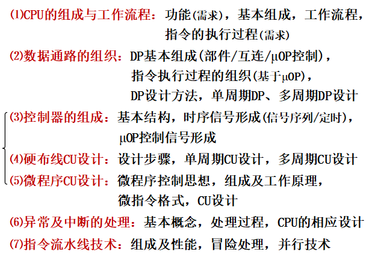

## 🤽‍♂️**CPU = 运算器+控制器**

**基本功能（*6）**：指令控制（控制执行顺序，PC、IR、ID）、操作控制（产生相关信号）、时间控制、数据加工（ALU、FPU…）、外部访问、异常中断处理。

> 注意理解这句话：下条指令在当前指令执行过程中产生。

**基本组成**：

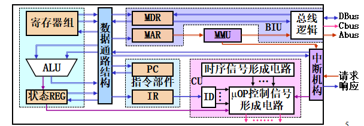

**控制器 v.s. 运算器**

运算器的寄存器：暂存寄存器、累加寄存器（ACC）、通用寄存器、状态条件寄存器。

控制器中的寄存器：程序计数器（PC）、指令寄存器（IR）、存储器数据寄存器（MDR）、存储
器地址寄存器（MAR）。


### 寄存器组织

> `任书P173`不保存结果的操作毫无意义，基本操作的结果必须保存到寄存器等部件中。


**用户可见**：数据/地址/通用/状态 REG…

**专用寄存器**

- PC（存放指令地址，用作循环变量）、IR（当前指令内容）、MAR（$\mathrm{Addr}$）、MDR（$\mathrm{Data}$）、控制REG、程序状态字寄存器（PSW，在**运算器**中）$\to$（OF、SF、ZF、CF…）


- MAR/MDR可使外部操作与内部操作并行(性能)


（`2010`）**PC**对汇编程序员可见，IR、MAR、MDR是不可见的。


### 指令执行过程

指令周期：**取指**（+分析）+**执行周期**

<center><font color = darkgreen><B>指令周期 && 机器周期 && 时钟周期(节拍)</B></font></center>

1. 时钟周期是最基本单位， $指令周期 =\sum(机器周期)$，$机器周期 =\sum(时钟周期)$

   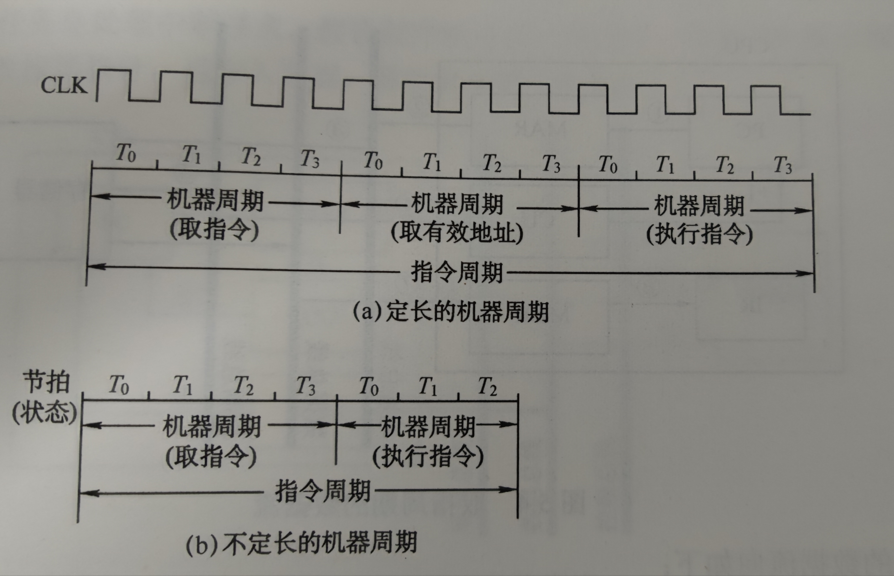

   - 指令周期指完成**一条指令**的全部时间，机器周期之的是一步较完整的操作（如取指令这种）。
   - 时钟周期通常指计算机时钟的周期时间，是计算机基本的时序单位。
   - 时钟周期和微操作对应，微操作与微命令一一对应。

2. 关系图。

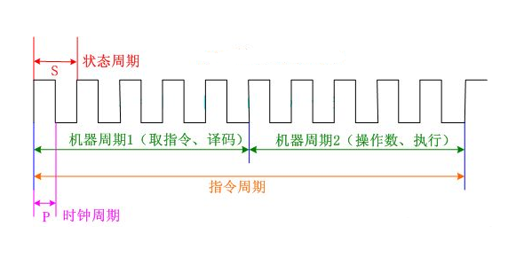

执行过程：**取指令——指令操作译码——取操作数——数据操作——保存结果——指令地址计算。**

> Tip：<font color = orange><B>PC增量</B></font>操作通常放在取指令；<font color = orange><B>转移型的</B></font>地址计算放在取操作数。（执行过程）

（`王道P183`）

- 无条件跳转指令，PC的值修改（**2**）次。
- n位CPU，指的是（**数据总线总数**）。
- PC的位数由（**存储器容量**）决定。

指令执行阶段，只有4种基本操作：
$$
\begin{cases}
\mathrm{RD \leftarrow (RS)}
\\
\mathrm{MDR \leftarrow M[(MAR)]}
\\
\mathrm{M[(MAR)] \leftarrow MDR}
\\
\mathrm{RD \leftarrow (RS1) \ op \ (RS2)}

\end{cases}
$$


---

**e.g.	Demo_IS**

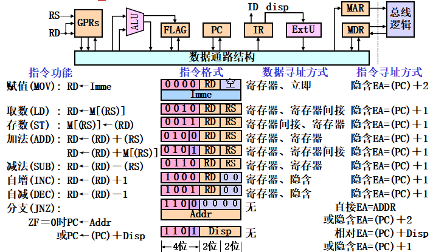


**（1）取指令**——①MAR←(PC)，②MDR←M[(MAR)]、PC←(PC)＋1，③IR←(MDR)（*通用操作序列*） $\Rightarrow$ 结果（PC || IR …）

**（2）分析指令**——无操作

**（3）执行指令**——操作序列 && 结果


## 🦸‍♂️数据通路の功能、基本结构

数据通路的组成：==`功能部件+互连结构`== 

**功能：**实现CPU内部的运算器和寄存器以及之间的数据交换。

### 数据通路部件

**部件类型**：操作部件(组合逻辑)、状态部件(时序逻辑)
                    └←实现操作          └←保存数据

数据通路的部件：

1）操作部件（组合逻辑）：ALU、取指部件；2）状态部件（时序逻辑）：PC、通用寄存器。**不含控制部件。**

### 数据通路结构

> （`王道P194`）单总线、双总线、专用数据通路方式。

结构类型：总线结构、点点结构。

### 数据通路设计

……


## 🖋控制器 && 硬布线控制器

循环地、有序地产生工作流程所需的μOP控制信号。

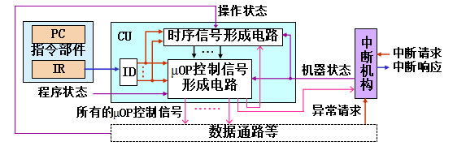

### 时序信号

- <font color = purple><B>机器周期（完成基本功能<font color = gray size = 2>如取指令等</font>）v.s. 节拍（完成一个μop） v.s. 工作脉冲</B></font>

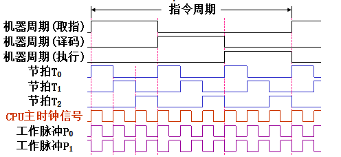

- 早期计算机（CISC）：三级时序(机器周期/节拍/工作脉冲)$指令周期＝∑_{i=1}^x机器周期_i，机器周期＝∑_{i=1}^m节拍_i，
  节拍＝∑_{i=1}^k工作脉冲_i$

- 现代（RISC）：节拍/工作脉冲两级时序


##### 时序电路的组成

环形信号发生器（**产生节拍与工作脉冲**）、定时逻辑（**控制信号时长**）

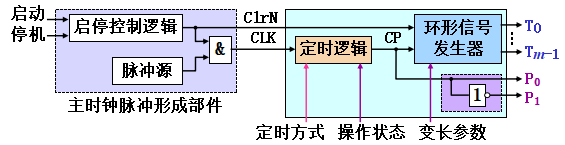

（T和P分别为节拍和脉冲）


##### μOP定时方式

指的是μOP序列中各μOP时长的控制方法。

1. 同步控制方式（`统一的基准时钟信号(主时钟脉冲信号)控制`）、异步控制方式（`专门的联络信号(应答信号)控制`）
2. 异步控制方式（`应答方式 or 握手方式`），CU发出控制信号后，等待部件完成操作后的应答信号。
3. 联合控制（`半同步`）


##### μOP控制信号的形成

**CU**的任务：循环地、有序地产生工作流程所需的μOP控制信号。

$\begin{cases} Input——指令操作、程序状态、时序信号… \\ Output——\{\mu OP_i\} \end{cases}$

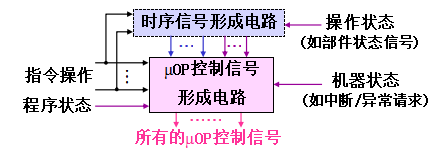

### 硬布线控制器

**实现要求**：两级时序信号，*组合逻辑*形成μOP控制信号（组合逻辑实质上是编码器）——FSM实现

如何实现？


## 🛫微程序控制器

- 微程序 v.s. 硬布线：
  1. 硬布件实现复杂。
  2. 微程序执行速度慢，但是修改和扩展难。（2009）
  3. 微程序的时序系统更为简单。（`王道P216`）
- 基本思想：存储程序的思想解决μop控制信号的形成。（存储逻辑实质上是微主机）
- 😒`指令`、`微程序`、`微指令`、`微命令`：

<table><tr><td bgcolor = lightpink><B>微程序：μOPCmd序列；微指令：一个序列的所有μOPCmd；微命令：一个μOPcmd.</B></td><tr><table>


CS（控制存储器、ROM、CS、in CPU）、微指令周期（CS中取出执行）。

> **微程序控制思想：**
>
> ①每条指令的执行过程(μOPCmd序列)都用一段微程序表示，所有微程序都存放在专用MEM中
> ②CU自动、逐条取出并执行微指令(产生μOP控制信号)。


### 微程序控制器的组成&&原理

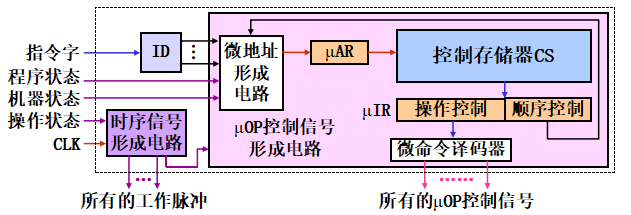

工作原理：循环地取出并执行微指令。

- 形成微程序的入口地址？——（**机器**）指令的（**操作码**）字段

- 指令系统有n种机器指令，则`cs`的微程序数目：（**n+1**）

- 我们如何由顺序字段返回取指程序？——地址字段跳回取指微程序的入口

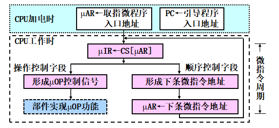


### 微指令格式——定长指令字结构

定长 $\to$ 控制简单、执行速度快。


#### 微指令编码（*3）——与μOP有关

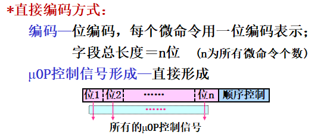

（1）直接操作控制字段最长，信号形成最简单。

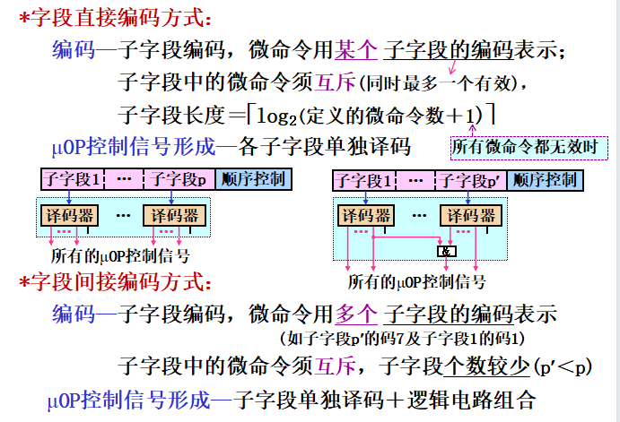

指出：对于+1的操作，有题目是+2（涉及到**中断**任务）（`王道P217`）

（2）字段间接最短，信号形成最复杂。

---

**e.g.	Demo_IS系统：**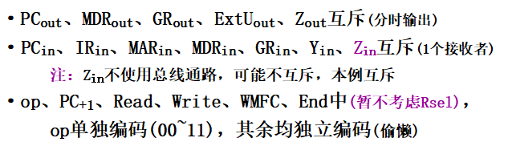

> Tip：这里：所有的`输出`、`输入`互斥，其余的单独（思考）。（关键是考虑到输出输入的分类）

最终结果：（3+3+2+1*4 = 13）

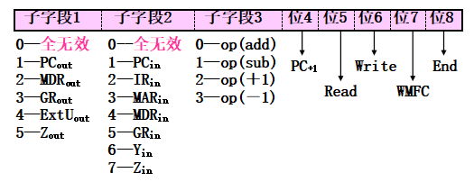

#### 微指令地址——后继微地址形成方式

讲的是<font color = darkgreen><B>顺序控制字段</B></font>的编码。

**顺序控制字段的组成**：方式位+地址参数。

**种类**：计数器法、下址法、测试网络法 

**应用**：断定法(下址+网络)、增量法(计数器+网络)

`(王道P217)`32条指令对应的微程序平均4条微指令，公共的取指令微程序包含2条微指令，下地址法，则字段位数：（**8**）。$\leftarrow \lceil \log_2(32*4+1*2) \rceil$


#### 微指令格式（*2）

水平 v.s. 垂直

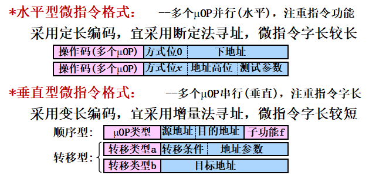

`（王道P216）`水平型指令的位数（**较多**），编写的微程序（**较短**）。


### 🚚微程序控制单元设计

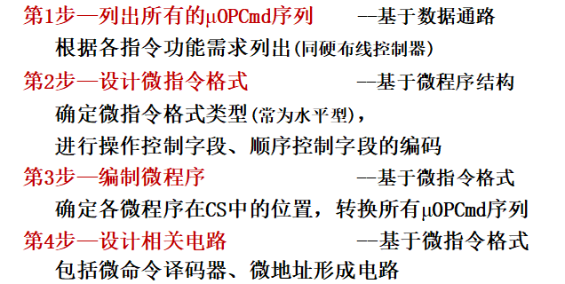

---

**e.g.	Demo_IS:** `（任书P180）`

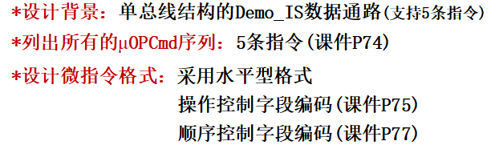

==（1）==$\mathrm{\mu OPCmd}$（skip）

==（2）==设计微指令格式：OP（13），CU（1+5）

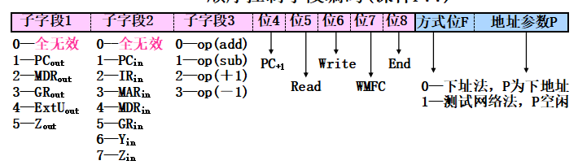

==（3）==微程序：先列出来，再编写地址。

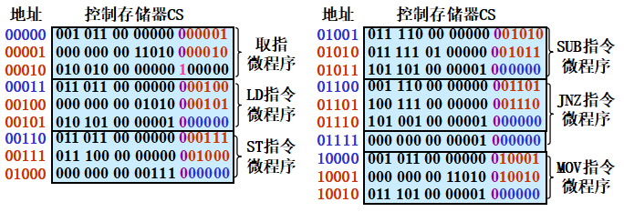

> 注：（1）入口地址	（2）地址字段（微程序中+1，最后一步跳转回**取指**）

==（4）==设计电路（skip）

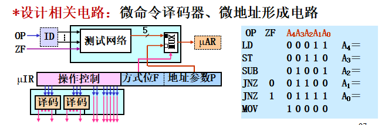


## 中断 && 异常

**事件**：改变程序正常执行顺序的特殊情况；事件类型：中断 && 异常。

**处理方法**：执行处理程序（CPU）。


### 异常（内部异常）

由CPU内部执行指令所引起的意外事件 (如除零、断点、缺页……)

立即处理。（$\leftarrow$ `异常发生程序无法正常执行`）

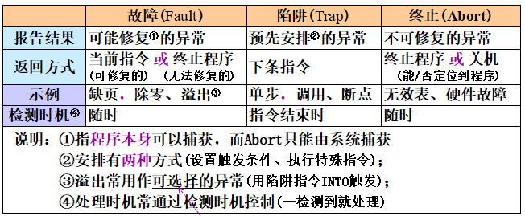

> 异常是同步事件（与指令的执行相关）；中断是异步事件（与指令的执行无关）。


### 中断（外部中断）

由CPU外部的设备产生的请求事件，常称为异步事件

**分类**：

- *可屏蔽中断*——可暂不处理的中断（键盘中断、打印机中断）、可以多个指令周期后处理
- *不可屏蔽中断*——须立即处理的中断（MEM校验错、电源故障）当前指令周期结束处理

**返回**

可屏蔽中断返回下条指令；不可屏蔽返回下条指令或退出。


### 处理过程

事件处理过程：响应、处理、返回。

#### 响应（tasks * 3）

- 响应中断的条件：允许中断触发器EINT=1且有中断请求。关中断会置EINT=0。
- 时器：指令周期结束后回去查询。

硬件实现（软件无法在指令周期内完成）；要完成三个任务：`保存断点以及对应状态`、`关中断`、`识别事件类型转入处理程序`。

**1）断点**

- **目标**—事件返回时，当前程序能继续执行
- **断点**—事件的返回地址（当前 or 下条指令地址）
- **实现**—断点、程序状态(PSW)用后援寄存器保存，异常类型用异常类型寄存器保存   

**2）关中断**——保证响应过程不被新事件打断（IF=0）

**3）识别事件转入处理程序**

识别事件类型(最紧急的)、获取相应处理程序的入口地址、PC←获取的入口地址。（$\leftarrow$ 向量 && 非向量）

> - 非向量方式—所有事件共用一个处理程序，入口地址固定
> - 向量方式—每个事件有一个处理程序，各入口地址保存在中断向量表IVT中（ in **memory**）

（`王道P285`）中断向量表存放的是**中断服务程序入口地址的地址。**


#### 返回

回复断点以及程序状态，用处理程序中的专用指令实现。

### 中断机构的组成 && 设计

Skip

##  🧶指令流水线

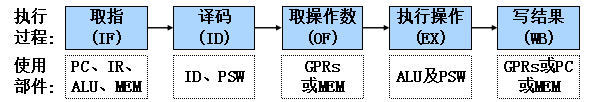

**基本思想**：指令执行过程分为**多阶段**，每个阶段用专门部件实现。

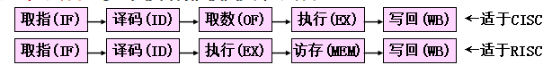

*理想情况*下的执行：（新旧的执行时间各是多少？）

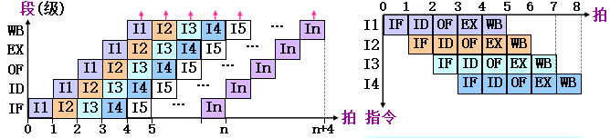

$\mathrm{Tips}$

- 各个段之间相互独立（$\leftarrow realize -$ 增设（阶）**段**间寄存器）
- **段的同步操作**——设置公共的时钟信号同时写入段间寄存器（==拍长==：$\max\{time(段_i)\}$）。
- 关于冒险(*Hazard*)，见后文。（实现：增设部件与控制器）


### 性能

<center><font color = purple><B>假设流水线有m段、拍长为Δt，共执行n条指令</B></font>

<font color  = darkgreen><B>吞吐率</B></font>——单位时间内完成/输出的指令条数或结果数量
$$
T_p = \frac{n}{m \Delta t+(n-1)\Delta t}
 \ \ \ \ \ \ \ \ \ \ \ 
 (T_{max} \to 1,if \ n >> m)
$$
<font color  = darkgreen><B>加速比</B></font>——流水方式相对于串行方式的速度比
$$
S = \frac{nm}{m+n-1} \to m  \ \ \ \ \ \ (n >> m)
$$
<font color  = darkgreen><B>效率</B></font>——部件使用时间与整个执行时间的比值(平均值)
$$
E = \frac{n}{m+n-1}  (=T_p \cdot \Delta t) \to 1 \ \ \ \ \ \ (n>>m)
$$


### 结构冒险

由于争用硬件资源，引起流水线停顿的现象。（例：PC+4中，ALU争用的情况）

solution：重复设置部件、分时使用部件（阻塞后续指令）

采用流水方式执行的时候，指令周期的长度取决于最后一个操作所在段的位置。


### 数据冒险

由于指令**所需数据不可用，引起流水线停顿的现象**。写后读(Read After Write, RAW)冒险。（脏数据？）

处理方法：`阻塞法`、`转发法`、`乱序执行法`

1. **阻塞法**：使冲突指令及其后续指令停顿，直到RAW冒险消除

   ​	（**ID**）检测到RAW，就暂停（**IF**）段，（**ID**）产生气泡   (==理 解==)

   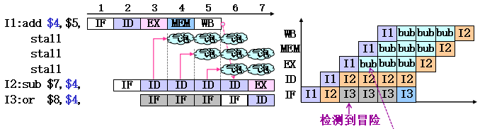

2. **转发法**：使冲突指令可直接从数据产生段获取数据——增加转发线路，同一拍提前写。

   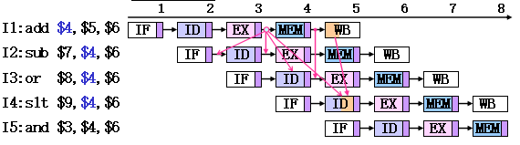

   > load-use 冒险只能用阻塞法。

3. **乱序执行法**：只停顿冲突指令，先执行后续无RAW冒险的指令。改变了程序的执行顺序——WAR && WAW冒险。


### 控制冒险

由于指令执行顺序改变，引起流水线停顿的现象。（**分支**冒险）

处理方法：`阻塞法`、`分支预测法`、`延迟分支法`

1. **阻塞法**——分支指令之后的指令停顿，直到控制冒险消除。（**ID**检测到冒险，则暂停**IF**……直至冒险消除）

2. **分支预测法**——猜对立刻执行，猜错返回执行（==猜对时≥0拍(IF/ID)，猜错时＝阻塞法＋1拍==）<font size = 2>(思考为什么会+1)</font>

   IF段或ID段预测，猜对不写PC，反之清空流水线(分支指令已实现写PC)

   <center><B><table><tr><td bgcolor = pink>静态预测（首次执行） + 动态预测</td></tr></table></B></center>

   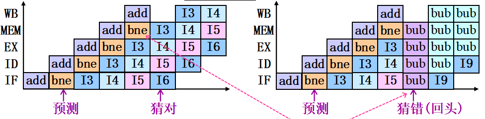

3. **延迟分支法**——逻辑上延长分支执行的时间，软件实现。编译代码的时候，重排序。

---

**e.g.	`任书例题`**	（关于流水线的三个冒险，考察的比较多的还是周期的计算。）指令序列的执行时间计算

**P225**：MIPS流水线	写GPRs放在WB段	*阻塞法*

```assembly
		I1: add $4, $5, $6     ；$4←$5＋$6
        I2: sub $7, $4, $5     ；$7←$4－$5
        I3: or  $8, $4, $7     ；$8←$4 | $7
        I4: sw  $6, 20($4)     ；M[$4＋20]←$6
        I5: lw  $9, 20($8)     ；$9←M[$8＋20] 
```

过程：（1）找RAW冒险。（2）分析每个冒险（3）计算。

- RAW冒险有：I1-I2、I1-I3、I1-I4，I2-I3，I3-I5

- I1-I2冒险停3拍，I1-I3、I1-I4停0拍(随I1-I2自动消除)；I2-I3冒险停3拍；I3-I5冒险停2拍

- 指令序列执行时间＝[5Δt＋(5－1)Δt]＋(3＋3＋2)Δt ＝17Δt


**P226**：*转发法*	写GPRs放在前半拍	转发线路：EX→EX、MEM→EX

- RAW冒险有：I1-I2、I1-I3、I1-I4，I2-I3，I3-I5
- 前半拍写GPRs可消除I1-I4冒险；EX→EX线路可消除I1-I2、I2-I3冒险；MEM→EX线路可消除I1-I3、I3-I5冒险
- 指令序列执行时间＝[5Δt＋(5－1)Δt]＋0Δt＝9Δt


