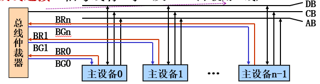

# Chp6 总线

$$
DR \ \ \ \ \ \ \ \ \ \ 2021/10/16 \  \ \ \ \ \ \ \ \ \ V 1.0
\\
----------------------------
$$

[TOC]

## 总线概述

**定义：**连接多个设备用于信息传输的一组公共信号线。

**总线事务：**总线上一对设备之间的一次信息交换过程。【主设备（*CPU*） $\Rightarrow$ 从设备】

（`王道P247`）总线上数据传送：（**分时**）发送，（**同时**）接收。

### 分类

$\mathrm{ABUS,CBUS,DBUS}$

1）DBUS：双向传输；

2）ABUS：目标主存单元地址 or 外设地址，单向；

3）CBUS：控制传输过程，单向

### 💨性能指标

**总线宽度：**数据总线的位数（*bit*）

**总线带宽：**总线的最大数据传输率（MB/s）：==总线宽度*总线工作频率==
$$
B = w\times f/m
$$
**e.g.**	32位总线，100MHz，每个时钟传一次数据，则带宽$B = 32bit \times (100MHz/1) = 3.2Gbps$

---

（`王道P249`）块传送，每块6个字，每个字4个字节，CLK 100MHz。RD操作，第一个clk接收地址， 第二第三延时周期，四个周期写一个块。则*带宽*？

已知：$\color{red} {\textbf{7Tc ~ 1*block = 24B}}$，则$B = 24\times(100/7) = 343MB/s$

### 总线的操作过程

总线是分时共享的（每个时间只有一个设备）。

总线操作：总线上完成一次数据传输的所有操作。$\Rightarrow$ *总线周期：*完成一次总线操作的时间。

**四个阶段：**

- **请求与分配**：主设备提出申请（$BR_i$），总线仲裁器确定总线使用权（$BG_j$）（仲裁结果）
  - 仲裁时机：有请求 && 总线空闲
- **寻址**：主设备发送目标地址与命令，从设备响应操作（如果选中）
- **传送数据**：`主 -(data)-> 从`，需要准备好（ $ACK$ || $\overline{WR}$）
- **结束**：撤销信号，让出使用权

## 总线仲裁

**总线仲裁器**也就是**总线控制器**。解决控制权问题。（**冲突**）

### 集中式仲裁——统一的仲裁器

主设备与仲裁器连接：BR（总线请求）、BG（总线允许）

（`王道P246`）总线忙（$BS=1$）的建立者是（**获得控制权的设备**）。

#### 链式查询

自动轮询每个主设备，主设备（被询问 && 有请求）获得使用权。（BG线是**链式连接**）

需要增加状态线BS（1表示总线忙），设备获得使用权$\to$`BSi <- 1`，结束设0。

显然：$BR = \sum_i BR_i,BS = \sum_i BS_i,BG(i+1)_{in} = BG(i)_{out}$

**特点**：静态、固定优先级（不公平）、信号线最少（*2）、断链？

#### 计数器定时

信号线：BR、BS、设备号

- 也是**轮询**主设备，轮询方法为*逐次定时查询*，主设备自行裁决：$DevNo = ID,ID \in[0,error]$

  换言之，此时总线设备**优先级可变**。（**王道P246**）

- *仲裁器：*$\overline{BS}\cdot BR = 1$，每隔$\Delta t$`DevNo++`，则主设备$BS_i = (DevNo = i)\cdot BR_i$。

- **特点：**静态、有优先级、公平、*无断链*、仲裁信号线多（$ \lceil\log_2 n \rceil$）

#### 独立请求

根据请求线的连接次序仲裁。独立的BR与BG。（$BR_i = 1$ && 总线空闲开始仲裁）$\to$ （直接让$BG_i = 1$即可）

动态优先级、可实现隐藏式仲裁、线多

### 分布式仲裁——无统一仲裁器

每个主设备有自己仲裁号（唯一）、仲裁器。

#### 自举式

优先级请求线表示，仲裁时检查高优先级。（**各主设备**按优先级连接一部分仲裁总线）

静态，线多，不易扩展。

#### 竞争式

优先级仲裁号表示，逐位竞争。

静态、线少、易扩展。

## 总线的定时与传输

### 总线的定时方式

实质是协议或规则。

- **同步：**统一的CLK实现为基准，固定时长。（各部件存取时间*接近*）
- **异步：**握手（应答实现）$\to$ 【主$\to_{(Req)}$从、从$\to_{Ack}$主】
  - 全互锁（双响应）&&半互锁（主🔒从撤销）&&不互锁（一段时间撤销信号）
- **半同步：**折中

### 总线传输模式&&总线标准

`总线标准`：ISA、PCI、EISA（这三个是并行总线）、串行总线（USB、SATA、IDE…）。

（`2013`）（**USB**）用于设备和设备控制器之间。

## 总线的结构与互连

### 总线结构

增加传输并行性、提高总线带宽。

- 单总线、双总线、三总线
- 单与多指的是整个结构，单总线≠一条线（数据、控制、地址）

### 总线互连

总线接口电路实现——中转操作

功能：总线侧操作控制、信息缓冲（`寄存器`）、设备侧操作控制、记录设备状态、信息格式转换。

> **实质**是**信号及时序转换器**。