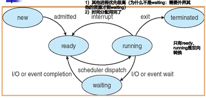
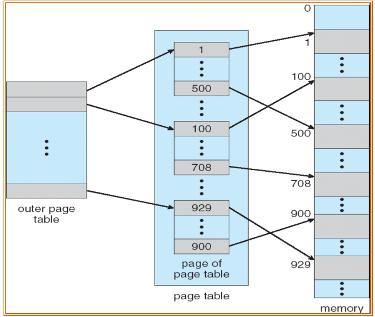
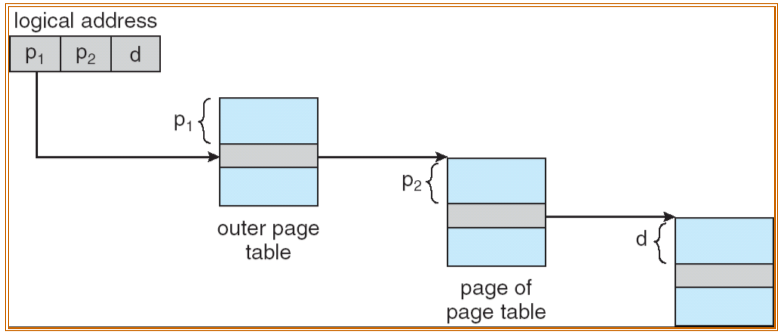

# OS review

$$
DR \ \ \ \ \ \ \ \ \ \ \ \ \ \ \ \ 2021/9/17\\
nobody\ \ \ \ \ \ \ \ \ \ 2020/6/16\\--------------Content--------------
$$

[TOC]

## chp1 Intro

### 1.1	基本概念

==操作系统概念：==本质是**程序集**

······是一种**接口程序、分配程序、控制程序、内核程序**

> program：本质是程序集（操作系统是一种软件）
>
> interface：对用户而言的，用户可以通过操作系统使用硬件资源
>
> allocation（分配**资源**）：做分配，哪部分资源给用户使用
>
> control（控制**程序**执行）：多个程序都想使用同一个资源
>
> kernel：伴随计算机运行而运行，唯一不可或缺

==操作系统基本目标：==**方便性**（对用户）、**高效性**（对资源）


### 1.2	中断

中断是能够引起操作系统注意的一种事件，该事件能够驱动操作系统进行工作。

- 软中断是由**程序执行中断指令**产生的，软中断的发生是有序的、可控的。
- 硬中断是由**外设**引发的，硬中断的发生是随机的、突发的。

**中断机制如何工作**

> 操作系统是由**中断驱动**工作的，当产生一个中断时，当前正在执行的程序被挂起，同时保留当前状态，系统控制权交给操作系统，操作系统通过查找**中断向量**调用相应的**中断处理程序**。中断处理结束后返回被挂起的程序继续执行。

**中断向量 interrupt vector**

包含中断处理程序的入口**地址**

**中断处理程序 interrupt service routine**

处理中断的，预先编写好的程序


### 1.3	存储结构

内存（**小，易失**）、二级存储（**大，非易失**）、分层结构

CPU直接访问主存·······Only large storage media that the CPU can access directly

> Cache Coherency：缓存一致性问题
>
> 是指在采用**层次**结构存储系统的计算机系统中，保证高速缓冲存储器中数据与主存储器中数据相同机制


### 1.4	I/O结构

I/O设备和CPU可以同时工作

**设备控制器**

- Each **device controller** is in charge of a particular device type and has a **local buffer**. I/O is from the device to **local buffer** of the device controller. CPU moves data from/to main memory to/from local buffers.

- 这种中断驱动的I/O适合移动**少量数据**

**DMA**

- Device controller directly transfers blocks of data between buffer storage and main memory **without CPU intervention**. Only **one** interrupt is generated per block.
- CPU给予控制器三条消息【**disk address, memory address for storing the block, byte count**】后就可以不再干预


### 1.5	硬件保护

双模式保护、CPU保护、内存保护、I/O保护

- CPU保护机制的目的是防止操作系统因**用户程序长期占用**而**得不到CPU资源**，可通过==定时器==来实现。(分时系统)
- 内存保护机制的目的是确保**每一进程的内存地址空间不被其他进程访问**，可通过==基址寄存器和界限寄存器==来实现。
- I/O保护机制的目的是**防止I/O设备被用户程序破坏**，可通过将**所有**I/O操作指令==设置为特权指令==来实现。

**双模式保护**·······user mode、kernel mode

模式位规定·······kernel(0), user(1)

一旦中断产生，硬件就从用户态切换到内核态

**特权指令**

一些机器指令可能会破坏系统，为了避免破坏，必须在内核模式下执行

常见特权指令：load-timer, load base registers, load limit registers, all I/O instructions


### 1.6	多道程序设计

> 一些任务被同时放置在内存中，CPU选一个执行，若当前的任务需要等待，CPU切换到下一个任务

It’s the **first instance** where the operating system must make decisions for the users

多道程序设计的**好坏**：

- 调高CPU利用率，充分发挥并发性（包括程序间、设备间、设备和CPU间均并发工作）
- 用户独占资源，无交互性，延迟大

**现代操作系统具备的四大特征**

- 并发性（Concurrence）：程序与程序之间、设备与设备之间、设备与CPU之间均可以并发工作。
- 共享性（Sharing）：系统中的资源可以供多个程序共同使用。
- 虚拟性（Virtual）：内存中的程序都认为自己“独享”硬件资源，把一台物理设备变成逻辑上的多台设备。
- 异步性（Asynchronism）：程序的执行是无序的、随机的。


## chp2 OS structures

*操作系统的功能：*进程（CPU）管理、内存管理、文件管理、磁盘管理、I/O管理、**用户接口**

**操作系统的服务：**🐷

- 程序执行：系统可以将程序加载进内存并执行
- I/O操作：用户程序不能直接执行I/O操作，所以OS要提供一些支持I/O的方法
- 文件系统操作：程序可以读、写、创建、删除文件
- 通信：**进程间**交换信息（共享内存、消息传递）
- 错误检测与处理：检测硬件、用户程序的错误
- *资源分配*
- *统计（审计accounting）*：产生日志
- *保护*：保证访问系统资源的操作是受控制的，检测break-ins....

**功能和服务的关系**⭐

功能是**对内**而言，指**自身具备**的一种**能力**。服务是**对外**而言，指**满足外部需求**的一种能力，这种能力**并非完全自身具备**，可以通过**调用其他服务**来实现。


### 2.1	系统调用

> 系统调用是**操作系统对程序所提供的服务的实现形式**。
>
> 系统调用是一些可以向外提供操作系统服务和资源的函数。是用户态的程序访问内核态程序的接口

**参数传递**（传递参数到操作系统的通用方法）

1. 通过**寄存器**（最简单）
2. 通过**内存中的块和表**(**address** of block passed as a parameter in a register)
3. 通过**堆栈**

**系统调用类型**🐷

Process control, File management, Device management, Information maintenance, Communications.

**为什么更喜欢用API编程？**

> **API**是应用程序开发人员**编写程序所使用的应用编程接口**。
>
> 使用API编程有如下优势：
>
> - 可移植：API对于某些系统调用实现了很好的封装，提高编程效率。
> - 可维护性：当对操作系统功能进行维护和修改时，主要API不变，无需修改用户程序。
> - 实用性：一个简单的程序需要大量的系统调用，实现对多个系统调用的封装，隐藏系统调用过程中的复杂细节，方便用户的使用。
> - 提高性能：可以减少从用户空间到内核空间切换的次数和开销。


### 2.2	微核结构

提供少量的**【进程管理、内存管理、通信功能】**⭐（也是冯诺依曼规定，不可或缺的……）

它的任一模块都能调用任何其他模块，提高了系统效率

优缺点：

- 容易扩展（动态加载内核，提高效率），部署，更可靠安全
- 用户空间与内核空间的交流性能差


### 2.3	策略与机制分离

> 机制是方法，类似函数；策略是参数，不同的参数会有不同的结果


## chp3 Process

### 3.1	进程

**概念**

进程是指执行中的程序。

**组成**

- text section	(program code)
- program counter    (下一条指令的地址)
- **contents** of the **processor's registers**
- heap-stack     (function parameters, return address, local variables)
- data section    (global variables)

(第二、三条组成体现了进程的**动态性**)

**特征**

- Dynamic (动态性)  


- Independency (**独立**性)：进程有独立的存储空间（内存保护）


- Concurrence (并发性)  ：每个进程任务不同


- Structure (结构化) ：进程有……结构（组成）

**进程和程序的区别**

- 程序是一组指令的有序集合，是一个**静态的实体**。而进程是程序在某个数据集上的执行，是一个**动态的实体**。
- 进程是一个程序的状态变化过程，有自己的**生命周期**，是**暂时**的，而程序是可以**永久保存**的。
- 进程和程序**不是一一对应**的，一个程序执行在不同的数据集上就成为不同的进程，而一个进程通过调用关系可以包括多个程序。
- 进程不能脱离具体的程序而存在，而程序规定了相应进程要完成的动作。

**进程和线程的区别**

- 进程是**资源分配**的基本单位，**同一进程内多个线程共享进程的资源**； 
- 线程是进程内的控制流，是**处理器调度**的基本单位；
- **线程不能单独执行，必须组成进程**，一个进程**至少有一个主线程**

**状态**

基本的三态：ready、running、waiting⭐



- new to ready：进程被创建并获得了**除CPU以外**的所有资源

- ready to running：当处理机空闲时，进程调度程序**必将**CPU分配给一个处于就绪状态的进程

  [**不会出现的情况**：没有进程处于running，却有进程除以ready]（课堂讨论题）

- running to waiting：处于运行状态的进程在运行过程中需要等待某一事件发生后才能继续运行，则该进程放弃处理机

- waiting to ready：处于等待状态的进程，其等待的事件已经发生

- running to ready：处于运行状态的进程在其运行过程中，因分给它的处理机时间片已用完或被抢占，而不得不让出处理机

- running to terminated：进程执行结束退出后


tip：进程都在内存中


### 3.2	进程调度

调度队列：Job queue（在系统中的全部进程的集合）、ready queue（在内存中的，处于ready态，等待被执行的进程集合）、device queue（等待I/O设备的进程集合）

**调度器**

- 长期调度器：又称为**作业调度器**，负责选择哪些作业被加载到内存中。

  （决定多道程序的degree，即在内存中的进程数量）

- 短期调度器：又称为**CPU调度器**，用来选择哪些进程获得CPU的使用权。（必须存在的）

- 中期调度器：用来实现内存中进程的换进换出操作。

**上下文切换**

> 什么是一个进程的上下文？
>
> 一个进程的上下文通过进程的PCB来表示，包括CPU寄存器的值、进程状态、PC、其他内存/文件管理信息等……

- 当CPU切换到另一个进程时，系统必须保存旧进程的状态，读取之前保存的新进程的状态。
- 上下文切换时间是overhead的，在切换过程中，CPU does no useful work
- 上下文切换需要硬件支持


### 3.3	进程操作

- `fork()`：新进程创建，重新分配内存空间，会有复制（code section必然也复制）

  fork()后：

  - 在父进程，fork返回新创建的子进程的进程号（大于0）
  - 在子进程，返回0
  - 出错，返回负值

- `exec()`：要想子进程执行不同的功能，则调用（replace the process's memory space with a new program）

- `exit()`：进程执行完了它的最后一句话后，调用`exit()`告知OS删除它

- `wait()`：子进程都执行完了，该调用`wait()`父进程才继续执行

- `abort()`：父进程可以终止子进程执行


### 3.4	进程间通信

两种通信机制：**共享内存、消息传递**

- 共享内存机制通过**建立内存空间**实现进程间通信

- 消息传递机制通过**进程间交换信息**实现进程间通信

  Message passing may be either **blocking or non-blocking**, <u>blocking is considered synchronous</u>, and <u>non-blocking is considered asynchronous</u>.⭐

**共享内存——生产者-消费者**

**消息传递——直接通信、间接通信**

直接通信：

- 进程间要彼此命名，调用函数`send(P,message)`, `receive(P,message)`
- link是自动创建的，一对进程一个link
- link可以是单向的，但一般是双向的

间接通信

- 消息的发送、接收要通过邮箱（端口），which有个独特的ID，原语是`send(box, message)`, `receive(box, message)`
- 两个进程可以通信当且仅当它们共用一个邮箱
- 一个链接可能和多个进程链接
- 每对进程可能有多个链接
- 链接单双向均可

**区别**

- *共享内存比消息传递快（共享内存直接访问空间，消息传递需要通过内核做消息拷贝、转发）*
- 共享内存机制仅**在建立共享内存区域时需要进行系统调用**，之后均为常规内存访问，且不需要复制信息，因此比较**适合传递大量数据**。而消息传递机制的实现**经常使用系统调用**，且需要信息**复制**，传递信息的事件开销大于共享内存机制，**不适合传递大量数据**。
- 共享内存机制通过**共享变量**实现进程间通信，需要**额外机制**防止访问冲突发生，因此**不适合传递少量数据**。而消息传递机制可以避免访问冲突，比较**适合传递少量数据**。
- 由于共享内存机制存在**缓存一致性**问题，在**多核系统中==消息传递机制==**往往成为进程间通信的**首选**。
- 共享内存系统中，提供通信的责任主要在**应用程序员**上，操作系统只需提供共享内存空间；而在消息传递系统中，提供通信的责任主要在**操作系统**本身，应用程序员无法干涉。


## chp4	Thread

### 4.1	线程

**概念**

线程是进程内的控制流(a flow of control)，是CPU调度的基本单位。

（同一进程内的线程共享进程的资源(code section, data section, other resources)）

**组成**⭐

Thread ID, program counter, register set, stack

> Each thread has its separate set of register values and a separate stack.(✔)

**程序、进程、线程的区别**⭐（见3.1）


### 4.2	分类

**用户级线程**

没有内核的干预，用户级进程更加**高效**

由于内核只能识别包含用户级线程的进程，若一个线程阻塞了，同一进程的其他线程也阻塞了。

**内核级线程**

在内核空间进行管理

阻塞一个线程不会引起同一进程的其他线程阻塞，内核 simply runs other threads

> Management and Creation of the kernel threads are usually **slower** than that of the user threads.(✔)

**区别**（导学问题答案）

- 用户级线程仅存在**用户空间**，操作系统内核**不知道**它的存在，而内核级线程位于**内核空间**，操作系统内核**能够感知**到它的存在。
- 用户级线程由**应用程序线程库**来调度和管理，而内核级线程由**操作系统**来调度和管理。
- 各个用户线程**只能在进程内**进行资源竞争，而内核级线程可以在**全系统**内进行资源竞争。


### 4.3	多线程模型

多对一、一对一、多对多

- ==多对一模型==中，多个用户级线程映射到一个内核级线程。**一次只能有一个进程**中的**一个线程**被调度执行，如果该线程被阻塞，那么该线程所属的整个进程都被阻塞，在多核系统中**未能体现真正的并发性。**

- ==一对一模型==中，一个用户级线程映射到一个内核级线程，如果一个线程被阻塞，那么该线程所属进程的其他线程仍然可以被调度执行。在多核系统中**提供了更好的并发性**。如果用户级线程的创建不受限制，系统资源将被**耗尽**。
- ==多对多模型==中，多个用户级线程映射到多个内核级线程，既能够提高多核系统的并发性，又能够防止因用户级线程的创建不受限制而造成的系统资源耗尽。


### 4.4	线程库

`int pthread_create(tid, attr, function, arg)` 

创造一个执行function的线程 

`int pthread_join(tid, val_ptr)`

使一个线程等待另一个线程(with handle tid)结束，才继续执行

**只有一个线程可以被joined**

线程状态有**joinable和detached**，后者can't be joined


### 4.5	信号机制（对比中断机制）

Signals are used in UNIX systems to **notify a process** that a particular **event has occurred**.

**All signals follow the same pattern:** 

- Signal is generated by particular event 

- Signal is delivered to a process 

- Signal is handled

> 信号机制和中断机制的异同（考研网答案）⭐
>
> **同：**都采用了相同的异步通信方式；对信号和某些中断都可以屏蔽；都是处理完毕后回来原来断点
>
> **异：**中断有优先级，信号没有；信号处理程序是在用户态下运行的，中断处理程序是在核心态下运行的；中断响应是及时的，信号相应通常有较大的时间延迟。


## chp5	CPU scheduling

### 5.1	CPU调度

CPU scheduling is **the basis of** multiprogrammed OS

**调度的可行性**

- CPU调度的成功取决于进程的属性————CPU-I/O Burst Cycle

- 进程的执行重复着CPU burst和I/O burst

  当一个进程在I/O burst时，另一个进程可以用CPU进行它的CPU Burst

- CPU-bound：一个进程绝大部分时间在做计算，占用CPU，有**少而长**的CPU bursts

  I/O-bound：一个进程绝大部分时间在做I/O，有很多**短**的CPU bursts

**发生调度的时机**

进程转换图，除了ready->running不会发生调度外，其他转换都会发生CPU调度

**抢占式调度和非抢占式调度**

> 区别：抢占式调度允许一个正在执行中的进程暂时中止，将CPU交给其他进程。非抢占式调度保证一个进程在执行期间不会被剥夺CPU。

- 抢占式调度发生在new->ready, running->ready, waiting->ready。
- 非抢占式调度发生在running->waiting, running->terminated

**调度器**

*真正去实现调度的是分派器，调度器负责决策*

CPU空闲时，调度器必须选择一个ready的进程去执行————短期调度器（CPU调度器）

**分派器**

分派器给予CPU那个，被短期调度器选择的进程，的控制权

分派器功能包括：上下文切换，切换到用户态，跳转到用户程序重启的合适位置

分派潜伏（Dispatch latency）：分派器停止一个进程，重启另一个进程所需要的时间

**调度准则**

1. CPU利用率(CPU Utilization)：单位时间内CPU**被使用**的**比率**
   $$
   ≤40\%\ \ \ lightly\ loaded\ \ \ \ \ \ \ \ \ \ ≥90\%\ \ \ heavily\ loaded
   $$

2. 吞吐量(Throughput)：单位时间内**完成进程**的**个数**

   与CPU利用率没有直接关系

3. 周转时间(Turnaround Time)：从一个**任务提交**到**任务完成**所需要的时间
   $$
   turnaround\ time=finished\ time-arrival\ time
   $$

4. 等待时间(Waiting Time)：进程在**就绪队列中等待时间的总和**

   为什么仅仅是就绪队列：当一个进程执行或做I/O时，CPU调度算法不影响其执行时间；当进程处于就绪队列中时，CPU调度算法影响其时间。
   $$
   waiting\ time=finished\ time-burst\ time-arrival\ time
   $$

5. 响应时间(Response Time)：从**提交一个请求**到产生**第一次响应**所需要的时间

   不包括output response的时间


### 5.2	调度算法

#### 1.	FCFS(First-Come-First-Served)

用队列容易去实现，**不是抢占式调度**（进程一旦占用CPU，就直到它terminated或waiting）

==Convoy Effect：==（护航效应、车队效应）所有进程等待一个大进程放弃CPU使用权


#### 2.	SJF(Shortest-Job-First)

可以是抢占式（Shortest-Remaining-Time-First）/非抢占式调度，可以获得最小的平均等待时间

可能会产生**饥饿**

怎么知道下一个CPU burst的时间？Predict，根据先前的CPU burst————**exponential averaging（指数平均）**
$$
τ_{n+1}=αt_n+(1-α)τ_n
$$

- t~n~：第n次CPU burst的时间
- τ~(n+1)~：估计的下一个CPU burst时间


#### 3.	优先级调度

可以是抢占式/非抢占式调度（课件规定数字越小越优先），可能会产生Indefinite block（**饥饿**）

内部优先级：determined by time limits, memory requirement, number of files, etc.

外部优先级：不是被OS所控制的（例如进程的重要性）

**Aging**：逐渐提升那些在系统中等待许久进程的优先级


#### 4.	Round Robin 轮转法调度

特别为time-sharing systems准备的，类似FCFS，每个进程被分配了一个时间片，用完了则自愿放弃CPU使用，继续重头排队。Typically，**平均周转时间更长，但相应时间更好**。时间片太长——变成FCFS；时间片太短——变成处理器共享。上下文切换可能影响RR的性能，更短的时间片意味着更多的上下文切换。In general，**80%** CPU bursts应当小于时间片长度。**增加时间片的长度，平均周转时间不一定减少**


#### 5.	多级队列调度

就绪队列被分割为不同的队列，根据进程的性质将其**永久**分配到一个队列中

- foreground(interactive): RR
- background(batch): FCFS

一个进程P可以执行，当且仅当所有在其队列之上的包含P的队列为空。当一个进程Q在执行，一个更高优先级队列进来后，Q被抢占。

固定优先级队列：可能产生饥饿

时间片：每个队列都有certain amount of CPU time


#### 6.	多级反馈队列调度

类似多级队列，但是**允许进程在队列间移动**（实现方法：aging）。若进程P占用**更多**CPU time，则被移动到**更低**优先级的队列中，因此I/O bound进程会在更高优先级的队列中。


## chp6	Process Synchronization

### 6.1	竞争条件	Race condition

⭐

竞争条件发生，仅当：

> **两个或更多**的进程/线程**同时或并行**地**访问、操作相同的数据**。执行的结果取决于访问发生的特定顺序。

非抢占式内核不会有race conditions

为了防止竞争条件，同时和并行的进程必须要**同步**


### 6.2	临界区问题

> 临界区：**进程**中**包含修改共享数据**的**代码段**。

> 临界区问题：设计一个**协议**，确保一进程在临界区执行时**不允许其他进程同时也在临界区执行**。

临界区协议包含两部分：**进入区、退出区**。中间的是**临界区**（互斥访问），最后还有一个**剩余区**

临界区问题需要满足的**三个条件**：互斥、进展、有限等待⭐

- 互斥性：如果一个进程在临界区内执行，那么其他进程都不能在其临界区内执行。
- 进展性：如果没有进程在临界区内执行，而且有进程需要进入临界区，那么一定会有一个进程能够进入临界区执行。（避免死锁）
- 有限等待：从一个进程**做出进入临界区的请求**直**到这个请求允许为止**，**其他**进程允许进入其临界区的次数是**有限**的。（避免饥饿）


### 6.3	Peterson算法

对两个进程而言

```c++
// process i
do{
    flag[i]=true;
    turn=j;
    while(flag[j] && turn==j);
    // critical section
    flag[i]=false;
    // remainder section
}while(1);
```

### 6.4	Bakery算法

对多个进程而言

看PPT Chp6 (1)


### 6.5	硬件同步机制（中断管理，特殊指令）

两种硬件同步机制：**Disabling/Enabling interrupts、特殊指令**。

**Interrupt Disabling**

因为中断被禁用了，**不会发生上下文切换**。在多处理器系统中不可行，因为所有的CPU都要被通知。

**TestAndSet**

Test and modify the content of a word atomically.

```c++
bool lock = false;
// process Pi
do{
    while(TestAndSet(lock)); // 第一次返回是false，后面都是true
    // Critical
    lock = false;
    // remainder
}
```

PPT还有一个算法，看一下 chp6 (2) page 10，看看解释……


### 6.6	软件同步机制

#### 1	信号量

`wait(S):P(S)`：while S <= 0;	S— —;

`signal(S):V(S)`:	S++;

**两种类型的信号量：**

Counting semaphore：整数值可以在无限制范围内变化，用来对**多实例资源**的分配控制

Binary semaphore：整数值只能在0、1之间变化，也叫mutex locks

Counting semaphore 也能用 binary semaphore 来实现

上述信号量的定义要求**忙等**（有一个进程在临界区时，其他进程要在它们的进入区持续的循环判断），所以这种信号量也叫spinlock（自旋锁）

好处：没有上下文切换，减少多处理器系统的开销；坏处：浪费CPU周期

**Priority inversion:** The high-priority process is blocked by the low-priority process 

**How to solve:** all processes, including the one that is accessing the data, inherit the high priority until they are done with the resource. When they finish, their priority values revert back to the original values 


#### 2	管程

把分散在各进程中的临界区集中起来进行管理 

同时只能有**一个进程**在**一个管程**内执行，若一个进程P调用一个管程的处理程序而这个管程内已经有其他进程Q在执行，则P将被阻塞在管程外面。

**条件变量**⭐

To allow a process to **wait within the monitor**, a condition variable must be declared, as condition
x, y;

条件变量只能用wait、signal使用

- `x.wait()`：调用该功能的进程被挂起，直到另外一个进程执行`x.signal()`
- `x.signal()`：恢复一个特定的被挂起的进程，如果没有进程被挂起，这个操作没有effect

> 管程和进程的区别：
>
> - 管程定义的是公用数据结构，而进程定义的是私有数据结构
>
>
> - 管程把共享变量上的同步操作集中起来，而临界区却分散在每个进程中
>
>
> - 管程是为管理共享资源而建立的，进程主要是为占有系统资源和实现系统并发性而引入的
>
>
> - 管程是被欲使用共享资源的进程所调用，管程和调用它的进程不能并发工作，而进程之间能并发工作
>
>
> - 管程是语言或操作系统的成分，不必创建或撤销，而进程有生命周期，由创建而产生至撤销便消亡


### 6.7	三大经典同步问题的解决方案

看导学问题答案


## chp7	Deadlocks

### 7.1	死锁

> 如果两个或多个进程永久等待某个事件，而且该事件只能由这些等待进程的某一个引起，那么就出现了死锁状态。

> 和饥饿的区别：
>
> - 饥饿是指长期得不到想要的资源，导致进程无法向前推进的现象
> - 同：都是由于资源无法获取，导致进程无法向前推进
> - 异：死锁进程永远得不到资源，饥饿进程等待时间没有上界；死锁一定涉及多个进程，饥饿可能只涉及一个进程；死锁一定发生循环等待，饥饿则不定，

**概念资源分配图**

进程指向资源指的是进程向资源申请实例

资源指向进程指的是进程占有着资源的一个实例(is holding an instance)

**特征、条件**

- 互斥：一次只能有一个进程使用某资源（单实例）
- 占有并等待：一个进程必须在拥有某资源的情况下，等待其他的资源
- 非抢占：只有拥有某资源的进程能够自愿地释放，释放即说明进程完成了它的工作
- 循环等待：A等B，B等C，C等A（包含占有并等待）


### 7.2	死锁处理

1. 采用某种方法**预防或避免**死锁，让系统永远不会进入死锁状态
2. 允许系统进入死锁状态，检测死锁（死锁发现）然后恢复。
3. 完全忽略这个问题，假设系统从来都不会出现死锁。（大多数系统采用）


### 7.3	死锁预防

**破坏四个条件之一**

1. 互斥。增加实例个数：假破坏互斥条件

2. 占有并等待。规定进程不能在占有资源的时候同时申请其他资源

   可行的策略：1）在运行前获取所有资源，2）申请新资源前释放已有资源

   资源利用率低（长期占用，可能不用）；可能产生饥饿（一个进程要无限期等资源）

3. 非抢占。允许抢占，若当前申请的资源不可用，则

   1）若资源的占有者仍需等待其他的资源，则抢走他~**（抢别人）**

   2）否则，当前申请的进程则需等待，在等待期间，它的资源也是可抢占的**（被抢）**

4. 循环等待。给资源编号，一个进程只能申请比其占有资源种类更高（序号更高）的资源。


### 7.4	死锁避免

> OS获得更多信息后判断，当前请求是否可以被允许，或应当被推迟。

死锁避免算法动态分析资源分配状态，确保永远不会出现**环等**

**安全状态**

当一个进程申请资源时，系统要判断该次分配后系统是否处于安全状态，即对所有进程均存在一个安全序列
$$
<P_1,P_2,...,P_n>
$$
，即对任何一个Pi(i>j)，其要申请的资源可以被当前空闲的资源和所有Pj拥有的资源所满足。

【处于非安全状态————**可能**有死锁；处于安全状态，一定没有死锁】


**资源分配图算法**（单实例资源）

Claim edge：**虚线**箭头，P指向R说明P**可能**会申请资源R

Request edge：申请了则变成实现

资源被释放后，申请线又变成虚线（claim edge）


**银行家算法**（多实例资源）

- Available，一维数组，不同资源可用实例个数
- Max，二维数组，不同进程会申请的各个资源的最多实例个数
- Allocation，二维数组，当前分配给不同进程的各个资源的实例个数
- Need，二维数组，不同进程仍需的各个资源的实例个数

新来了一个request，步骤：检查是否小于need，检查是否小于available，假设分配资源后调用安全算法检查是否存在一个安全序列

**安全算法**

（在银行家算法第三步已经假设分配资源了，Available，Need，Allocation更新了，但没确认更新）

- Work=Available
- Finish，一维数组，初值为false

步骤：找到一个i，finish[i]=false, **Need[i]<Work**⭐，并更新**Work+=Allocation[i], finish[i]=true**。直到找不到i，最后看看finish是否全为true，是的话系统安全。

安全：找到的i的顺序即为安全序列的顺序


### 7.5	死锁发现

**单资源实例**

维护一个wait-for graph，Pi指向Pj即Pi在等待Pj，结点都是进程

周期性调用算法，**searches for a cycle** in the graph，O(e^2)，e=edge_num

**多资源实例**

- Available：一维数组，同上
- Allocation：二维数组，同上
- Request：二维数组，不同，对应着某个进程对某个资源的实例申请个数

检测算法

- Work=Available
- Finish，一维数组，若**Allocation[i]=0,则Finish[i]=true**，**否则为false**

步骤：找到一个i，Finish[i]=false且**Request[i]<=Work**⭐，更新**Work+=Allocation[i], Finish[i]=true**。直到没有i满足条件了，看Finish数组，若有false，则系统处于死锁态。进一步而言，若Finish[i]=false，则Pi处于死锁态。


## chp8	Memory Management

### 8.1	基本概念

**主存和寄存器**是CPU能直接访问的存储介质，Cache在主存和寄存器之间

**基址寄存器和界限寄存器**用于内存保护，定义了合法的地址空间

**逻辑地址空间与物理地址空间**

- 逻辑地址是CPU生成的
- 物理地址是内存单位所能见的
- 两者在compile-time and load-time address-binding schemes是**相同**的，但在execution-time address binding scheme是**不同**的
- 用**重定位寄存器**来动态重定位——Dynamic relocation using a relocation register


### 8.2	连续分配

*固定分区*


**可变分区**

**Hole孔**：可用的内存块

If the hole is larger than the requested size, it is cut into two. The **one** of the requested size is **given to the process**, the **remaining one** becomes a **new hole**. 

When a process returns a memory block, it **becomes a hole** and **must be combined** with its neighbors （指的是邻居孔，不是邻居进程）.

**动态分配问题的三种方法**

1. 首次适应：分配给第一个够大的孔
2. 最佳适应：分配给最佳大的孔（最小且够大）
3. 最差适应：分配给最大的孔

首次适应、最佳适应在减少时间、存储空间利用率方面比最差适应好；但对于存储空间利用率（storage utilization）而言，首次适应、最佳适应不一定说哪个更好，但首次适应一般是更快。


### 8.3	碎片

==内部碎片==是处于**页面内部**的存储块，占有**这些页面的进程**并**不使用**这个存储块，同时**系统也无法利用**它，直到进程释放含有内部碎片的页面，系统才有可能利用这个存储块。

（仅仅给进程其申请的一模一样的内存空间是**不明智**的，因为有内存管理的最小需求）

==外部碎片==是处于**任何已分配页面外部的**空闲存储块，即使这些存储块的总和可以满足当前申请的长度要求，但由于这些存储块地址**不连续**，使得系统也**无法满足**当前申请。

**消除外部碎片的方法：**

1. Compaction压缩————把所有空闲的内存集中起来变成一个大的块，方法可行当且仅当分配的动态的，而且在执行时间就已经完成，压缩是高耗的。（不是永远可行）
2. 允许一个进程的物理地址空间是不连续的————采用分页和分割（paging & segmentation）段页式？


### 8.4	分页

**页表**

包含着每一个页在物理内存中的基址

Contains **base address** of **each page** in **physical memory**


**页与帧**

帧大小=页大小

> Divide **physical memory** into **fixed-sized** **blocks** called ==frames(帧/页框)== 
>
> Divide **logical memory** into blocks of **same size** called ==pages(页)==

运行一个具有**n大小页**的程序，需要找到**n大小空闲的帧**然后读取程序

（分页是清除外部碎片的方法，仍然会有内部碎片）


**页大小的取值因素**⭐

- 内部碎片————希望小页
- table size————希望大页
- I/O 开销————希望大页
- locality————希望小页
- TLB Reach————希望大页


**逻辑地址结构**

**Page number(p):** Index into a page table（页表的项的索引）

**Page offset(d):** Combined with **base address** to **define the physical memory** address that is sent to the memory unit（由页表项找到基址后，加上偏移量得到真正的地址）

> 给定一个逻辑地址空间2^m^,页大小2^n^（帧大小也为2^n^），则
>
> page number	|	page offset
>
> ​		m-n			  |			n


> Exercise：如果帧的大小为4KB，那么具有4B大小页表条目(page table entry)的系统可以访问的最大物理内存空间为多少？
>
> 答：4B=32bit，一个帧（页）大小为4KB=2^12^B，帧个数(页个数) * 帧大小(页大小)=**2^32^ * 2^12^B =2^44^B**
>
> Exercise-Cont. 若固定页表大小为一页呢？
>
> 答：页大小为1页，约束和物理地址空间大小没有关系，答案还是2^44^B，页表大小限制的是逻辑空间大小而已


**页表实现（寄存器、PTBR、TLB）**

1. **寄存器：简单，适合小页表**

2. **Page-Table Base Register（PTBR）**

   页表保存在内存中，使用PTBR指向页表。在这个情况下，每个数据/指令的获取需要两次内存读取(two memory accesses)，一次是找页表，一次是找数据/指令。故Memory access速度减慢。

3. **translation look-aside buffer（TLB）**（*快表*）

   解决两次内存读取的问题。

   > Page#     |       Frame#

   如果page#在TLB中，直接把对应的Frame#读取出来就好，否则再从内存的页表中读取帧#

   一些TLB在其入口存储**地址空间标识符（address-space identifiers（ASIDs））**，以独一无二地分辨不同的进程，提供对相应进程的**地址空间保护**措施。ASID允许TLB同时包含不同进程的入口，不然的话它需要在每次上下文切换时刷新。


**Hit Ratio命中率**

> Percentage of times that a **page number is found in TLB**

$$
hit\ ratio=α,\ \ \ \ \ \ TLB \ lookup=ε\ time\ unit,\ \ \ \ \ \ memory\ cycle \ time=1ms
$$

$$
Effective\ Access\ Time=(1+ε)α+(2+ε)(1-α)=2+ε-α
$$

**内存保护**

在**分页环境**下，将**保护位**和每个帧相互关联起来

**Valid-invalid bit** attached to each entry in the page table：

- Valid: The associated page is in the process's logical address space, and is a legal page
- Invalid: The page is not in the process's logical address space

使用**page table length register(PTLR)**保存一个进程的页表的长度，这样的话一个进程就不能访问它范围之外的内存


**页表结构——层次结构**

将**逻辑地址空间**分成**多个**页表，例如==两层页表==：

A **logical address** (on **32-bit** machine with **4K page size**) is divided into: 

- A **page number** consisting of 20 bits（下面得到了offset12位，所以这里是32-12=20位）
- A **page offset** consisting of 12 bits. （因为页表大小为 4K，4KB=2^12^B=12位）


Since the page table is **paged**, the **page number** is further divided into: 

- A 10-bit page table number.
- A 10-bit page table offset.

> page number     |    page offset
>
> p1    |     p2			|			d
>
> 10    |      10			|			12





（导学问题+15年期考题）


## chp9	Virtual Memory

### 9.1	按需调页

Bring a page into memory only when it's needed

Lazy Swapper(Pager)：Never swaps a page into memory unless page will be needed

Valid-Invalid Bit：与每个page table entry关联，1代表valid && in-memory，0代表invalid || not-in-memory，初始值为0，在地址转换时，如果该位为0则叫**page fault（缺页）**

第一次对页的查找（first reference）一定是缺页，OS看看它的内部table，是invalid reference就终止abort，如果是仅仅不在内存里，就拿一个空的frame，把page置换到frame里，然后重置tables，将bit变为1，然后重启instruction


**有效访问时间**

设p为缺页率
$$
EAT=(1-p)×memory\ access\ time+p(page\ fault\ overhead)
$$

$$
page\ fault\ overhead=serviece\ the\ pagefault\ interrupt+[swap\ page\ out]+swap\ page\ in+restart\ overhead
$$


### 9.2	页置换算法

没有空闲的帧，就使用页置换算法选择一个受害者帧，将其写入磁盘，然后修改页表、帧表，然后重启进程

modify(dirty) bit：减少页置换时间，外面磁盘有就不写出去了，新来的直接覆盖victim就好了


#### 1.	FIFO

先来的先进，也先走

**Belady Anomaly（Belady 异常）**⭐（算法2、3**不会有**Belady异常）

随着帧数量的增加，缺页率反而也增加了


#### 2.	Optimal Algorithm 最优算法

置换一个最长时间内不会用到的页（将来的）

（怎么知道呢……所以用来衡量设计算法的效果）


#### 3.	Least Recently Used (LRU)

置换一个最长时间没有用的页（之前的）

实现方法：

1) Counter: Every time page is referenced through this entry, the clock is copied in to the counter. SO, we can replace the page with the **smallest** time value

2) Stack: When a page is referenced, remove it from the stack and put it on the top. **LRU** page is **always at the bottom**


### 9.3	Thrashing	系统颠簸

一个进程没有足够的帧，它的缺页率很高，CPU利用率很低，此时OS认为要增加多道程序度，则其他进程会继续被加载进来……

**含义⭐**：A process is busy swapping pages in and out

**原因⭐**：size of locality > allocated memory size

(A locality is a set of pages that are actively used together)

**解决⭐（2种，最实用：缺页率的监管）**

1. Working-Set Model

    ▲= working-set window：是一个固定的页的访问次数(a fixed number of page references)

   WSS~i~(working-set of process P~i~) = total number of pages referenced in the most recent ▲

   -  ▲太小不能包含整个locality
   -  ▲太大会包含多个locality
   -  ▲无穷会包含整个程序

   The working set is an approximation of the program’s locality. 

   D = ΣWWS~i~=total demand frames

   若D>m → 颠簸 → suspend one of the processes

2. Page-Fault Frequency监管，设定一个可以接受的缺页率

   若实际缺页率太高，进程获得新的帧；否则，丢失帧


## chp10	File System Interface

### 10.1	文件的概念

A file is a **named collection** of **related information** that is recorded on **secondary storage**.

（有**连续**的**逻辑**地址⭐）


### 10.2	访问方法（顺序，直接）

**顺序访问**

**直接访问**


## chp11	File System Implementation

### 11.1	文件分配（连续、链接、索引）

文件分配的方法即：磁盘块是如何分配给文件使用的

#### 1	Contiguous Allocation	连续分配

每个文件占有一组连续的磁盘块

- 简单：只需要starting location、length(number of blocks)

- 随机访问：使用顺序、直接访问；

- 浪费空间，且文件不能变大（在Extent-based system中，支持文件的扩充）


#### 2	Linked Allocation	链接分配

每一个文件都是磁盘块的链表，块的位置是任意的

- 简单：只需要starting address、end address

- 不会有外部碎片

- 文件可以变大

- 不能随机访问

- 浪费空间：每一块都有一个指针指向下一块


#### 3	Indexed allocation	索引分配

将所有的指针集合起来，放在索引块(index block)中

（就是directory中存的文件名对应的是他的index block下标，然后它的index block里面存的是存放这个文件所用的所有块的指针（地址））

- 可以随机访问
- 浪费空间，例如index block不是完全被使用，有内部碎片
- 文件大小取决于index table的entry数


知道索引后推导出来支持的最大大小？


### 11.2	空闲空间管理（位向量、链表）

如何记录空闲块？

A **free-space list** is maintained. When a new block is  requested, we search this list to find one.


#### 1	Bit vector	位向量

对n blocks而言，位向量`bit`的`bit[i]=1`说明`block[i]`是空闲的，`bit[i]=0`说明`block[i]`被占用了

**Block number calculation**

(number of bits per word) × (number of 0-value words) + offset of first 1 bit


#### 2	Linked List	链表

用一个free-space list head指针指向最开始的空闲块，然后各个空闲块直接依次以指针相连形成链表

- Cannot get contiguous space easily
- No waste of space


*3	Linked List + Grouping*

*4	Linked List + Address + Count*


## chp12	Mass Storage Structure

### 12.1	*磁盘结构*（传输速率、定位时间）

**传输速率（Transfer rate）**硬盘和电脑之间数据流的传输速率（每秒兆字节）

**定位时间（Positioning time/ Random-access time）**

Time to **move disk arm to desired cylinder** (**seek time**) and (plus) time for **desired sector to rotate under the disk head** (**rotational latency**)

Mapping顺序：从上到下，从外柱面到里柱面（距转轴的同一距离的所有sector都存满了（不同层），探头才往里面伸）


### 12.2	磁盘调度算法

**寻道时间⭐(Seek time)**

Time for the disk are to move the heads to the cylinder containing the desired sector

**旋转延时(Rotational latency)**

Additional time waiting for the disk to rotate the desired sector to the disk head

Access time = Seek time + Rotational latency

**磁盘带宽⭐(Disk bandwidth)**

The total number of bytes transferred, divided by the total time between the first request for service and the completion of the last transfer
$$
\frac{Total\ number\ of\ bytes\ transferred}{total\ time\ between\ the\ first\ request\ for\ service\ and\ the\ completion\ of\ the\ last\ transfer}
$$
**寻道距离⭐(Seek distance)**

寻道过程中，disk head走过的距离

寻道距离的计算方法：对每个方向，最大值—最小值，然后把所有结果加起来


（以下算法建议配合ppt图食用）

#### 1.	FCFS

first come first served


#### 2.	SSTF

Shortest seek time first

对disk head所在位置而言，下一个寻找的位置总是离当前位置最近的

可能会产生**饥饿**


#### 3.	SCAN——电梯算法

在读取下一个前，看看当前disk head移动的方向，按照这个方向移动到头（尾）读取，再反向读取至尾（头）。注意：移动到最后一个位置（queue中的都读过了）就停车


#### 4.	C-SCAN

C——有空跑

在读取下一个前，看看当前disk head移动的方向，按照这个方向移动到头（尾）读取。然后空车返回到尾（头），按原方向继续读取。注意：移动到最后一个位置（queue中的都读过了）就停车

Provides a more uniform wait time than SCAN


#### 5.	LOOK

在读取下一个前，看看当前disk head移动的方向，按照这个方向移动到queue中的最大（最小）位置就好了。然后反向读到最小（最大）位置。


#### 6.	C-LOOK

C——有空跑，空车返回到申请的最大/最小位置，按原方向……


### 12.3	磁盘调度算法选择

- **SSTF** is common and has a natural appeal
- **SCAN and C-SCAN** perform better for systems that place a **heavy load** on the disk
- Either **SSTF or LOOK** is a reasonable choice for the default algorithm
- Performance depends on the number and types of requests
- Requests for disk service can be influenced by the file-allocation method
- The location of directories and index blocks is also important


### 12.4	磁盘管理（格式化、引导块、环块）

**低层的格式化/物理格式化**——将磁盘分成几个区域，使得磁盘控制器可以进行读写操作

**引导块	Boot block**

引导块用来初始化系统，存放在ROM中，Bootstrap loader program

**环块**

A disk track with a bad sector. 

1. 用一个空闲的块替代那个bad sector
2. 或者，绕过那个bad sector，shift all sectors（重新编号、移动）


## chp13	 IO Systems

### 13.1	I/O硬件（轮询、中断、DMA）

包含：设备、总线、控制器……

I/O port一般由四个寄存器组成

- data-in register: read by the host to get input
- data-out register: ........ send output
- status register: Can be read by the host
- control register: Can be written by the host to start a command or to change the mode of a device

主机和控制器之间的交互：

**1）Polling	轮询**

The **controller** indicates its state through the busy bit in the status register.

The **host** signals its wishes via the command-ready bit in the control register.

The host is busy-waiting or polling


**2）Interrupts	中断**

效率低，产生一个中断就处理

The **device controller** raises an **interrupt** by asserting a signal on the interrupt request line, the **CPU** catches the interrupt and **dispatches** it to the **interrupt handler**, and the handler **clears the interrupt** by **servicing the device**.


**3）DMA**

效率高，一开始CPU就把需要处理的disk address、memory address、byte count给控制器，就回去继续做它的任务了


### 13.2	内核I/O系统（缓冲、缓存、假脱机）

**1）Buffering	缓冲**：

**A memory area that stores data** being transferred between two devices or between a device and an
application.

Coping with a **speed mismatch** between the producer and consumer of a data stream

Providing **adaptations** for devices that have **different data-transfer sizes**

Supporting **copy semantics** for application I/O

(可能数据会被修改，所以保证写出去的是想要的)


**2）Caching	缓存**：解决访问效率问题

A region of **fast memory** that holds **copies** of data

（缓冲和缓冲的功能是不一样的）


**3）Spooling	假脱机**：解决并发访问的问题（打印机）

**A buffer that holds output for a device** that cannot accept interleaved data streams.

**（用于保存不能接受交错数据流的设备的输出的缓冲区）**


Each application’s output is spooled to a separate disk file.

The spooling system copies the queued spool files to the printer one at a time.

Spooling is one way operating systems can coordinate concurrent output.