# <font size = 12>冲刺刷题篇（真题408）</font>

<center><font style = "font-family:'STXingkai';"><font color = red size = 5><B>“与天奋斗，其乐无穷。与地奋斗，其乐无穷。与人奋斗，其乐无穷。”</font></center>


[TOC]


$$
\textbf{ DR \ \ \ \ \ \ \ \ \ \ 2021/12/09  \ \ \ \ \ \ \ \ \ V1.0 }
\\
----------------------------
$$


## :deciduous_tree:真题篇（2015~2021）

### 2019

- **树与二叉树的转化：**左孩子，右兄弟。BST的（**`inOrder`**）和T的后序遍历一致。

  对树来说：$visiit(child_[i]) \to visit(*root)$。转换过来就是$visit(leftTree) \to visit(*root)$。

  

- **多路归并排序：**几个参数——初始归并段r（r个bucket），k路（每次在k个里面选择最大（小）的数）。因此书的高度：$h = \lceil \log_k r \rceil = S(归并趟数)$


- **DAG：**有向无环图。（如何描述表达式？）

  先写操作数，然后两两计算，运算符是对应的两个操作数的root，结果可以看成一个新的操作数以此循环。（编译原理最后一章画DAG）

  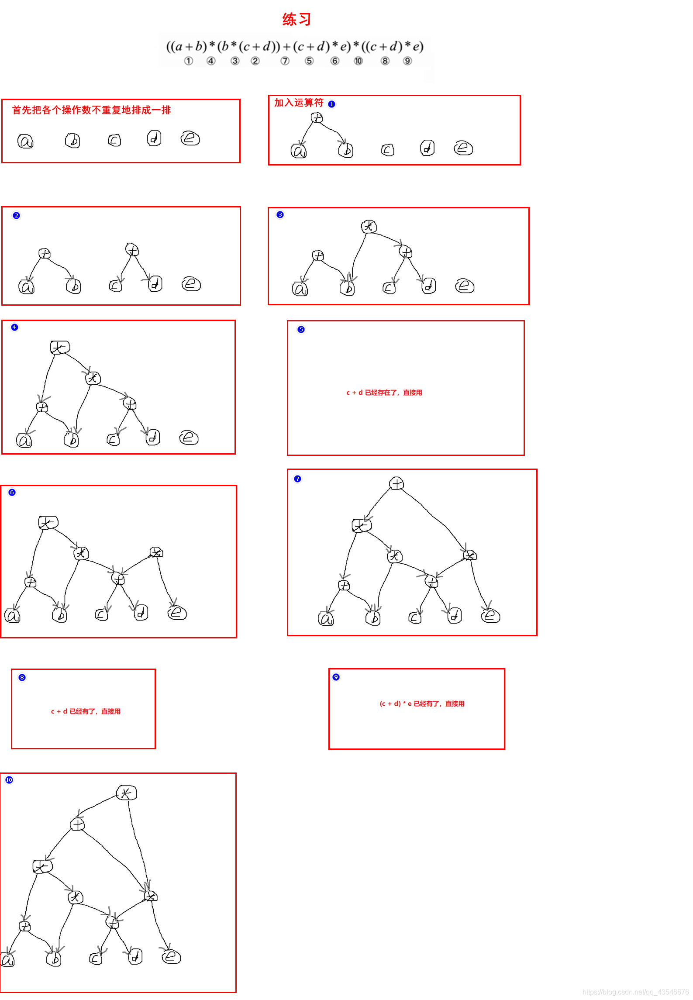


- （`T15`）**虚拟地址补码**：基址寻址，形式地址（补码表示）`FF12H`。基址寄存器的内容是`F0000000H`。则操作数的LSB（最低有效字节）地址是（`EFFFFF15H`）。【此时形式地址是`offset`，化成补码。基址是寄存器中的地址，无符号数，偏移量可以加减，因此是负的】


- （`T21`）关于I/O的计算题（$interrupt$）。

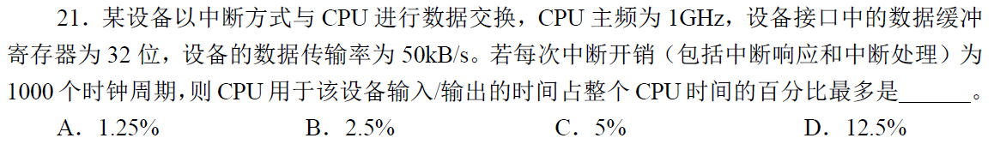


- （`T46`）cache计算题：

  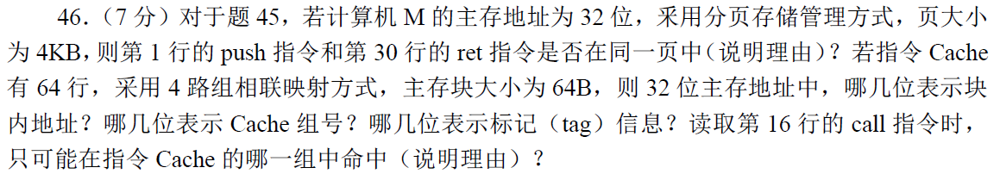

$$
\begin{cases}
\begin{aligned}
virtual\_addr &= pageNum(20)+pageOffset(12)
\\
physical\_addr &= tag(22) + group(4) + blockOffset(6)
\\
cache[16] &= \{tag+data+...\}_i
\end{aligned}
\end{cases}
$$
程序中的地址是虚拟地址。我们做虚拟地址到物理地址的转化时，查表换前面，**页的`offset`保留，因此`vrtual_addr`的后12位保留**。正好`group`就在其中（`7~10`）。转换后得出答案。

> 关于虚拟地址的页和主存地址的块的纠结：我们需要知道虚拟地址查表后的最终产物是实地址。然后实地址再去做相应的变换。


### 2018

- （`T16`）**算术右移**（向右移前面补正负号，正就补0负补1）、逻辑右移（直接补0）。

- （`T17`）DRAM芯片是按**行**刷新的。

- （`T18`）**变址寻址**：地址码是`<Ix,A>`。A是基准地址，不变，`Ix`指向的是寄存器。我们修改的是**寄存器中的内容**。（`EA = (Ii) + A`）

- （`T29`）**时间中断服务：**处理有关时间的一切以及决定调度程序的执行与否。


- （`T43`）非常nb的一个IO题。

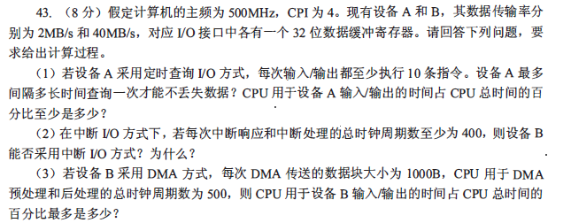

**解：** 

> 整个思路是这样的：可以得出**每次cache数据传输的时间**。这可以看成是一个I/O传输的**完整周期**，也可以理解成准备数据的时间。是**I/O的指令周期时间必须比传输的时间小**（可以理解为如果超过了数据没传完就要执行新的操作了）。**因此用【整个指令的时间】去比上周期的时间**。
>
> 王道的做法是：看一秒内完成多少个I/O操作（$1/(2\mu s)$），共需要多少时钟周期，然后除以CPU频率。

（1）数据传输时间（一个周期）：$ T_{cycle} = \frac{4\ B}{2 \ MBps} = 2*10^{-6}s$。

I/O上CPU使用指令的时间：$T_{I/O} = \frac{40 \ clk}{500 \ MHz} = 8*10^{-7}$。

最后的结果：$\frac{T_{cycle}}{T_{I/O}} = 40 \%$。


- （`T44`）内存管理一张神图。

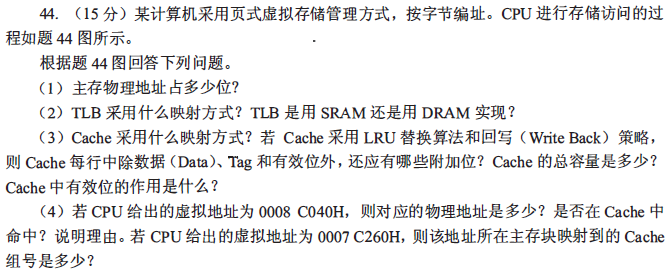

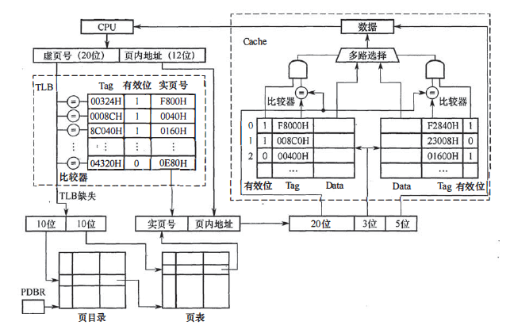

关于数据容量的计算：其中有一项`data`，值是多少？（$2^5B = 32b$）最后的结果是：$8*2*(20(tag)+1(valid)+1(LRU)+1(dirty)+32*8) = 4464 \ b = 558 \ B$

> 计算机按照字节编址的意思就是32位的地址，此时最小单位不是`1b`，而是`1B`了。（$2^{32}$个房间）而内存里面搞的是块（`block`）作为最小单位，`offset`5位，因此`cache`里面存的也是一个`block`的内容。也就是$2^5B$。

（:stars:**理解这张图**！）


### 2017

- （`T8`）折半查找与折半查找判定树：二叉树的中序遍历是有序的。

- （`T11`）当使用链表排序的时候，（**希尔排序**，**堆排序**）时间效率降低。（因为本身是支持随机访问的）【选择和冒泡不变因为时间复杂度没变】


- （`T13`）

  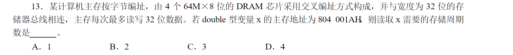

一个芯片每次读`1B`数据，主存每次`4B`数据，double是`8B`数据。开头是10，因此从芯片2（低位选择芯片：`AH -> 1010（b） -> 10`）开始，第一次读2、3，第二次0~3，第三次0、1。因此是三次。


- （`T20`）总线之间必须通过桥接器连接。（起到流量交换的作用）
- （`T22`）**关中断与开中断**：【==记忆==】关就是不允许中断，开就是允许中断。我们在中断处理的时候（**开**）中断，在现场的保护、恢复的时候（**关**）中断。
- （`T29`）file-system的**物理格式化**：分区，校验码；**逻辑格式化**：建立空目录，建立空的`DS`。
- （`T30`）**文件权限**：`A[user][operation]`。


- （`T31`）**硬链接与软链接：**见appendix。


- （`T42`）`Prim`（玩点，每次搞一个新的点连接）、`Kruskal`（玩边，每次搞一个边加进去），唯一的充分条件（$e_i \not=e_j$）？


- （`T43`&&`T44`）计算大题。
  - `int`4字节，`float`4字节，`unsigned`4字节，计算的时候`unsigned`无符号，减法直接取反就可。
  - 计算：`f1(0)`（`unsigned` -1 即全1，无限大），`f1(24),f2(24)`（前者没问题，后者因为尾数的最大是23位，舍去），`f1(31)`（正好溢出，返回-1，最多只能取到30），`f2(127)`（此时指数移码后溢出，为正无穷，因此最大值只能是`f2(126)`，此时阶码是253【127+126】）。
  - **RISC && CISC**：前者固定指令字长（精简），后者不固定（更复杂）。


### 2016

-  （`T13`）`short`是16位（2B）。

- （`T18`）PC理论上内存一样的，但是可能这里是RISC，只用记住指令的个数就行，然后乘个指令字长。如果是CISC那么必然是32位。（==不懂==）

- （`T26`）**改进的CLOCK算法**——双检测位：$<A_{visited},M_{modified}>$。先找`(0,0)`，找不到的话，找`(0,1)`，并且第一位设0。这样再找不到就循环（此时就是原先的`(1,0)`，最后是`(1,1)`）。


- （`T31`）**SPOOLING**：假脱机技术，低速IO和告诉磁盘之间的数据交换。多道批处理，需要IO操作（必然），系统实现（管理资源了，不可能用户），实现了**独占设备转为共享设备**。


- （`T44`）I/O的船新考法。

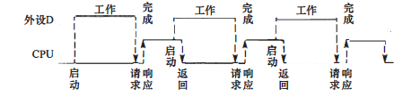

第二问：**首先是**请求中断（`10clk`）；**接着**CPU开始干活（`20clk`），但是看图，它搞到第`15clk`的时候外设开始干活了（`0.5ms`）。

搞完了下一个周期开始。因此只要加到第15各`clk`即可。（关键要看图）


### 2015

- （`T2`）**已知先序序列求二叉树个数**：`stack`：$preOrder() \Rightarrow inStack;\ \ inOrder() \Rightarrow outStack()$。因此给定先序的意思就是给了入栈求出栈，结果是卡特兰数：$\frac{C_{2n}^{n}}{n+1}$。
- （`T15`）**cache**：tag和valid位是必须的！
- （`T24`）`NOT RO`（寄存器取非）一切OK while `MOV R0,addr`（`addr`的数据放入`R0`寄存器中）有可能产生缺页。

- （`T31`）**位图**：就是一个**01序列串**，表示**对应的块是否有修改**，因此如果按照字节编址的话要化为b，结果就是$\lfloor\frac{block\_num}{block\_size \times 8} \rfloor$。最后再除回去作为字节序号结果。

- （`T44`）理解指令。其中第一问指令直接是$2^7$，这是因为已经定义了相应的指令格式。第二问的指令格式为：$<op(7bit) + addr1(3bit) + addr2(3bit) + addr3(3bit)>$。


## :oil_drum:OS


### 🍴进程同步

​	首先补充进程同步与互斥。

- 互斥是两个竞争对立的事物之间，每次只允许一个进程运行。
- 同步则是有一定的先后次序的互斥，可以看成是一种**复杂的互斥**。

- `PV`操作并没有实际的意义，只是保证了实际作用的函数`function()`可以顺利地进行。


（`OS Concept`）关于同步：$p_1-s_1,p_2-s_2$，假设$p_1$后执行$p_2$，那么我们假设共享变量`synch=0`：

```
s1:	V( synch );
s2:	P( synch );
```


#### :haircut:**理发师问题**

*一个理发师，n把等候椅，一张理发的椅子。*


王道给出的解释：

1）**同步关系：**理发师和顾客（`barber`），来的顾客和等候的顾客（`customer`）。**互斥关系：**对于理发椅的访问（加锁`mutex`）。

---

**分析：**

1. 关于**加锁**：就是对于waiting变量的操作前后加锁即可。
2. 关于**同步**：首先分析起点。起点是顾客进门（产生`customer`的资源），同时他会**申请使用**理发师（`barber`的资源）。理发师则正好相反，申请使用`customer`同时会在结束后释放自己（`barber`）。

给出伪代码。

```
customer:
	P(mutex);
	if(waiting < chairs)
	{
		waiting ++;
		V( customers );
		V( mutex );
		P( barbers );
		//	getHairCut();
	}
	else V(mutex);	//	leave
```

```
Barber:
	P( customers );
	P( mutex );
	waiting --;
	V( mutex );
	V( barbers );
	//	haveHairCut();
```

> **思考：**
>
> （1）如何理解锁和信号量？锁是对共享的变量加的（**INT**型），每个进程都是一对操作。同步关系则是一组同步关系添加一个信号量。
>
> （2）如何理解`P()`、`V()`？【**申请**·**使用资源**】、【**申请**·**释放资源**】

可以想象成一个队列`queue[n]`，对于顾客进程，需要`push（）`，对应的barber则可以`pop()`。这样来看的话，customer其实是针对入队而言的，即产生新数据（有地方才能放），barber是针对出队而言的，即消耗新数据（有数据才能取）。

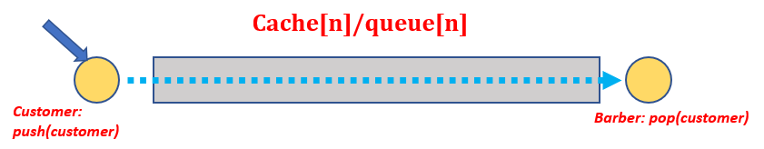


#### 变1：面包师

面包无限多，n推销人员。顾客进店后取号，一个销售人员空闲的时候去叫下一个号。

---

起点还是顾客，拿号码（`i`、`j`）。互斥的一个是取得的最大号码，一个是`saler`选取的最大号码（`mutex1=1`，`mutex2=1`）。同步关系就是顾客先进店，然后`saler`取号码。

```
Consumer:
	P( mutex1 );
	i++;
	V( mutex1 );
	//	getBread();
	
Saler:
	while(1)
	{
		P( mutex2 );
		if( j<i ){
			j++;
			P( mutex2 );
			//	sale bread
		}
		else P( mutex2 );
	}
```

没有用到n个`saler`这个条件？


#### 变2：和尚喝水问题

小和尚取水，老和尚喝水。不管取水还是喝水都要用到一个桶。一个缸（十通水），一口井，三个桶。求取水和打水的进程。

---

首先看打水，打水分为两步，一是打水，二是把水倒入缸中。需要搞两个资源，一个是桶，一个是缸。

然后是取水，也是要用桶，要用缸。类似的同步关系。

取水和打水的过程，自然都是互斥的。（`mutex1`、`mutex2`）

定义三个信号量：桶（`workers=3`）、缸（`space=10`）、与水（`water=0`）。

```
small():
	while(1)
	{
		P( space )；
		P( workers );
		
		P(mutex1);
		//	fetchWellWater();
		V(mutex1);
		P(mutex2);
		//	putWaterIntoVat();
		V(mutex2);
		
		V(workers);
		V(water);
	}
```

```
Old():
	while(1)
	P{
		P(water);
		P(workers);
		
		P(mutex2);
		//	getWaterFromWell();
		V(mutex2);
		
		V(space);
		V(workers);
	}
```

**Tip**：

（1）一开始的时候只用了water，没用space，是否可以？

（2）可不可以只用一个mutex？

> 是不会出错的，但是效率会降低（就像`SX`锁与`SUX`锁一样）

（3）`wait()`操作的两个顺序不能颠倒：执行的顺序是先拿桶再用缸，因此要先等到缸的资源（不能做一半发现没资源了）。


### 软链接硬链接

> 作者：henix
> 链接：https://www.zhihu.com/question/20729978/answer/28885520
> 来源：知乎
> 著作权归作者所有。商业转载请联系作者获得授权，非商业转载请注明出处。
>
> 其实只有两种：硬链接和[符号链接](https://www.zhihu.com/search?q=符号链接&search_source=Entity&hybrid_search_source=Entity&hybrid_search_extra={"sourceType"%3A"answer"%2C"sourceId"%3A"28885520"})。
>
> 谁说硬链接是读写不受影响的？
>
> 硬链接就是：一面墙上有一个洞，洞里放着一个苹果。从墙的这一面看是这个苹果，从墙的另一面看还是同一个苹果。
>
> 硬链接就是同一块数据但有两个不同的名字，读写的时候本质上都是修改的同一块数据。硬链接在删除的时候只是删除了一个名字。只有一块数据的所有名字都删除了的时候，数据才会被删除。（删除的时候相当于把墙的这一面糊上，但苹果本身不动，只有两面都糊上了，你才会看不到）
>
> 符号链接就是：我声称我有一个苹果，但是当你找我要的时候，我对你说，到某个建筑物的仓库就可以拿到那个苹果了。可见我并不真正拥有一个苹果，我只是拥有“某个地方有一个苹果”这个信息。但对于外部的观察者来说，这跟我实际上拥有一个苹果并无差异。
>
> 符号链接的删除：假设我死了，不会影响到原始数据。假设原始数据没了，那我这个符号链接就变成了一张[空头支票](https://www.zhihu.com/search?q=空头支票&search_source=Entity&hybrid_search_source=Entity&hybrid_search_extra={"sourceType"%3A"answer"%2C"sourceId"%3A"28885520"})，也就是悬空的符号链接。
>
> 快捷方式：本质上就是符号链接，只不过 Windows 的资源管理器可以直接管理这种文件。
>
> junction points：可能跟符号链接的区别仅仅是能否使用相对路径。
>
> 复制：把一个苹果变成两个苹果。
>
> 链接都是为文件起别名（alias）的方式，跟复制有本质区别的。


## :sailboat:DS

### 特殊矩阵的压缩

基本思想就是不存空的。

- **对角、三角矩阵**：存一半。
- **稀疏矩阵**：$<row,col,val>$。

（`2017`）适合存储压缩的稀疏矩阵的是（**三元组**，**十字链表**）。

- **三对角矩阵**：第一行最后一行存两个，其余存三个。$a[i][i-1],a[i][i],a[i][i+1]$。


### Union-Set（补充）

定义很简单：就是一个数组实现不同的集合划分。

我们用`parent[n]`来表示节点对应的父亲节点。


几个操作：

```
Init:	parent[i] == -1;
find:
	while(parent[x] > 0) x = parent[x];
	return x;
Union( root1,root2 ):	//	root1 <- root2
	parent[root2] = root1;
```

这是王道的写法。显然很低效。（树无限延伸，最坏是链表）

`find()`函数的通常写法：（如果没找到我们就进行路径的压缩）（**路径压缩**）

```c++
int find( int x )
{
    return x == parent[x]? x : (parent[x] = find(parent[x])); 
}
```

---

继续优化（另一种方法，**按秩压缩**）：

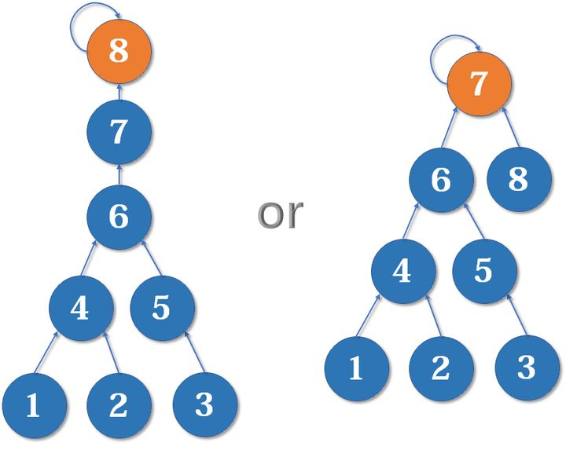

显然我们希望把8加到7上，因为7的深度很大。

自然地，我们添加辅助数组，构造`rank[n]`。


## :baby_symbol:计组

### 数据表示计算相关汇总

- **大小端：**`0x123456`在内存中的存储方式

```assembly
big   低地址 -----> 高地址
  0x12 | 0x34 | 0x56 
small 低地址 -----> 高地址
  0x56 | 0x34 | 0x12 
```

- **IEEE 745**： 1 + 8 + 23，其中阶码用**移码**表示，全0和全1不用，因此最小的阶就是-126。（`2018`）

  **IEEE 754**如何表示零（**全零**）和无穷（阶码**全1**，尾数**全0**）？
  
- **数据类型转换：**

  - char转int：前面补0。
  - 有符号数字与无符号数字转化：有符号为补码，无符号后直接转，符号不管他：`int -1 (1 1111111) -> unsigned int 255 (11111111)`。


### Memory

- **交叉编址与顺序编址：**提高并行访问速率。以交叉为例，则每次从选中的芯片往后各访问一个对应的数据。（其实地址上来看就是地址的增加，但是表示的意义就是**每个芯片都访问一次然后进位**）。

  $\Rightarrow$ 编址方式是（**字扩展方式**）。

  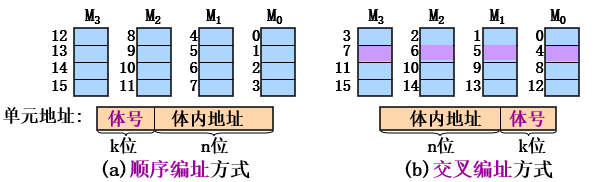


- 关于**PC：**程序计数器，存放的是**指令**的地址，IR存的是指令的内容：`IR <- MEM[ (PC) ]`。理论上是由内存容量决定的。（例外看2016）


