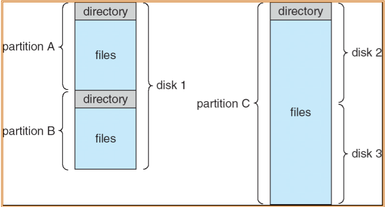
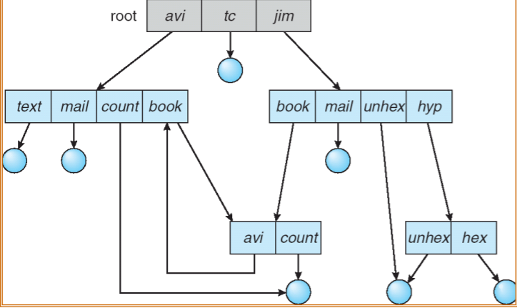
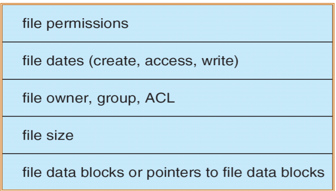

# ⌛File-System

[TOC]

$$
\textbf{DR          2021/11/06          V 1.0}
\\
--------------------------
$$

## :file_folder:文件（==**管理**==）系统接口

### Concept

- A file is a **named collection** of **related information** that is recorded on **secondary storage**.（有**连续**的**逻辑**地址⭐）
- 文件是对Disk的抽象，在逻辑上是具有完整意义的信息序列。
- 文件的**属性**：名称、标识符（唯一）、类型、位置、大小、访问权限……【自下而上看就是“**数据项—记录—文件**”（`王道P217`）】

（`王道P231`）对一个文件的访问，常由用户访问权限和用户优先级共同确定。（**×**）$\to$ 【用户访问权限+文件属性】

### 文件的操作

#### 🧧基本操作

- **创建文件：**分配空间、创建条目。
- **读写文件：**维护一个文件当前位置指针。
- **重定位：**文件寻址，搜索目录相应条目，设置当前文件指针为给定值。
- **删除文件：**释放文件空间与目录条目。
- **截短文件：**只是长度设为0并释放空间。

#### 打开文件`open()`

- 调用系统调用`open()`。OS维护包含**所有打开文件**的信息表（open-file-table）。

- open操作根据文件名搜索文件并复制到打开文件表。**返回：指向打开文件表中相关条目的指针，**之后的操作都是通过（**该指针**）进行。

- 每个打开文件具有的相关信息：文件指针、计数器、文件磁盘位置、访问权限等。

> **Q**：文件指针和文件磁盘位置两个变量是否重复？
>
> **A：**不重复。文件指针定位到上次读写位置。

### 访问方法

**顺序访问：**编辑器等

**直接（相对）访问：**数据库等

### :book:文件结构

#### 逻辑结构

用户角度出发的组织形式。（与存储结构相对应）

无结构文件（流式文件）、有结构文件（纪录式文件：顺序文件、索引文件等）

#### 目录结构

仍然可以看作**用户视角**。

- 磁盘分区，每个区都可以创建一个独立的文件系统。

- 目录的相关**操作**：搜索文件、创建文件、删除文件、遍历目录、重命名文件、跟踪文件系统（备份使用）。

#### 单层&&双层目录结构

skip.

#### :deciduous_tree:树状结构

**绝对路径**与**相对路径**。

**删除目录**？——子目录跟着删除或只有子目录为空才可以删除。

**无环图目录结构**——为了实现文件共享。

#### 🔒文件共享

（如果删除共享节点？）**悬挂指针**！

系统中只需要保留一个文件的一个副本即可。

（以下为`王道补充`）

##### <B>硬链接</B>

又叫**基于索引节点**的链接方式。

此时文件目录只有文件名。共享的**索引节点**包含其他信息。自然还有一个计数器$count$，实行加减工作。为0时系统删除该文件。

##### <B>软链接</B>

又叫**符号链接**。

用户通过一个同名的LINK型的新文件和文件建立链接，两个文件名字相同，但是**LINK文件只包括原文件的路径名**。

此时，只有文件的拥有者才拥有指向索引节点的指针，其他共享者只有文件路径名。访问失败就把符号链删除。

> However，需要挨个地查找目录，增大开销。

（`2009`）`F1`计数值为1，先建立其符号链接文件`F2`，再建立硬链接文件`F3`，然后删除`F1`.此时`F2`和`F3`的计数值分别是（**1**，**1**）。

软链接不加计数值，硬链接加计数值。

### 文件系统的挂载（安装，mounting）

安装位置：安装（挂载）点。（一般需要空目录）

## :card_file_box:文件（==管理==）系统实现

### 文件系统结构

内存与I/O之间的信息交换以（**块**）为单位。

文件系统的设计：**分层**设计。

### :clinking_glasses:文件系统实现

> **文件系统**是**文件管理系统**的简称。

#### :star:文件控制块（**FCB**）

内核的DS，存放在内存。（对应的目录文件放在磁盘）。FCB的有序集合构成文件目录（FCB是**文件目录项**）。

#### :moon:索引节点（**inode**）

由于检索目录文件的时候只需要文件名，因此有的系统（UNIX）将文件名和具体描述信息分开。

索引节点存放了文件的描述信息。因此此时**文件目录项**只包含文件名与`inode`指针。

指出，对于单个文件的长度来讲，索引节点的总数与其是**无关**的。（`2013`）

### :bookmark_tabs:目录实现

OS利用路径名找到对应的目录项，目录项中包含了查找文件磁盘块所需要的信息。

### 🍖文件分配方法

为文件分配磁盘空间。（block）

#### 连续分配

线性序列，每个文件占有一个连续的块。$<start,length>$

快、支持顺序和直接访问、浪费空间且文件不能变大。（**外部**碎片）

只需访问磁盘（**1**）次。

#### 链接分配

文件是磁盘块构成的**链表**。$<start,end>$

简单、五外部碎片、文件可以变大、不支持随机访问、浪费空间（指针需要额外的空间）。

访问磁盘（**n**）次。

#### 索引分配

每个文件都有索引块：对应磁盘块地址的数组。

可以直接访问、无外部碎片、空间浪费更大（很少的指针也需要调用完整的块）。

访问磁盘（m+1）次。（m级索引）

> 原则上，索引块应尽可能小，但也不能太小。

处理大文件索引块的几种机制：

:tipping_hand_man:**链接方案**（索引块链表链接）、**多层索引**、**混合索引**（结合）。

---

（`2010`）7个地址项，4个直接地址索引，2个是一级间接，1个是二级间接。每个地址项大小4B，块大小256B，则文件大小（**1057KB**）。

**解：**

每块可以存64个地址

**直接**：4*256

**一级**：2\*64\*256

**二级**：1\*64\*64\*256

$\Rightarrow$$Res = 1057KB$

### 存储（空闲）空间管理

系统维护一个空闲空间链表。

#### 位向量

空闲块（**1**）、已分配（**0**），构成了一个01序列。

$\Rightarrow$search：找到第一个1？

**Block number calculation**

(number of bits per word) × (number of 0-value words) + offset of first 1 bit

如果二维的话：（i行j列）$b = n*(i-1)+j$。

---

（`2015`）位图位于32~127号块中，每个块占1024B，从0编号。假设要释放的盘号为403612，则修改的盘块号和字节序号为（**82**，**1**）。

**解：**注意这里是位图，每个盘块号只占一位。

**盘块号**：$\color{blue}32+409612/(1024*8 \ bit) = 82$.

**块内字节序号：**$\color{blue} 0+[409612 \% (1024*8)]/8 = 1$

#### 链表法

所有的空闲磁盘链表链接，指向第一块空闲（同时存在cache中）。

- **分组：**n个空闲块中，有一个包含其他（n-1）块的地址。
- **计数：**记录第一块的地址和紧跟第一块的连续空闲块的数量n。

### :book:大容量存储器的结构

#### :cd:磁盘（Disk）

传输速率（MB/s）、定位时间（==**寻道时间+旋转等待时间**==）、读写操作的总时间（定位时间+传输时间）

- 可以看成**一维**的逻辑块的数组，逻辑块是最小的传输单位。
- **寻道时间：**磁臂将磁头移动到目标柱面的时间；**旋转延迟：**目标扇区转动到相应磁头的时间。

- **寻道距离⭐(Seek distance)**

  寻道过程中，disk head走过的距离。寻道距离的计算方法：对每个方向，最大值—最小值，然后把所有结果加起来。

---

（**王道P265**）disk 100个柱面，每个柱面8个磁道，每个磁道8个扇区。5000逻辑记录的文件，记录大小和扇区大小相等。顺序存放。问文件的***第3468条记录***的位置。

**解：**

**柱面：**$3648/64 = 54$.

**磁道：**$(3648\%64)/8 = 1$.

**扇区号：**$(3648\%64\%8) = 4$.

#### :dvd:磁盘调度

考虑一个磁盘调度的待处理请求队列。OS进行相应的选择。

##### **FCFS调度**

公平，不是最快。

##### **SSTF调度**

**最短寻道时间优先算法**。（优先选取距离最近，即差最小的）

类似SJF，动态，会导致一些请求永远得不到处理。（类似**饥饿**）

##### :star:**SCAN调度**

**电梯算法。**一个方向扫描（上楼）再反向扫描（下楼）。

如果请求密度不同，可以进一步优化——**CSCAN。**

> SCAN的两种算法适合磁盘符合较大的情况。

##### **C-SCAN调度**

SCAN调度的优化。等于是首尾相接或者是绕操场跑，到了结尾直接继续回到开头。

> SCAN场景中，出现扫描到了末尾，结果开头来了很多请求的情况，C-SCAN就是针对这一情景设计的。

##### **LOOK && C-LOOK**

SCAN要扫描到尽头，而LOOK只扫描到当前队列中的最远位置。

> SSTF和LOOK算法是比较合理的默认算法。

---

（`王道P266`）1000个柱面（0~999）。开始磁道345，读写头朝0移动。序列是：$\color{blue}\textbf{<123,874,692,475,105,376>}$。分别计算不同方法的时间。

**解：**

1）**FCFS**：**123、874、692、475、105、376**，$\color{orange}\textbf{res = 2013}$。

2）**SSTF**：**376、475、692、874、123、105**，$\color{orange}\textbf{res = 1298}$。

3）**SCAN**：**123、105、0、376、475、692、874**，$\color{orange}\textbf{res = 1219}$。

4）**CSCAN**：**123、105、0、999、874、692、475、376**，$\color{orange}\textbf{res = 1009}$。

5）**C-LOOK**：**123、105、874、692、475、376**，$\color{orange}\textbf{res = 1507}$。

#### :floppy_disk:磁盘管理

**格式化：**磁盘分区以便读写（低级or物理格式化）。

创建文件系统、存储初始的文件系统数据（空闲、分配的空间、空的目录），这是逻辑格式化。

**引导块：**ROM保留自举加载程序，目的是从磁盘上调入完整的自举程序。（Bootstrap loader program）

**坏块：**

A disk track with a bad sector. 

1. 用一个空闲的块替代那个bad sector
2. 或者，绕过那个bad sector，shift all sectors（重新编号、移动）