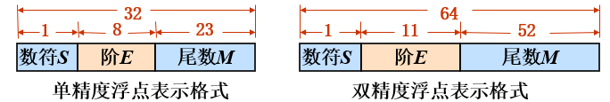

# Chp 2 数据的表示与运算

[TOC]

$$
DR \ \ \ \ \ \ \ \ \ \ 2021/11/29 \ \ \ \ \ \ \ \ \ V1.0
\\
----------------------------
$$

## 数制与转换

|              | **二进制** | **八进制**  | **十进制**  | **十六进制**             |
| ------------ | ---------- | ----------- | ----------- | ------------------------ |
| **数码**     | **0,1**    | **0,1,…,7** | **0,1,…,9** | **0,1,…,9,** **A,B,…,F** |
| **基数**     | **2**      | **8**       | **10**      | **16**                   |
| **书写形式** | **B**      | **O**       | **D**       | **H**                    |

## 机器数与编码

> 数据的组成为：`【符号】+数值`。在计算时，我们的符号与数值分开计算。

### 原码

最简单的编码方式：最高位（**正负**）+剩余（**绝对值**）。我们假设有n位，那最终实际能表达的数就要***减半***。

自然而然地，我们需要对整数和小数分别定义。但核心思想是统一的：即只变换最高位。

- **整数**：$X=\pm x_{n-2}\ldots x_0 \Rightarrow [X]_{原} = x_{n-1}\cdot x_{n-2} \ldots x_0$

$$
[X]_{原} = 
\begin{cases}
X,X \in [1,2^{n-1}]
\\
2^{n-1}-X = 2^{n-1}+|X| ,X \in [-2^{n-1},0]
\end{cases}
$$
（绝对值是从0开始减的，因为这样不会改变本身的值。）

- **小数**：$X=\pm 0.x_{-1}\ldots x_{-(n-1)} \Rightarrow [X]_{原} =x_0. x_{-1}\cdots x_{n-1}$

$$
[X]_{原} = 
\begin{cases}
X,X \in [0,1)
\\
1-X = 1+|X| ,X \in (-1,0]
\end{cases}
$$

原码的特性：

①X与[X]原关系—[X]原与X表示值的范围相同，[+0]原≠[-0]原 ← 2n个码表示2n-1个数。

 ②运算方法—符号与数值**分开运算**、减法先比较大小
                                   └→不利于硬件实现←┘

### 补码

> **符号与数值一起运算，减法无需比较大小。**

本质就是模运算。**正数的补码是其本身，负数的补码是它的正补数。**如此，我们可以直接将减法运算转变为加法运算。（简化硬件）
$$
[X]_{补} = 
\begin{cases}
X,X \in [0,2^{n-1}]
\\
2^n+X = 2^n-X = (2^n-1-X)+1 , X \in [-2^{n-1},0)
\end{cases}
$$
对于负数，我们的后（n-2）位其实是<b>各位取反+1</b>。我们可以这样理解：$ 2^{n}-1$其实是各位都是1的求和，此时作差就是取反。

小数的补码如下：
$$
[X]_{补} = 
\begin{cases}
X,X \in [0,1)
\\
2-|X|, X \in [-1,0)
\end{cases}
$$
对于负数，也就是取反加一，个位置1。

> 关于原码和补码之间的相互转换：**都是用加法，没有-1的操作！**

**反码**：作为补码的过渡编码，取反后不需要+1。

<b><I>COMPARISON</I></b>

①机器数的最高位均为符号位(0/1表示正/负)

②X为正数时，[X]原=[X]补=[X]反
③X为负数时，[X]原符号位=[X]补符号位=[X]反符号位
                    [X]补数值位=[X]原数值位＋1
                    [X]反数值位=[X]原数值位

**④补码比原码、反码多表示一个负数**！

### 补：移码

**WHY？**比较更方便（原码和补码不好直接比较大小）

**HOW？**$[X]_移 = 2^{N-1}+X$。这样，所有的数都处在相同的区间内（**+**）

### CONCLUSION

- 原码直观

- 补码对机器友好（反码是过渡码）

- 移码只适用于整数，方便比较大小

  

## 字符串编码

看书吧。没时间整理了。

## 数据&&非数据的表示

### 定点表示法&&整数的表示

- 定点表示法：即定小数点，小数点位置固定不变。
- `char`、`short`、`int`分别占8、16、32位。

### 浮点表示法

和十进制一样，无非是正负、阶和前面的尾数。（指数是2）

也就是：【**数字的正负 + 尾数（0.5~1） + 指数 + 指数的正负**】。

其中：$X = M\times 2^E$

浮点数的阶超过会上衣，需要溢出处理；反之下溢，不需要。（认为是机器零）

:stars:**浮点数的规格化**：$|M| \le [\frac{1}{2},1)$。先移位，再改编码。尾数移位，阶数加减。

#### IEEE 754 standard

### 非数值数据

**机器字长**：CPU一次能处理的定点数的位数。（和CPU的运算相关）

（`2020`）和机器字长相同的是（**ALU**【运算】）、（**通用寄存器**【参与运算】）。

## 数据运算

### 定点运算

补码、原码、移码……加减。

#### 补码加减

- 减法就是直接$A_补+(-B)_补$
- 统一加减法：设置一个加减位判断（1 for plus）
- 判断溢出（`OF==1`）：同好相加 OR 异号相减，结果是异号。
  - 加法器引脚判断：因此最后看$z_{n-1}$位就OK ：$a_{n-1} = b'_{n-1} \not= z_{n-1}$。
  - 进位位判断：result的最高位和次高位的进位分别是$C_n,C_{n-1}$，则$OF = C_n \bigoplus C_{n-1}$
  - 两位符号判断位：$OF = z_n \bigoplus z_{n-1}$。

#### 乘法运算

基本思想：每次只和一位乘得到`temp`，左移后和之前的结果相加：`res = res + temp`。

- **原码乘法：**正负号异或，绝对值相乘。
- **补码乘法：**

### 浮点运算

对阶（选大的阶），尾数加减（允许溢出）与规格化、舍入，溢出判断（判断阶码是否上溢出）

## ALU

是**组合逻辑电路**，加法器为基础。

**外部接口**：两个输入，一个输出，状态，控制。

