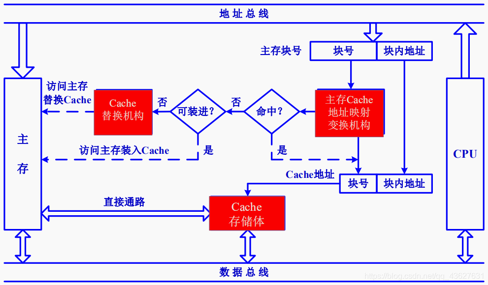
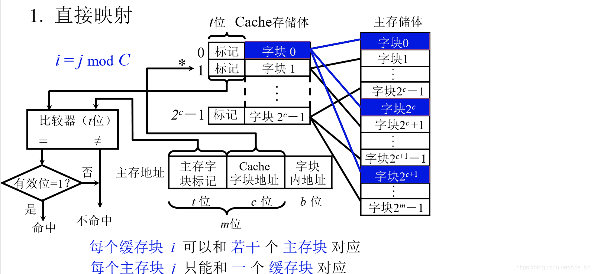
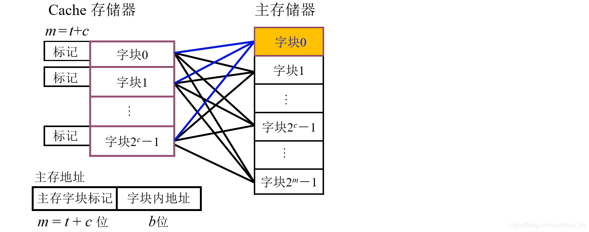
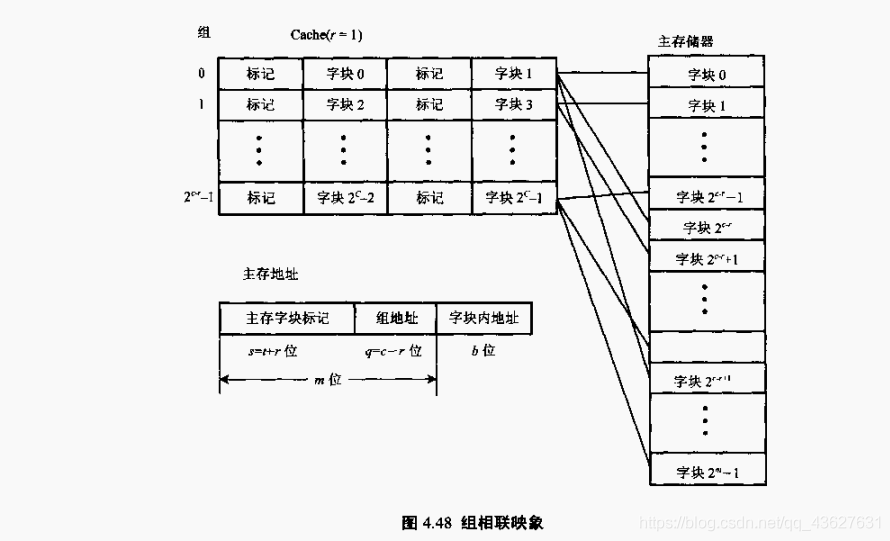
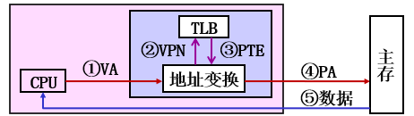

# :memo:Chp3 存储系统


[TOC]


$$
DR  \ \ \ \ \ \ \ \ \ \ \ \ \ 2021/11/27 \ \ \ \ \ \ \ \ \ \ V1.0
\\
---------------------------------
$$


```
Notes：
1. 内存地址是一维线性的。（理解）
2. skip

```

## 概述

- `存储容量`（B）、`存取速度`（存储时间存取周期表示）、`传输速度`（bps）
- 层次访问结构

## DRAM && SRAM && ROM


### 引脚组织

芯片容量 S = 存储单元长度w * 存储单元数量2^n

**SRAM：**

> 数据引脚：单向（2w），双向（w）
>
> 地址引脚：单向（n = ㏒2(S/w) ）
>
> 片选：CS非/CS 其中一种（即选择芯片的引脚）
>
> 读写引脚：WE非


**DRAM：**

数据引脚：同SRAM

地址引脚：n/2	（地址分两次接受（行地址、列地址））

控制引脚：行地址选通RAS非，列地址选通CAS非，读/写 WE非

- DRAM为何设置RAS非，CAS非引脚，没有CS非引脚？

  为了保持高级程度，DRAM芯片的地址分两次传送，故需要上述两个信号区分当前地址信号是行地址还是列地址。

  **使RAS非信号在整个过程中都有效，就可以实现片选引脚功能**

  

## :star:Cache

### Cache的基本工作原理

首先明确：cache远小于memory，它仅保存主存中**最活跃**的若干块的副本。

> <font size = 2>当缓存接收到CPU送来的主存地址后，只需要根据cache字块地址字段（c位）找到cache字块，然后判断cache字块地址与主存地址的主存块标记是否相符，若符合且有效位为“1”，表示cache块已经和主存的某个块建立对应关系（cache命中）；若不符合或有效位为“0”，就从主存中读入新的字块代替旧的字块，同时将信息送往CPU，并修改cache标记，将有效位置1。</font>

- cache是主存的上一级存储器，通常SRAM构成。CPU—cache—主存。
- 外部接口：
- 性能指标：命中&&缺失。 


### 🌃Cache-Memory 替换（<font color = red>理解</font>）

#### 存储空间管理

我们假设主存$n = (m+b)$位，缓存$(c+b)$位。高m位选择主存的块地址，块的大小$\pmb{2^b}$。

- 主存地址：主存块号+块内地址。

  cache地址：cache行号+块内地址。（<font color = indigo>因此cache可以看成组织成行的数组，所谓tag、valid等都是cache行的信息。</font>）

- cache的工作流程：





- Cache和主存映射的时候，以块作为基本单位，此时两者都是按块存储的。
- 由于是映射，对于每一个cache地址，需要包含一个主存地址的所有信息。反之也成立。也就是必须保证双向的操作都是成立的。
- CPU给出的是主存的地址，但是cache先接收到。


#### ==<font color = red>😍三种地址映射</font>==

直接映射、全相联映射、组相联映射。

<font color = darkgreen><b>直接映射</b></font>——固定的映射关系（静态）
$$
\begin{cases} 
Addr(Mem) = <mem_{block}(t),cache_{block}(C),offset(b)>
\\
Addr(cache)[cache_{block}] = <tag(t),offset(b)>
\end{cases}
$$



1. 主存分成若干个与cache存储体大小相同的区。Cache有$2^{c}$个块，则主存被分为若干个含有$2^{c}$个块的区。（说明cache决定主存）

2. 对于CPU给出的地址，可以分为三部分，分别是：***区号、块号、块内偏移地址***。区号就是t位主存子块标记；块号就是c位Cache字块地址，块内偏移地址就是b位字块内地址。

3. - Cache存储体中的t位标记存储了主存储体中对应的区号。
   - 对CPU给出的地址，**可以**根据块号在Cache中直接找到对应的块，
   - **然后**再通过比较器比较地址给出的区号是否与Cache存储体中标记的区号一致。<font color = indigo>一致</font>则说明CPU给出的地址已经保存到了Cache中，可直接获
   - 取地址中的指令或数据，否则说明地址还未保存到Cache中，则需访问主存。


$$
----------------------------------------
$$
<font color = darkgreen><b>全相联映射</b></font>——灵活性好

简单来说，就是整个地址只划分了两块。




$$
----------------------------------------
$$


<font color = darkgreen><b>组相联映射</b></font>——折中方案，组间直接映射，组内全相联映射。

$Cache = Q(group)*R(bpg)*b\ \ \ \ \ \ \ \ \ \ bpg:blocks \ per \ group$



我们这里统一：（任书版本）

<table><tr><td bgcolor = lightyellow><font color = red><b>主存地址 = 群（m-s）+群内块（s）+块内地址（b）</b></font></td></tr></table>

相对应地，cache地址的划分：$Cache[group(s)] = <tag(m-s),offset(b)>$

关于cache的地址的一些tips：

1. cache容量：$num(blocks)*b$，也就是行号+块内地址。
2. cache行的内容：$tag+data(b)$（tag在标记阵列中）。

---

 *e.g.（任书 P122）*

CPU：20位，cache存放8kb数据，主存块大小16B，4组相联映射。

（1）cache一共是512行，分组的话就是128 group。因此主存的7位拿出来分组。
$$
MEM\_ADDR = \\<\textbf{cluster}(tag \ in \ cache,9bits),\textbf{block}(index \ of \ cache,7bits),\textbf {offset}(4bits)>
$$
（2）cache的group为128，即`cache[128]`。其中的tag是9 bits。


### Cache的替换算法

`RAND`、`FIFO`、`LRU`。其中只有LRU不会降低命中率，剩下两种忽略了程序的局部访问性。

#### LRU

选取近期最少使用的块替换。

需要计数器（**LRU位**），每次选择计数值最大的替换。

**更新方法：计数值小的加1，被访问的清零。（任书 P124）**（理解策略的道理）

则cache的管理信息：$<tag,valid,LRU,M>$。tag的位数：$\log_2[num(record \ in \ each \ group)]$，也就是cache中的每一个组的记录个数。


### Cache的写策略

#### 全写法

1. CPU对cache写**命中**时，同时写回cache和memory。
2. **未命中**时，只写入主存。（非写分配法）

> （`王道`）写buffer：CPU写到cache和buffer中。buffer形式是队列，满后写入主存。

#### 写回法

1. CPU**命中**cache的时候只更新cache的内容，该块被替换时写回主存。因此需要设置**脏位**（M）【**1 bit**】表示**是否被修改过**。
2. 反之**未命中**，加载主存中的块到cache中，更新cache块。（写分配法）


## 🛹虚拟存储器

- 主存+辅存 = 虚存，硬件（MMU）和系统软件共同管理，是按虚拟地址访问的存储器模型。

- 这是针对逻辑地址空间而言的，它可能很大。因此，处理的问题就是**逻辑地址和物理地址之间的转化**。


### 基本原理

> 考虑进程：每个进程地址空间相同，但是要比物理地址大的多。

**基本思想**：（进程）借助辅存来扩充贮存的存储空间，并能按虚拟地址访问。

三个概念：主存、辅存、虚存。


### 存储管理

#### :bee:页式（4KB）

虚拟地址：虚页号+页内地址。

**页表**实现虚地址——实地址的转化。一般长久地保存在内存中。（事实上也有在外存中的）

查表的过程需要访问一次主存。


##### <font color = red><b>TLB</b></font>

快表（TLB）——cache（`in CPU`）；慢表（Page）——主存。

分层思想——快表是存慢表的副本。

地址变换过程：先访问TLB，访问确实访问页表。



