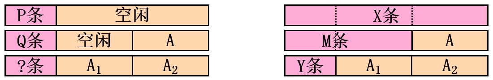
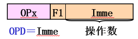
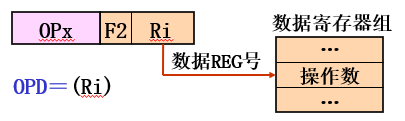
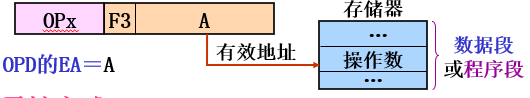
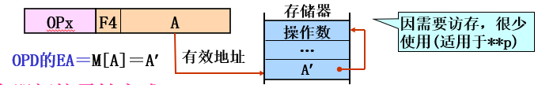
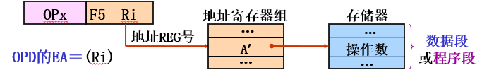
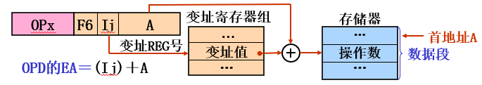
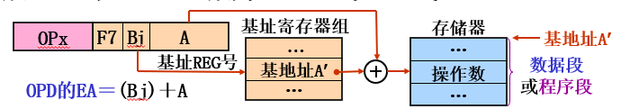
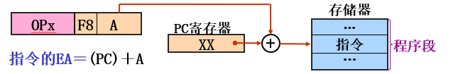
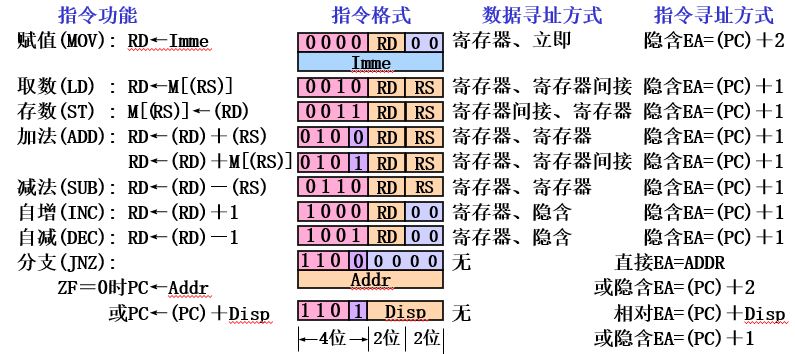

# Chp4 指令系统

[TOC]

$$
DR \ \ \ \ \ \ \ \ \ \ 2021/11/27 \ \ \ \ \ \ \ \ \ \ V1.0
\\
-----------------------------
$$

## 指令系统组成

*定义：*所有机器指令的集合称为指令系统。

**指令字长、机器字长、存储字长三者间有何关系?**

机器字长，一次整数运算所能处理的**二进制数据的位数**，也就是运算器进行定点数运算的字长，通常也是**CPU内部数据通道的宽度**。

存储字长，存储单元中的二进制代码（*存储*字）位数，可以是8位、16位、32位等

> **机器字长＝n×存储字长**，整数n≥1且为**常数**。解析：由于机器字长为CPU一次能处理数据的最大位数，故机器字长为常数；由于数据可存放在MEM中，故机器字长为存储字长的倍数；由于数据可表示为多种长度，为了节省其所占存储空间，存储字长通常为最短数据的长度，即n≥1。
>
> 
>
> **指令字长＝m×存储字长**，整数m≥1，**指令字长与机器字长没有关系**。解析：由于指令存放在MEM中，故指令字长为存储字长的倍数；由于指令系统有定长指令字、变长指令字2种结构，故**m不一定为常数**。

### 指令功能：OPD+OP

#### 指令操作（**OP**）

> 规定：
>
> 1. 寄存器`Ra`，寄存器的内容`(Ra)`。
> 2. 存储器`M[b]`，内容也是`M[b]`。
> 3. 指令功能：$(dest) \leftarrow (op 1)   \ \textbf{OP} \ (op 2) $。其中$dest\to Ra \ \&\& \ M[b]$，$op1|2 \to (Ra) \ \&\& M[b]$。

#### 指令格式：$<OP+ADDR>$

指令格式=操作码（**OP**）+ 地址码（**A**）

- **操作码**表示指令的`格式`（地址码个数、`addr_dest`）、`操作类型`（功能、操作数类型）；**地址码**表示各个**操作数地址**以及**下条指令地址**。
- **基本要求：**避免二义性——每个编码都是唯一的。
- **定长编码**（$len = \lceil\log_2 num(op)\rceil$）、变长编码。
- **地址码**：源OPD地址、目标OPD地址，下条指令地址。

**e.g.**	指令长度16位，地址吗都是6位，零地址、单地址、双地址。则指令分配？

（1）定长：零-P，单-Q。

（2）扩展：零-X，单-Y。

**解：**

（1）操作码长度4，双地址（$2^4-P-Q$）

（2）
$$
\begin{aligned}
& X \le [(2^4-Y)*2^6 - M]*2^6
\\
\Rightarrow
&M \le (2^4-Y)*2*6-X/2^6

\end{aligned}
$$

- 指令字长=n个主存单元长度；下条指令地址为主存单元地址。

## 操作数的存放方式

skip。

## 寻址方式

根据地址码形成OPD地址，生成下条指令。

**形式地址（A）**：地址码中给出的地址；**有效地址（EA）**：指令**·形·成·**的存储单元地址。

### 指令寻址方式

形成下条指令地址。

**顺序寻址：**隐式表示：$EA = (PC)+'1'*k$，表示一条指令的长度。取指令阶段实现。（取指结束时，`（PC）`地址自动加**1**）

**跳跃寻址：**$EA = f(addr)$。指令译码阶段实现。

### 数据寻址方式

**通式：**ADDR = 寻址方式（`F`） + 地址参数（`para`）

- **立即寻址：**操作数在指令寄存器中，`Imme`本身表示的是操作数而非地址。

  

- **寄存器寻址：**`Ri`一次指向操作数，村的是操作数（在`寄存器`）的地址。

- **直接寻址：**操作数放在存储器中，和寄存器的区别就是这是存储器的地址。

  

- **间接寻址：**操作数在存储器，地址参数为存放有效地址的有效地址；**寄存器间接：**OPD in MEM，地址参数指向`reg`，`reg`指向对应的操作数。

- **变址&&基址寻址**——OPD in memory。

  - **变址（index）**：地址参数【**变址reg + 形式地址**】（基准），数据块访问，变址reg可以自动变址。（如数组，A存首地址，`Ii`为下标）==*记忆*：寻找的是变（换）址，则offset放在寄存器中，基址不变。==

    

  - **基址（base）**：相反，地址参数为【**基址reg+形式地址（offset）**】段式存储与地址重定位。逻辑地址空间相对稳定，基地址A变换。==*记忆*：寻找的是基（**首**）址，即offset不变，基址在寄存器中。==

    

（A始终式offset，前面的参数始终指向初始地址）

- **相对寻址**：地址参数为offset

### 指令系统应用（DEMO_IS）

具体刷题整理。

## RISC && CISC

**CISC：**侧重增强指令功能，减少指令数。

变长指令结构、指令种类多，格式复杂寻址方式多……

**RISC：**侧重简化指令功能，提高速度。

定长、`reg-reg`型指令，寄存器多。

