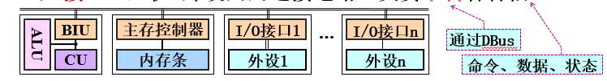

[TOC]

# Chp 7 I/O

$$
DR \ \ \ \ \ \ \ \ \ \ 2021/10/14 \ \ \ \ \ \ \ \ \ \ V \ 1.2\ (add \ \mathbb{WangDao}) \\
----------------------------------
$$

## 🚑I/O系统概述

**Task**：（*以主机为中心而言*）对信息进行输入和输出的控制。

> 其中，主存为（CPU+内存）

**组成**：硬件（信息传送） + 软件（传送控制）

<B>软件</B>

​	1）实现：I/O指令、I/O程序

（`王道P264`）I/O指令是机器指令的一类，但是格式有所不同。

​	2）指令：==<操作码（in || out），设备码，命令码>==

​	3）通道指令：通道I/O方式的传送控制部件，与指令系统无关。

### 外设连接主机

**连接方式**——总线连接

I/O接口连接，其中I/O接口用寄存器（`I/O端口`）暂存消息，总线传输。

选用接口与端口的方法，指令格式为：$<操作码，I/O端口地址，信息内容（地址）>$

### 外设编址方式——如何区分mem与I/O端口地址

**（1）统一编址方式——共用一个地址空间。**

- 机器指令（访存指令——MEM**R**  or MEM**W**）$\Rightarrow$ 访问控制信号——MEMR# OR MEMW#

  

- 不增加机器指令及总线控制信号，主存空间减小，I/O地址译码复杂。不易扩展。

**🥩（2）独立编址方式——主存单元、I/O端口都从零开始编址**

- I/O所需机器指令——input && output指令（new） $\Rightarrow$新增总线控制信号：**IOR#** && **IOW#**

- 空间扩展容易，I/O地址译码简单，需增设2条机器指令及2根总线控制信号。

### 外设的识别方法

for each 外设 $\Leftarrow$ 设备ID（唯一），保存在相应的I/O接口硬件中。

（**外设**）监视总线状态，有事务时比较地址和自身设备号。

---

<B>设备 v.s. 接口 v.s. 端口</B>

（1）1\*设备 ~ 1\*接口 ~ n\*端口

（2）接口是可以实现超多功能的电路，端口是I/O接口电路需要设置的专用寄存器，**CPU可直接访问**

（3）端口地址：设备号+内部序号

## 🍔外设（=驱动器+部件）

外设使用**设备控制器**进行连接。

### 存储设备（计算）

**性能指标：**

#### Disk——块设备

记录单位（数据块/扇区）、记录格式（定长&&变长）

则磁盘容量：$2^n_{(柱面)}*2^m_{(盘面)}$

磁盘访问时间：$T_M = T_{寻道}+T_{等待}+T_{读写},T_{RW} \ll T_{wait}$

（寻道和等待我们一般取平均）

---

**e.g.**	磁盘有六个双面盘片（最外侧两个保护面），每个盘面有204个磁道、每个磁道有60个扇区、每个扇区可记录512B数据，磁盘机转速为7200rpm，平均寻道时间为8ms。

**Q:**⑴计算磁盘的存储容量；⑵写出磁盘地址的格式及参数；⑶计算磁盘的平均访问时间；⑷计算磁盘的数据传输率

---

（`2013`） Disk 1000 rpm，平均寻道6ms，磁盘传送20MB/s，控制器延迟0.2ms，则读取4KB的扇区的时间是？

**解：**
$$
\begin{aligned}
T &= T_{find} + T_{rotate} + T_{rw} 
\\ 
&=(6)ms+(\frac{1}{2500}*0.5 )ms+(4KB \div 20MB/s) ms + 0.2ms
\\
&\color{red}= 9.4ms
\end{aligned}
$$

## 🍤I/O接口

主机外设间的连接电路，负责中转（`DBUS`）各种信息（`命令`、`数据`、`状态`）。

**功能：**数据缓冲与中转（寄存器暂存）、状态检测（寄存到register中）、通信控制、信号转换。

I/O端口：寄存器（可与数据总线交换信息，*3种*：==<B>数据、状态、命令</B>==）

（`王道P274`）CPU可以对数据端口执行读写，但是对状态只能读，对控制只能写。

（`王道P275`、`2014`）状态和控制端口可以合并为一个。

（`2017`）I/O实现数据传送的时候，两个传送的部件（`通用寄存器`）&&（`I/O端口`）。

**组成：**

信息中转：（i）主机—I/O：总线标准；（ii）I/O端口—外设：设备传输协议。

**分类：**

（1）数据的传送方式：并行、串行

（2）功能选择：可编程、不可变成

（3）传送的控制方式：查询、中断、DMA

**访问：**

CPU执行指令→BIU产生总线事务→I/O接口响应事务

访问的机器指令：统一编址 && 独立编址

> （`王道P274`）统一编址把I/O当作存储器的单元进行地址分配，因此用统一的**访存指令**（如MIPS的`lw rt,imme(rs)`）。独立编址自然就是单独的I/O指令访问。

## 💂‍♂️数据传送方式

### 程序直接控制I/O

I/O完全依靠CPU执行程序实现。（`程序查询`、`直接传送`）

**基本思想：**

==查询==：CPU启动外设后不断查询状态，ready就开始send data.（独占立即查询，定时稍后查询）

==直接传送==：随时传送

**接口组织：**设置状态口—*查询* && 只需数据口（并行）—*直传*

---

**e.g.**	

（**理解**）CPU主频100MHZ，32位总线。硬盘数据传输率为1MB/s，

鼠标每秒50次I/O，硬盘每秒50%时间进行I/O，每次I/O平均需要400个时钟周期。

Q：两个都外设I/O时间占比。

**解：**

*（1）mouse：*
$$
T_m = 400T_c*50 = 2*10^{-4}s
\\
\eta_{mouse} = T_m/1 = 0.02 \%
$$
*（2）disk：*
$$
T_d = 400T_c * (1\mathrm{MB}/32\mathrm{bit}\times50 \%) = 0.5s
\\
\eta_{disk} \ ......=50 \%
$$

---

（`2011`）CPU 50MHz，定时查询方式 $\to$ A。查询程序运行一次$500T_c$，A工作期间，每秒查询至少200次，则CPU用于A的时间占比？

CPU每秒是$50M \cdot T_c$，A占用$(500*20) \cdot Tc$，则$\eta = 0.2 \%$

### 🎆程序中断I/O

基本思想：设备提出请求，CPU才响应请求。

所占时间：响应时延 + 中断程序执行

#### 分类

- **可屏蔽 && 不可屏蔽**：基于紧急程度，下条指令或终止程序(不可屏蔽中断)。
  - *响应时机*：指令周期结束后（可屏蔽是多个指令，不可屏蔽是当前指令）
  - 设置**IF**（0 for 不响应，1 for 响应）
  
  > （**王道P286**）给出四个中断的屏蔽字分别为$interrupt = \{1101,0100,1111,0101\}$，则对应的优先顺序是（$3 \to 1\to 4 \to 2$）。

- **向量 && 非向量**：基于响应的实现方法。（见 `Chp 5`）
- **单重 && 多重**：基于处理过程能否重叠

还包括内中断与外中断，这里内外的分别是（**CPU与主存**）。

（`王道P285`）

- 主存故障属于（**内中断**）；算术上溢属于（**内中断**）【下溢不会发生中断！】

#### 中断响应过程

$\Rightarrow \begin{cases} 中断响应 \\ 中断服务 \\ 中断返回 \end{cases}$

##### 中断响应

1）保存断点、程序状态：$\mathrm{save \ PC \ \&\&  \ save \ PSR}$，寄存器堆栈实现。

2）关中断：$\mathbf{IF \leftarrow 0}$

3）识别事件类型&&转入处理程序：识别中断源 $\to$ 获得程序入口地址 $\to$ 写入PC（**实质**）

##### 中断处理 && 中断返回

> Tips: 注意这里的第一步是保存现场。

返回：保存断点与程序状态的逆操作。（出栈）

中断服务程序的最后指令是**中断返回指令**！

---

**e.g.**	CPU 50MHZ，CPI=5，中断响应 $6*T_c$。外设D 20KB/s，每次16位数据，中断程序包括10条机器指令。

**解：**中断请求间隔：$2B/20KBps = 100\mu s$（==一个周期==）

​		  CPU用于中断的时间：$(6+10*5)/(50*10^6) = 1.12 \mu s$

​		 $\therefore \eta = 1.12 \% \ll xxx$

#### 接口组织

中断请求位（INT）、中断允许位（EI）、响应电路

### 🎨DMA

*主存—外设*之间，传送数据按*批*算。

**特点：**不占CPU时间（DMA接口 控制总线 实现）

- DMA接口需要获得总线使用权（==请求——响应联络方式==）

需要注意发出DMA请求的仍是（**外设**）。

#### DMA传送方式（*3）

##### CPU停止访问方式

DMA接口占用整个周期（CPU停止访问）

控制简单，效率高，CPU工作效率$\downarrow$，==外设速度≈主存速度==。

##### 周期挪用方式

1）外设就序，请求使用权；每传送完一个就放弃。

2）等待外设就放弃使用

3）优先级：外设 > CPU

效率双高，==外设速度< 主存速度==。

##### 分时交替访问方式

总线使用权定时、轮流分配给CPU及DMA接口使用。（**无需请求总线使用权！**）

效率双高，==CPU > 主存周期==。

#### DMA功能与结构

DMA接口的功能：DMA控制传送、设备I/O接口。

*逻辑*如下：（中断式I/O接口）

##### 预处理（DMA初始化）

（**CPU**）使用I/O指令设置传送（外设）参数（to DMA寄存器）。

##### 数据传送

DMA接口（*循环地*）传送数据（**一个字/次**）

如何实现循环？ $\Longrightarrow$ `MAC <- (MAC) +1, WC <- (WC) - 1`

##### 后处理

CPU响应中断请求，完成结束处理工作。

---

**e.g.**	CPU 500MHz	CPI=5	DBus=32bit，外设cache 4B，数据传输max 0.5MB/s，中断程序18条指令、中断响应开销=2条指令时间。

Q：（1）中断方式CPU用于外设的百分比？

​	  （2）数据传输 $\to$ 5MB/s，DMA，预处理及后处理共$500T_C$，块大小5000B，则百分比？

$\mathfrak{Answer}：$

（可以把I/O视为数据的传输时间）

#### 👓$\mathbb{DMA \  v.s. \ 中断}$

同：都是==请求—响应==方式；都需要软硬件协作。

$Reference:《王道》$：

- （==**理解**==）DMA方式要用到中断处理。（**√**）（只在前处理和后处理请求CPU工作）
- （`2018`）CPU响应中断时，通过执行中断隐指令保护寄存器。（**×**）$\Leftarrow$ 这是执行中断保护程序的第一步。

### 接口组织

#### 通用型

只实现DMA传送控制功能。

#### 请求判优

各个DMA接口独立连接到*DMA控制器*，DMA控制器共用请求到CPU。

#### 增强型

连接多个外设。

