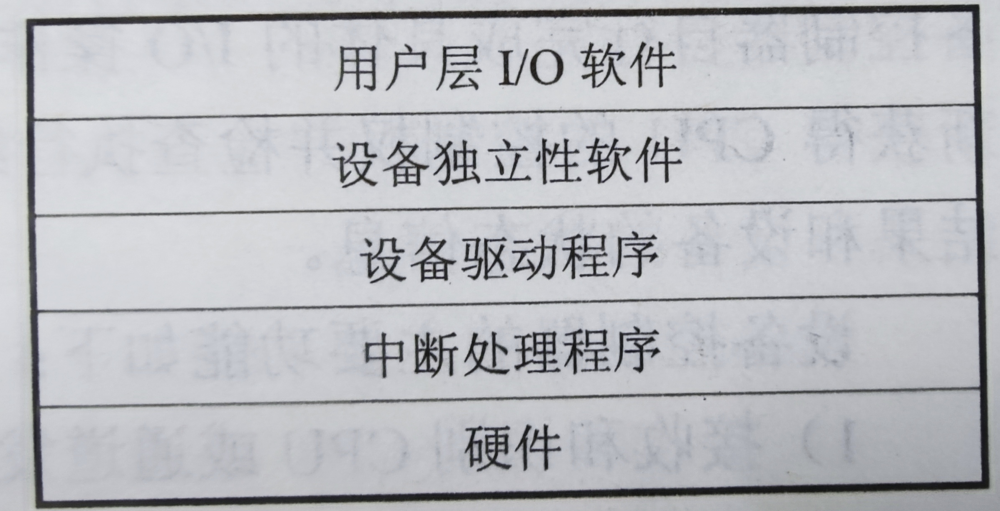

# :man_playing_water_polo:I/O管理

[TOC]

$$
\textbf{DR          2021/11/07          V1.0}
\\
-----------------------
$$

## I/O设备

- 设备，总线，控制器……

- I/O端口一般有4种寄存器：状态寄存器、控制寄存器、数据输入&&输出寄存器。

### 主机 $\Leftrightarrow$ 控制器（控制方式）

- **轮询**
  - 状态寄存器中的忙位表示状态。（置位1，清位0）
  - 主机忙等待或者轮询，直到忙位被清除。
- **中断**

效率低，产生一个中断就处理

The **device controller** raises an **interrupt** by asserting a signal on the interrupt request line, the **CPU** catches the interrupt and **dispatches** it to the **interrupt handler**, and the handler **clears the interrupt** by **servicing the device**.

- **DMA（直接内存访问）**

效率高，一开始CPU就把需要处理的disk address、memory address、byte count给控制器，就回去继续做它的任务了

## I/O应用接口

子系统的层次结构：

## I/O内核子系统

**I/O调度：**所谓I/O调度就是确定一个合适的顺序来执行请求，代价最小。

### Buffering

用处：

**1）**处理数据流生产者和消费者之间的速度差异。

**2）**协调传输数据大小不一致的设备。

**3）**支持应用程序I/O的复制语义。（脏数据情况，再数据修改之前把数据写出去）

### Caching

解决缓存的**效率问题**

A region of **fast memory** that holds **copies** of data

（缓冲和缓存的功能是不一样的）

### Spooling

**A buffer that holds output for a device** that cannot accept interleaved data streams.

**（用于保存不能接受交错数据流的设备的输出的缓冲区）**

输出先假脱机到独立的disk file上，假脱机系统对文件排队，一次复制一个到打印机上。

假脱机可以用来协调并发输出。