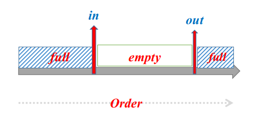
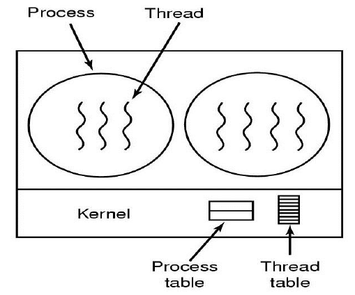

[TOC]

$$
DR \ \ \ \ \ \ \ \ \ \ 2021/10/20 \ \ \ \ \ \ \ \ \ \ \ V 1.0
\\
------------------------------
$$

# 😎进程管理

## Introduction

> “现代操作系统允许多个程序调入内存并发执行。这些需求产生了进程的概念。”

内存中的进程：

在OS中，进程是以PCB的形式存在的。

换言之，内存中，进程包括：

<B>（数据+代码（文本））/ 地址空间 + PCB</B>

## 进程概念

### 进程 v.s. 程序

- 进程（`动态实体`）、程序（`静态实体`）
- 进程在（**内存**）中，程序不一定
- 进程和程序不是一一对应的

### 进程特征

动态性、独立性（独立的存储空间）、并发性、结构化。

### 🌈进程状态

***5 states***:$\Rightarrow$

------

**指出：**

（1）一次只有一个进程在一个处理器上运行，但就绪和等待有多个。

（2）就绪态表示的是准备运行（换句话就是随时可以运行），while 阻塞态（等待态）需要等待某一事件，或某一资源（CPU excluded）而暂停运行。

关于中间的三角转换图：

- $ready \rightleftharpoons running$：涉及到时间片与优先级。

- $running \to waiting$：进程（==**主动**==）请求某一资源的使用分配（如外设）或等待某一事件的发生（如I/O的完成），此时由用户态转为内核态。

  > e.g. 进程自发的状态转换：$running \to waiting$

- $waiting \to ready$：进程等待的事件到来（如I/O结束）。（被动的过程，WHY?）

### $\star$🥩PCB——进程存在的唯一标志

> 每个进程在==OS内==用PCB表示。

PCB是进程存在的唯一**标志**。（`王道P29`）

从结构上看进程实体：**代码段、数据段和PCB**。

> 这里的PCB是一个==抽象的概念==，在Linux中主要表现为`task_struct`，但是还有别的部分，包括内核态的数据结构。

## 🚕进程的操作

（`王道P42`）使用（**原语**）实现对进程的管理和控制。

### 进程的创建与终止

<b>创建</b>

- **创建进程**（父进程）创建新进程（子进程），新进程创建 $\Rightarrow$ 进程树

  - 在Linux 中,创建一个新进程的==唯一==方法是有某个已存在的进程调用`fork()`函数,被创建的新进程称为子进程,已存在的进程称为父进程。

  需要明确的是：创建后其实是两个进程，应该按照两个进程去分析。

- 唯一的**进程标识符**来识别进程：**pid**。子进程返回0，父进程返回子进程的ID。

- **两种执行可能**：并发执行 **OR** 父进程wait。（为什么没有第三种情况？）

  关于新进程的地址空间：子进程复制父进程（程序和数据） **OR** 装入新程序。

>在Linux中，使用fork函数得到的子进程是父进程的处继承了整个进程的地址空间，包括：**「进程上下文、进程堆栈、内存信息、打开的文件描述符、信号控制设置、进程优先级、进程组号、当前工作目录、根目录、资源限制、控制终端」**等。

---

**补充1：**

当父进程调用`fork()`创建子进程之后，下列哪些变量在子进程中修改之后，父进程里也会相应地作出改动？
A.全局变量	B.局部变量	C.静态变量	**D.文件指针**

**补充2：**

刚fork之后：
`父子相同处:`
全局变量、`.data`、`.text`、栈、堆、环境变量、用户ID、宿主目录、进程工作目录、信号处理方式…
`父子不同处:`

1. 进程ID
2. fork返回值
3. 父进程ID
4. 进程运行时间
5. 闹钟(定时器)
6. 未决信号集

父子进程间遵循==读时共享写时复制==的原则。这样设计，无论子进程执行父进程的逻辑还是执行自己的逻辑都能节省内存开销。

**补充3：**

<b>$\mathfrak {What \ happen\ when \ fork()?}$</b>

（1）在fork之后，exec之前两个进程用的是相同的物理空间（内存区），子进程的『代码段』、『数据段』、『堆栈』都是指向父进程的物理空间。（not虚拟空间）。

（2）当父子进程中有更改相应段的行为发生时，再为子进程相应的段分配物理空间。

1. 如果不是因为exec，内核会给子进程的数据段、堆栈段分配相应的物理空间（各自有进程空间，互不影响），而代码段继续共享父进程的物理空间（代码完全相同）。
2. 如果是因为`exec`，由于两者执行的代码不同，子进程的代码段也会分配单独的物理空间。

---

<b>终止</b>

进程终止返回状态值给父进程，释放资源。

有些系统，如果进程终止，则对应的子进程也全部终止。（*级联终止*）

相关操作总结如下：

- `fork()`：新进程创建，重新分配内存空间，会有复制（code section必然也复制）

  fork()后：

  - 在父进程，fork返回新创建的子进程的进程号（大于0）
  - 在子进程，返回0
  - 出错，返回负值

- `exec()`：要想子进程执行不同的功能，则调用（replace the process's memory space with a new program）

- `exit()`：进程执行完了它的最后一句话后，调用`exit()`告知OS删除它

- `wait()`：子进程都执行完了，该调用`wait()`父进程才继续执行

- `abort()`：父进程可以终止子进程执行

### 进程调度

**作业队列：**进程进入系统加入作业队列。（所有进程）

**就绪队列：**就绪状态的队列。通常用**链表**实现。（双向循环链表）

> 调度队列：Job queue（在系统中的全部进程的集合）、ready queue（在内存中的，处于ready态，等待被执行的进程集合）、device queue（等待I/O设备的进程集合）

#### 调度程序（选择进程）

<b>长期调度 && 短期调度 && 中期调度</b>

- 长期调度器：又称为**作业调度器**，负责选择哪些作业被加载到内存中。

  （决定多道程序的degree，即在内存中的进程数量）

- 短期调度器：又称为**CPU调度器**，用来选择哪些进程获得CPU的使用权。（必须存在的）

- 中期调度器：用来实现内存中进程的换进换出操作。

#### 进程切换

1）保存上下文

2）更新PCB信息，PCB移入队列

3）选择新进程同时更新其PCB

4）更新内存管理相关DS && 恢复处理机上下文

## 进程通信

基本方式：共享内存 && 消息传递

### 共享内存

顾名思义。就是共享地址空间。速度快，跨平台。实现复杂。（同步、互斥问题）

两种缓冲：有限缓冲与无限缓冲。

Solution is correct, but can only use `BUFFER_SIZE-1` elements. Why?

### 消息传递

假设*P*和*Q*进程之间通信，则我们希望两者都可以实现收发信息的操作：`直接间接`、`同步异步`、`自动或显式缓冲`。

- **直接**：传对方的进程名称/ID。

- **间接**：邮箱或端口实现。此时，一个进程可以通过多个邮箱通信，两个进程至少通过一个邮箱通信。
  $$
  send(A,msg)
  \\
  receive(A,msg)
  \\
  (A \ is \ mail)
  $$

---

What if this condition? $(p_1,p_2,p_3) \Rightarrow A_{mail}$

#### Pipe

管道通信是一种特殊的消息传递。pipe是共享文件（Linux表现为4KB的缓冲区）

**pipe可以理解为共享内存的优化和发展。**pipe的cache是半双工，write进程会写满再允许读。

---

**区别：**

（1）共享内存更（**快**）

（2）系统调用的时机：共享内存：仅在建立共享区域时，而消息传递经常使用。因此共享内存适合（**大数据**），消息传递适合（**小数据**）。

（3）多核系统中用消息传递（缓存一致性问题）。

（4）共享内存系统中，提供通信的责任主要在**应用程序员**上，操作系统只需提供共享内存空间；而在消息传递系统中，提供通信的责任主要在**操作系统**本身，应用程序员无法干涉。

# 💦线程

## 概述

$\textbf{Definition}:$

- $\mathrm{flow \ of \ control}$  （执行流 or 指令序列）within a process && basic unit of CPU execution
- **组成**：线程ID、PC、寄存器集合、栈。
- 同一进程内的线程共享资源。

## 多线程模型

### 😮用户级线程 v.s. 内核级线程

所谓用户与内核级，就是**谁来管理线程**的问题。

**内核级线程（ULT）：**

1）线程库创建线程（used by 程序员），内核不介入（so that more efficient）。

2）线程堵塞会导致兄弟线程堵塞（该进程陷入阻塞态）

**内核级线程（KLT）：**

1）supported and managed by **Kernel**，完成相关操作比ULT（慢）。

2）阻塞一个线程不会导致兄弟线程阻塞。

Comparison:

- 用户级进程在用户空间，同理，内核级进程在内核空间进行管理。
- OS kernel不知道用户级线程（ULT）的存在。（**如何理解？** $\Rightarrow$ 内核是通过TCB感知线程存在的，我们不让内核访问TCB…）

### 3*models

**多对一：**多个用户级线程映射到一个内核级线程。**没有体现并发性**。

**一对一：**一个用户级线程映射到一个内核级线程。并发性🆗，但是系统资源消耗太大。（need **`restriction`**）

**多对多：**是折中方案，既并发，又防止耗尽资源。

## 线程库（Thread Libraries）

Provided for the （**`Programmers`**）

`int pthread_create(tid, attr, function, arg)` 

创造一个执行function的线程 

`int pthread_join(tid, val_ptr)`

使一个线程等待另一个线程(with handle tid)结束，才继续执行

**只有一个线程可以被joined**

线程状态有**joinable和detached**，后者can't be joined

## 多线程问题

### 信号处理

用来通知进程某个特定事件已经发生了。

1. 特定事件的发生产生信号。
2. 产生的信号发送到**进程**。
3. 一旦发送必须处理。

**同步**（如非法访问内存、除0…）直接发送到相关进程，**异步**（运行进程以外的事情产生）异步接收相关信号（定时器到期这种）。

我们可以用`默认信号处理程序（内核中进行）`或自定义的`信号处理程序`处理。

---

**信号机制和中断机制的异同（考研网答案）⭐**

**同：**都采用了相同的异步通信方式；对信号和某些中断都可以屏蔽；都是处理完毕后回来原来断点

**异：**中断有优先级，信号没有；信号处理程序是在用户态下运行的，中断处理程序是在核心态下运行的；中断响应是及时的，信号相应通常有较大的时间延迟。

---

## 实现

### windows

- win严格区分两个概念：进程负责分配资源、线程是CPU调度的基本单位。都有自己的数据结构。
- **one-to-one** mapping: `createThread()`同时创建KLT，每个线程都有自己的kernel stacks

### Linux

- Linux模糊进程与线程：这里的线程**本质上就是共享资源的进程。**用`task_struct`表示。
- 调用的函数是`clone()`.

